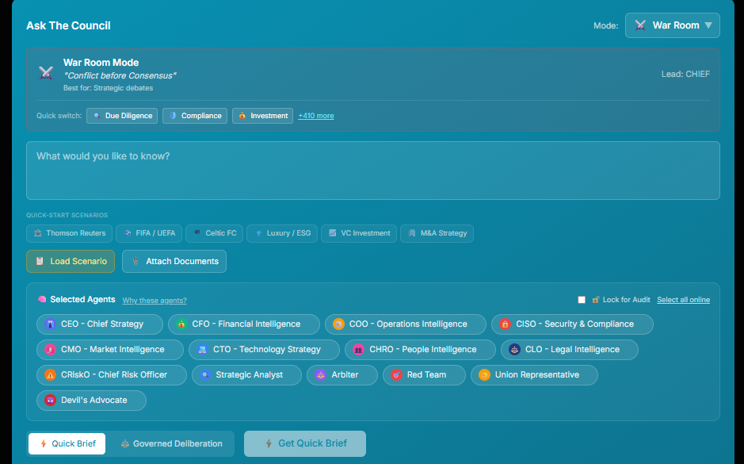

# Datacendia Core

<div align="center">


**Open-Source AI Decision Intelligence Engine**

Multi-agent deliberation · Immutable audit trails · 29 industry verticals · Sovereign-first

[](LICENSE)
[](https://www.typescriptlang.org/)
[](https://nodejs.org/)
[](https://react.dev/)
[](https://www.postgresql.org/)
[](https://redis.io/)
[](https://www.docker.com/)
[](https://www.nvidia.com/en-us/startups/)

[Getting Started](#-getting-started) · [Architecture](#-architecture) · [Verticals](#-industry-verticals) · [Infrastructure](#-infrastructure) · [Contributing](#contributing) · [Enterprise Edition](#-enterprise-edition)

</div>

---

## Requirements

| Requirement | Version | Required |
|-------------|---------|:--------:|
| **Node.js** | 20.x or later | ✅ |
| **Docker** & Docker Compose | Latest | ✅ |
| **PostgreSQL** | 16+ | ✅ (via Docker) |
| **Redis** | 7+ | ✅ (via Docker) |
| **Ollama** | Latest | ✅ (or Triton/NIM) |
| **Neo4j** | 5+ | Optional (knowledge graph) |
| **NVIDIA GPU** | CUDA 12+ | Optional (RAPIDS, Triton, CC) |

> **Quickest path:** Install Node.js 20+, Docker, and Ollama. Everything else runs in Docker containers.

---

## What is Datacendia?

Datacendia is an **AI-native decision intelligence platform** where multiple AI agents with distinct perspectives deliberate on your behalf — then every decision is recorded in an immutable, auditable ledger.

**This is not another chatbot.** It's an operating system for enterprise decisions.

```
┌─────────────────────────────────────────────────────────┐
│                    YOUR DECISION                         │
│                         │                                │
│    ┌──────────┐  ┌──────────┐  ┌──────────┐             │
│    │ Financial │  │ Legal    │  │ Risk     │  ...agents  │
│    │ Analyst  │  │ Counsel  │  │ Assessor │             │
│    └────┬─────┘  └────┬─────┘  └────┬─────┘             │
│         │             │             │                    │
│         └─────────┬───┘─────────────┘                    │
│                   │                                      │
│         ┌─────────▼─────────┐                            │
│         │  THE COUNCIL      │  ← Multi-agent consensus   │
│         │  Deliberation     │                            │
│         └─────────┬─────────┘                            │
│                   │                                      │
│         ┌─────────▼─────────┐                            │
│         │  DECISION PACKET  │  ← Signed, Merkle-rooted  │
│         │  + Audit Trail    │     Court-admissible       │
│         └───────────────────┘                            │
└─────────────────────────────────────────────────────────┘
```

### See It in Action

<div align="center">



*The Council deliberation dashboard with five pre-seeded decisions — `docker compose -f docker-compose.demo.yml up -d`*

</div>

### Key Capabilities

- **The Council** — Multi-agent deliberation with configurable agent panels (financial, legal, ethical, adversarial, domain-specific)
- **Immutable Audit Ledger** — Every decision cryptographically signed with Merkle tree integrity
- **29 Industry Verticals** — Financial, Healthcare, Legal, Defense, Insurance, Energy, Government, Manufacturing, Pharmaceutical, Sports, and 19 more
- **Sovereign-First** — Runs fully air-gapped. No cloud dependency. Your data stays yours.
- **LLM-Agnostic** — Works with Ollama, NVIDIA Triton, NVIDIA NIM, or any OpenAI-compatible API
- **Enterprise Infrastructure** — Kafka event streaming, Temporal workflows, OPA policies, OpenBao secrets, NeMo Guardrails, RAPIDS GPU analytics, Flink CEP

---

## 🚀 Getting Started

### Prerequisites

- **Node.js** 20.x+
- **Docker** & Docker Compose
- **Ollama** (or any supported LLM provider)

### Quick Start (5 minutes)

```bash
# Clone
git clone https://github.com/datacendia/datacendia-core.git
cd datacendia-core

# Copy environment config
cp backend/.env.example backend/.env

# Start infrastructure
docker compose -f docker-compose.dev.yml up -d

# Install dependencies
npm install
cd backend && npm install && cd ..

# Run database migrations
cd backend && npx prisma migrate deploy && cd ..

# Start the platform
npm run dev              # Frontend → http://localhost:5173
cd backend && npm run dev # Backend  → http://localhost:3001
```

### Demo Mode (Docker, zero setup)

```bash
docker compose -f docker-compose.demo.yml up -d
# Open http://localhost:5173
```

---

## 🏗️ Architecture

```
datacendia-core/
├── src/                          # React frontend (Vite + TypeScript + Tailwind)
│   ├── components/               # 85 reusable UI components
│   ├── pages/                    # 197 page components
│   └── services/                 # Frontend API clients
├── backend/                      # Node.js backend (Express + Prisma)
│   ├── src/
│   │   ├── services/
│   │   │   ├── council/          # 🧠 Council deliberation engine
│   │   │   ├── inference/        # 🔌 LLM provider abstraction (Ollama/Triton/NIM)
│   │   │   ├── guardrails/       # 🛡️ NeMo Guardrails engine
│   │   │   ├── kafka/            # 📨 Apache Kafka event streaming
│   │   │   ├── temporal/         # ⏱️ Temporal.io workflow orchestration
│   │   │   ├── opa/              # 📋 Open Policy Agent
│   │   │   ├── vault/            # 🔐 OpenBao/Vault secrets management
│   │   │   ├── gpu/              # ⚡ RAPIDS analytics + Confidential Computing
│   │   │   ├── streaming/        # 🌊 Flink CEP real-time processing
│   │   │   └── verticals/        # 🏭 29 industry verticals
│   │   ├── routes/               # 155 API route files
│   │   ├── security/             # Casbin RBAC, Keycloak SSO
│   │   └── middleware/           # Auth, rate limiting, security
│   └── prisma/                   # 260 database models
└── docker-compose.dev.yml        # Development infrastructure
```

### Tech Stack

| Layer | Technology |
|-------|-----------|
| **Frontend** | React 18, TypeScript, Vite, Tailwind CSS, shadcn/ui |
| **Backend** | Node.js, Express, TypeScript |
| **Database** | PostgreSQL 16 + Prisma ORM (260 models) |
| **Cache** | Redis 7 |
| **Graph** | Neo4j 5 |
| **Vector** | Qdrant |
| **LLM** | Ollama / NVIDIA Triton / NVIDIA NIM |
| **Events** | Apache Kafka (opt-in) |
| **Workflows** | Temporal.io (opt-in) |
| **Policy** | OPA + Casbin |
| **Secrets** | OpenBao/Vault (opt-in) |
| **Guardrails** | NeMo Guardrails (opt-in) |
| **Analytics** | NVIDIA RAPIDS / cuGraph (opt-in) |

---

## 🏭 Industry Verticals

Datacendia ships with **29 industry vertical definitions**. Each vertical provides domain-specific agents, compliance frameworks, decision schemas, and knowledge bases.

| Vertical | Compliance Frameworks | Status |
|----------|----------------------|:------:|
| **Financial Services** | Basel III, MiFID II, SOX, GLBA, DORA | 100% |
| **Healthcare** | HIPAA, FDA SaMD, HITRUST, JCAHO | 100% |
| **Legal** | ABA Ethics, privilege gates, citation enforcement | 100% |
| **Insurance** | NAIC, Solvency II, bias/fairness engine | 100% |
| **Government** | FAR, FISMA, GPRA, FedRAMP architecture | 100% |
| **Energy** | NERC CIP, IEC 62443, FERC | 100% |
| **Manufacturing** | ISO 9001, IATF 16949, OSHA | 100% |
| **Defense** | CMMC, NIST 800-171, ITAR architecture | 100% |
| **EU Banking** | Basel III CRR/CRD, EU AI Act | 100% |
| **Sports** | FIFA Agent Regs, UEFA FFP, Premier League PSR | 100% |
| + 19 more | Education, Pharma, Retail, Real Estate, etc. | Framework |

---

## ⚙️ Infrastructure Integrations

All infrastructure components are **opt-in** — disabled by default, zero impact when off. Every component has an **embedded fallback** for air-gapped deployment.

| Component | Purpose | Activation |
|-----------|---------|-----------|
| **Apache Kafka** | Durable event streaming | `KAFKA_ENABLED=true` |
| **Temporal.io** | Durable workflow orchestration | `TEMPORAL_ENABLED=true` |
| **OPA** | Data-driven policy-as-code | `OPA_ENABLED=true` |
| **OpenBao/Vault** | Secrets management, PKI, transit encryption | `OPENBAO_ENABLED=true` |
| **NeMo Guardrails** | LLM input/output rail evaluation | `NEMO_GUARDRAILS_ENABLED=true` |
| **NVIDIA RAPIDS** | GPU-accelerated bias analysis & graph analytics | `RAPIDS_ENABLED=true` |
| **Confidential Computing** | GPU attestation, data-in-use protection | `CC_ENABLED=true` |
| **Apache Flink CEP** | Real-time complex event processing | `FLINK_ENABLED=true` |

---

## 🔐 Security

- **Sovereign-first** — Runs fully on-premise, air-gapped capable
- **Casbin RBAC/ABAC** — Role and attribute-based access control
- **OPA Policies** — GDPR, HIPAA, SOX, EU AI Act enforcement
- **Immutable Audit Ledger** — Merkle tree integrity, cryptographic signatures
- **Post-Quantum KMS** — Dilithium, SPHINCS+ support
- **Confidential Computing** — NVIDIA H100/H200 GPU attestation

---

## 🧪 Testing

```bash
# Backend tests
cd backend && npm test

# Frontend tests
npm test

# Type checking
cd backend && npx tsc --noEmit
```

---

## Contributing

We welcome contributions! See [CONTRIBUTING.md](CONTRIBUTING.md) for guidelines.

**Quick rules:**
- PRs to any code in this repo are welcome
- Follow [Conventional Commits](https://www.conventionalcommits.org/)
- Add tests for new functionality
- Run `npx tsc --noEmit` before submitting

See [COMMUNITY.md](COMMUNITY.md) for the full open-source boundary definition.

---

## 🏢 Enterprise Edition

**Datacendia Enterprise** adds premium capabilities for regulated industries:

| Feature | Community | Enterprise |
|---------|:---------:|:----------:|
| Council Engine | ✅ | ✅ |
| Immutable Audit Ledger | ✅ | ✅ |
| 29 Vertical Frameworks | ✅ | ✅ |
| Infrastructure (Kafka, Temporal, etc.) | ✅ | ✅ |
| Full Vertical Packs (12+ agents/industry) | — | ✅ |
| 22 Sovereign Architecture Patterns | — | ✅ |
| DCII (9 Decision Primitives) | — | ✅ |
| Collapse Orchestrator (19 adversarial agents) | — | ✅ |
| CendiaApotheosis™ Self-Improvement | — | ✅ |
| OmniTranslate (100+ languages) | — | ✅ |
| Defense/Pharma/Government Full Packs | — | ✅ |
| Enterprise SLA & Support | — | ✅ |

**Contact:** [enterprise@datacendia.com](mailto:enterprise@datacendia.com) · [datacendia.com](https://datacendia.com)

---

## 📄 License

Apache License 2.0 — See [LICENSE](LICENSE) for details.

Copyright 2024-2026 Datacendia, LLC

---

<div align="center">

Built by [Datacendia](https://datacendia.com) · NVIDIA Inception Program Member

</div>
