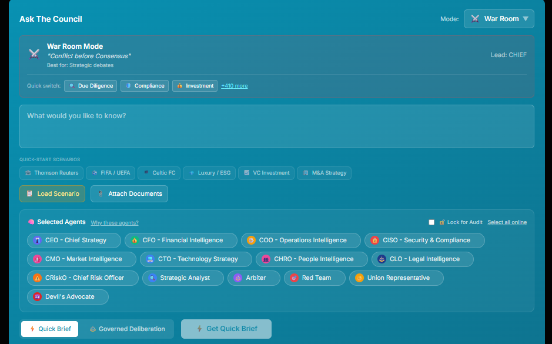

# Datacendia Core

<div align="center">


### The Defensible AI Platform

**Cryptographic proof and forensic trails for every AI decision.**

When your AI makes a $500M acquisition recommendation, can you prove in court exactly what it considered, what it dissented on, and who signed off? Datacendia can.

[](https://github.com/datacendia/datacendia-core/actions/workflows/ci.yml)
[](https://github.com/datacendia/datacendia-core/actions/workflows/security.yml)
[](LICENSE)
[](https://www.typescriptlang.org/)
[](https://nodejs.org/)
[](https://react.dev/)
[](https://www.postgresql.org/)
[](https://redis.io/)
[](https://www.docker.com/)
[](https://www.nvidia.com/en-us/startups/)

[**Try It Now →**](#try-it-in-60-seconds) &middot; [**Live Demo**](https://app.datacendia.com) &middot; [Architecture](#architecture) &middot; [Verticals](#industry-verticals) &middot; [Free Pilot](#free-pilot-program) &middot; [Security Audit](docs/AUDIT-REPORT-2026-Q1.md) &middot; [Standards](#standards--governance) &middot; [Contributing](#contributing)

</div>

---

## Try It in 60 Seconds

> **Don't want to install anything?** Try the [live demo at app.datacendia.com](https://app.datacendia.com) — no signup required.

```bash
# 1. Install Ollama (https://ollama.com) and pull a model:
ollama pull llama3.2:3b          # Fast — 2GB, good for demos
# ollama pull qwen3:32b          # Production — 20GB, much better quality

# 2. Run the platform:
git clone https://github.com/datacendia/datacendia-core.git
cd datacendia-core
docker compose -f docker-compose.demo.yml up -d

# 3. Open http://localhost:5173
#    Demo login: sarah.chen@acme.demo (no password needed)
```

> **What you'll see:** A pre-seeded Council dashboard with 5 real deliberations across 5 industries -- Energy grid emergency, Manufacturing safety defect, $1.7B CRE acquisition, Veterans IT modernization, and SaMD medical device deployment. Full agent transcripts, cross-examinations, and cryptographically signed decision packets.

<details>
<summary><strong>⚡ Pre-built images available</strong> — first run should take under 2 minutes</summary>

Docker pulls pre-built images from GHCR (`ghcr.io/datacendia/datacendia`). If you haven't pulled an Ollama model, AI agents will produce no output — the demo data is still fully browseable.

```bash
# Pull the latest all-in-one image directly
docker pull ghcr.io/datacendia/datacendia:latest
```
</details>

> **API Docs:** Interactive OpenAPI documentation is available at [localhost:3001/api/docs](http://localhost:3001/api/docs) once the backend is running. Raw spec at `/api/docs.json`.

---

## What is Datacendia?

Datacendia is the only AI platform where every decision is auditable, explainable, and independently verifiable at forensic grade. Multiple AI agents with distinct perspectives deliberate on your behalf -- then every interaction is recorded in an immutable, cryptographically signed audit ledger.

**This is not another chatbot.** It's an operating system for enterprise decisions.

```
+-----------------------------------------------------------+
|                    YOUR DECISION                          |
|                                                           |
|    +----------+  +----------+  +----------+              |
|    | Financial|  | Legal    |  | Risk     |  ...agents   |
|    | Analyst  |  | Counsel  |  | Assessor |              |
|    +----+-----+  +----+-----+  +----+-----+              |
|         |             |             |                     |
|         +--------+----+-------------+                     |
|                  |                                        |
|         +--------v---------+                              |
|         |  THE COUNCIL     |  <- Multi-agent consensus    |
|         |  Deliberation    |                              |
|         +--------+---------+                              |
|                  |                                        |
|         +--------v---------+                              |
|         | DECISION PACKET  |  <- Signed, Merkle-rooted   |
|         | + Audit Trail    |     forensic-grade, independently verifiable        |
|         +------------------+                              |
+-----------------------------------------------------------+
```

### See It in Action

<div align="center">



*The Council deliberation dashboard with five pre-seeded decisions -- `docker compose -f docker-compose.demo.yml up -d`*

</div>

### Key Capabilities

### Currently Implemented (Can Demo Today)
- **CendiaGateway** -- AI governance proxy with PII detection, policy enforcement, and SIEM integration
- **The Council** -- Multi-agent deliberation with configurable agent panels
- **Immutable Audit Ledger** -- Every decision cryptographically signed with Merkle tree integrity
- **Cryptographic Services** -- 8 frontend UIs for forensic-grade verification:
  - **CendiaVerify** -- Public verification portal (`/verify`) for third-party receipt validation
  - **CendiaEvidence** -- Evidence package download (ZIP, standalone HTML verifier, JSON)
  - **CendiaGapScan** -- Compliance gap scanner across 8 regulatory frameworks
  - **CendiaStamp** -- Cryptographic seal SVG renderer with Ed25519 signatures
  - **CendiaPrecedent** -- TF-IDF similar decisions panel with precedent matching
  - **CendiaRedTeam** -- 6-vector adversarial analysis report with gate decision
  - **CendiaEscrow** -- Shamir Secret Sharing (3-of-5) with VDF time-locks
  - **CendiaReplay** -- Decision Replay Theater with full deliberation playback
- **Service Orchestration Workflow Builder** -- Visual drag-and-drop workflow builder with 17 Foundation services
- **30 Industry Vertical Frameworks** -- Financial, Healthcare, Legal, Defense, Insurance, Energy, Government, Manufacturing, Pharmaceutical, Sports, and 19 more
- **Enterprise Security** -- JWT authentication, role-based access control, encryption at rest/in transit
- **WCAG 2.1 AA Accessibility** -- 57 passing tests for enterprise accessibility compliance
- **Multi-Tenant Architecture** -- Database-level isolation with configurable tenant separation
- **Basic White-Labeling** -- CSS-based theming with brand customization
- **SIEM Integration** -- Splunk, Datadog, Sentinel, ELK for security event forwarding
- **Performance Monitoring** -- Core Web Vitals tracking with real-time metrics
- **GDPR Compliance** -- Data subject rights implementation with audit trails

### Enterprise Infrastructure (Opt-In)
- **Apache Kafka** -- Durable event streaming (`KAFKA_ENABLED=true`)
- **Temporal.io** -- Durable workflow orchestration (`TEMPORAL_ENABLED=true`)
- **OPA** -- Data-driven policy-as-code (`OPA_ENABLED=true`)
- **OpenBao/Vault** -- Secrets management (`OPENBAO_ENABLED=true`)
- **NeMo Guardrails** -- LLM input/output rail evaluation (`NEMO_GUARDRAILS_ENABLED=true`)
- **NVIDIA RAPIDS** -- GPU-accelerated analytics (`RAPIDS_ENABLED=true`)
- **Apache Flink CEP** -- Real-time complex event processing (`FLINK_ENABLED=true`)

### Roadmap Features (In Development)
- **HSM Key Management** -- Hardware Security Module integration (Q2 2026)
- **Enterprise Connectors** -- SAP, Salesforce, Oracle integrations (Q3 2026)
- **99.99% Uptime SLA** -- Multi-region infrastructure deployment (Q2 2026)
- **Distributed Tracing** -- Jaeger/Zipkin integration (Q2 2026)
- **7-Year Audit Retention** -- Long-term storage configuration (Q2 2026)
- **Advanced Analytics** -- Predictive monitoring and business intelligence (Q4 2026)

See [enterprise-capabilities-audit.md](packages/widgets/enterprise-capabilities-audit.md) for complete capability matrix and [enterprise-roadmap.md](packages/widgets/enterprise-roadmap.md) for implementation timeline.

---

## CendiaGateway™ -- AI Governance Proxy

CendiaGateway governs every AI interaction in your organization -- API calls, browser-based AI usage, and internal systems. Three coverage layers provide 100% governance:

### Layer 1: API Gateway (Reverse Proxy)

Sits between your systems and AI providers. Every request is PII-scanned, policy-enforced, and cryptographically signed.

```
Employee/System → CendiaGateway → AI Provider (OpenAI, Anthropic, Google, Ollama, etc.)
                       ↓
           PII Scan → Policy Engine → DCII Signing → Audit Ledger
```

**Supported providers:** OpenAI, Anthropic, Google AI, Azure OpenAI, Mistral, Cohere, Groq, Ollama

**Endpoints:**
- `POST /api/v1/gateway/v1/chat/completions` -- OpenAI-compatible
- `POST /api/v1/gateway/v1/messages` -- Anthropic-compatible
- `POST /api/v1/gateway/proxy/:provider/*` -- Any provider

### Layer 2: Browser Extensions

Content-script extensions that monitor 15+ AI websites (ChatGPT, Claude, Gemini, Copilot, Perplexity, DeepSeek, Poe, etc.). Intercepts prompts before submission, blocks critical PII instantly.

| Browser | Status |
|---------|--------|
| Chrome / Edge / Brave / Arc | ✅ Manifest V3 |
| Firefox | ✅ Manifest V2 |
| Safari | ✅ Web Extension |

Enterprise deployment via Group Policy, Intune, MDM, or Google Workspace Admin.

### Layer 3: HTTP Forward Proxy (Network-Level)

Browser-agnostic, network-level AI traffic interception. Configured via PAC file or system proxy settings. Works with any browser, any app.

```bash
# Start the proxy
curl -X POST http://localhost:3001/api/v1/gateway/proxy/start

# Configure browsers via PAC file:
# http://gateway-host:3001/api/v1/gateway/proxy/pac
```

### PII Detection

Detects and blocks 10 PII types before they reach AI providers:

| Type | Action |
|------|--------|
| SSN, Credit Card, Medical Record, Bank Account, Passport | **Blocked** |
| Email, Phone, IP Address, Date of Birth | **Redacted** or warned |

### Recommended Deployment

1. IT blocks direct AI websites at the firewall (5 minutes)
2. Employees use the internal AI portal routed through CendiaGateway
3. Browser extension on managed devices catches stragglers
4. All interactions: PII scanned, policy enforced, cryptographically signed

See [`browser-extension/README.md`](browser-extension/README.md) for detailed deployment instructions.

### Federation Infrastructure

"One agreement, all member organizations covered." Create a federation, add member orgs, push shared AI governance policies, and generate consolidated compliance reports — all with cryptographic signing.

```bash
# Create a federation
curl -X POST http://localhost:3001/api/v1/gateway/federation \
  -H "Content-Type: application/json" \
  -d '{"name": "FEPCMAC", "adminOrgId": "fepcmac-hq", "regulatoryFramework": "DS 115-2025-PCM"}'

# Add member organizations
curl -X POST http://localhost:3001/api/v1/gateway/federation/{id}/members \
  -d '{"organizationId": "cmac-aqp", "orgName": "Caja Municipal de Arequipa", "orgCode": "CMAC-AQP"}'

# Push shared policies (block SSN across all members)
curl -X POST http://localhost:3001/api/v1/gateway/federation/{id}/policies \
  -d '{"name": "Block SSN", "action": "block", "piiTypes": ["ssn"]}'

# Consolidated compliance dashboard
curl http://localhost:3001/api/v1/gateway/federation/{id}/dashboard

# Generate signed compliance report
curl -X POST http://localhost:3001/api/v1/gateway/federation/{id}/reports \
  -d '{"reportType": "compliance", "periodStart": "2026-01-01", "periodEnd": "2026-03-31"}'
```

**Federation API:** 12 endpoints for federation CRUD, member management, shared policies, per-member stats, risk scoring, and SHA-256 + HMAC signed compliance reports.

---

## Getting Started

### Option 1: Demo Mode (Recommended for first look)

See [Try It in 60 Seconds](#try-it-in-60-seconds) above. Pre-seeded data, no configuration needed.

### Option 2: Development Setup (~45 minutes first time)

**Prerequisites:** Node.js 20+, Docker, Ollama

```bash
# 1. Pull an Ollama model (do this first — it takes time)
ollama pull llama3.2:3b          # Fast demo model (2GB download)
# For production quality, use: ollama pull qwen3:32b (20GB download, 30-60 min)

# 2. Clone and configure
git clone https://github.com/datacendia/datacendia-core.git
cd datacendia-core
cp backend/.env.example backend/.env

# 3. Start infrastructure (Postgres, Redis, Neo4j)
docker compose -f docker-compose.dev.yml up -d

# 4. Install dependencies (Prisma client auto-generates via postinstall)
npm install
cd backend && npm install && cd ..

# 5. Run database migrations
cd backend && npx prisma migrate deploy && cd ..

# 6. Start the platform (two terminals)
npm run dev              # Terminal 1 — Frontend: http://localhost:5173
cd backend && npm run dev # Terminal 2 — Backend:  http://localhost:3001
```

<details>
<summary><strong>Ollama Model Guide</strong></summary>

| Model | Size | Quality | Best For |
|-------|------|---------|----------|
| `llama3.2:3b` | 2 GB | Good | Quick demos, testing |
| `llama3.2:8b` | 5 GB | Better | Development |
| `qwen3:32b` | 20 GB | Excellent | Production (default in .env) |
| `llama3.3:70b` | 43 GB | Best | Enterprise (needs 48GB+ RAM/VRAM) |

The `.env` defaults to `qwen3:32b`. To use a smaller model, edit `backend/.env`:

```bash
OLLAMA_MODEL=llama3.2:3b
OLLAMA_MODEL_FAST=llama3.2:3b
```

</details>

### Requirements

| Requirement | Version | Required |
|-------------|---------|:--------:|
| **Node.js** | 20.x or later | Yes |
| **Docker** & Docker Compose | Latest | Yes |
| **Ollama** | Latest | Yes (or Triton/NIM) |
| **PostgreSQL** | 16+ | Via Docker |
| **Redis** | 7+ | Via Docker |
| **Neo4j** | 5+ | Optional (knowledge graph) |
| **NVIDIA GPU** | CUDA 12+ | Optional (RAPIDS, Triton, CC) |

---

## Architecture

```
datacendia-core/
|-- src/                          # React frontend (Vite + TypeScript + Tailwind)
|   |-- components/               # 92 reusable UI components
|   |   |-- crypto/               # CendiaEvidence, CendiaStamp
|   |   |-- council/              # CendiaPrecedent, CendiaRedTeam, SimilarDecisions
|   |   +-- ui/                   # ServiceInfoDropdown, shared UI
|   |-- pages/                    # 240 page components
|   |   |-- public/               # CendiaVerify (/verify)
|   |   |-- cortex/crypto/        # CendiaEscrow
|   |   |-- cortex/crown/         # Echo, Gnosis, RedTeam
|   |   |-- cortex/dcii/          # Memory, Notary, Truth, Witness, Similarity, Timestamp
|   |   |-- cortex/workflows/     # Service Orchestration Workflow Builder
|   |   +-- cortex/monitor/       # CendiaPulse live agent monitor
|   |-- config/                   # Service info definitions (22 services)
|   |-- types/                    # Shared TypeScript types (Workflow, ServiceDefinition)
|   +-- services/                 # ServiceRegistry (17), WorkflowPersistence, API clients
|-- backend/                      # Node.js backend (Express + Prisma)
|   |-- src/
|   |   |-- services/
|   |   |   |-- council/          # Council deliberation engine
|   |   |   |-- inference/        # LLM provider abstraction (Ollama/Triton/NIM)
|   |   |   |-- guardrails/       # NeMo Guardrails engine
|   |   |   |-- kafka/            # Apache Kafka event streaming
|   |   |   |-- temporal/         # Temporal.io workflow orchestration
|   |   |   |-- opa/              # Open Policy Agent
|   |   |   |-- vault/            # OpenBao/Vault secrets management
|   |   |   |-- gpu/              # RAPIDS analytics + Confidential Computing
|   |   |   |-- streaming/        # Flink CEP real-time processing
|   |   |   |-- gateway/          # CendiaGateway™ AI governance proxy
|   |   |   +-- verticals/        # Industry vertical modules
|   |   |-- routes/               # API route files (domain-grouped)
|   |   |-- security/             # Casbin RBAC, Keycloak SSO
|   |   +-- middleware/           # Auth, rate limiting, security
|   +-- prisma/                   # Database schema and models
|-- browser-extension/            # AI governance browser extensions
|   |-- chrome/                   # Chrome/Edge/Brave/Arc (Manifest V3)
|   |-- firefox/                  # Firefox (Manifest V2)
|   +-- safari/                   # Safari (Web Extension)
+-- docker-compose.dev.yml        # Development infrastructure
```

### Tech Stack

| Layer | Technology |
|-------|-----------|
| **Frontend** | React 18, TypeScript, Vite, Tailwind CSS, shadcn/ui (240 pages, 92 components) |
| **Backend** | Node.js, Express, TypeScript |
| **Database** | PostgreSQL 16 + Prisma ORM |
| **Cache** | Redis 7 |
| **Graph** | Neo4j 5 |
| **Vector** | Qdrant |
| **LLM** | Ollama / NVIDIA Triton / NVIDIA NIM |
| **Events** | Apache Kafka (opt-in) |
| **Workflows** | Temporal.io (opt-in) |
| **Policy** | OPA + Casbin |
| **Secrets** | OpenBao/Vault (opt-in) |
| **Guardrails** | NeMo Guardrails (opt-in) |
| **Analytics** | NVIDIA RAPIDS / cuGraph (opt-in) |

---

## Industry Verticals

Datacendia ships with **30 industry vertical definitions**. Each vertical provides domain-specific agents, compliance frameworks, decision schemas, and knowledge bases.

| Vertical | Compliance Frameworks | Status |
|----------|----------------------|:------:|
| **Financial Services** | Basel III, MiFID II, SOX, GLBA, DORA | 100% |
| **Healthcare** | HIPAA, FDA SaMD, HITRUST, JCAHO | 100% |
| **Legal** | ABA Ethics, privilege gates, citation enforcement | 100% |
| **Insurance** | NAIC, Solvency II, bias/fairness engine | 100% |
| **Government** | FAR, FISMA, GPRA, FedRAMP architecture | 100% |
| **Energy** | NERC CIP, IEC 62443, FERC | 100% |
| **Manufacturing** | ISO 9001, IATF 16949, OSHA | 100% |
| **Defense** | CMMC, NIST 800-171, ITAR architecture | 100% |
| **EU Banking** | Basel III CRR/CRD, EU AI Act | 100% |
| **Sports** | FIFA Agent Regs, UEFA FFP, Premier League PSR | 100% |
| + 19 more | Education, Pharma, Retail, Real Estate, etc. | Framework |

---

## Infrastructure Integrations

All infrastructure components are **opt-in** -- disabled by default, zero impact when off. Every component has an **embedded fallback** for air-gapped deployment.

| Component | Purpose | Activation |
|-----------|---------|-----------|
| **Apache Kafka** | Durable event streaming | `KAFKA_ENABLED=true` |
| **Temporal.io** | Durable workflow orchestration | `TEMPORAL_ENABLED=true` |
| **OPA** | Data-driven policy-as-code | `OPA_ENABLED=true` |
| **OpenBao/Vault** | Secrets management, PKI, transit encryption | `OPENBAO_ENABLED=true` |
| **NeMo Guardrails** | LLM input/output rail evaluation | `NEMO_GUARDRAILS_ENABLED=true` |
| **NVIDIA RAPIDS** | GPU-accelerated bias analysis & graph analytics | `RAPIDS_ENABLED=true` |
| **Confidential Computing** | GPU attestation, data-in-use protection | `CC_ENABLED=true` |
| **Apache Flink CEP** | Real-time complex event processing | `FLINK_ENABLED=true` |

---

## Security

> **📄 [Q1 2026 Platform Audit Report](docs/AUDIT-REPORT-2026-Q1.md)** -- Comprehensive security audit across all repositories. 2 Critical, 6 High findings identified and **all resolved** with commit-level traceability. [View the audit →](docs/AUDIT-REPORT-2026-Q1.md)

- **Sovereign-first** -- Runs fully on-premise, air-gapped capable
- **Casbin RBAC/ABAC** -- Role and attribute-based access control
- **OPA Policies** -- GDPR, HIPAA, SOX, EU AI Act enforcement
- **Immutable Audit Ledger** -- Merkle tree integrity, cryptographic signatures
- **Post-Quantum KMS** -- Dilithium, SPHINCS+ support
- **Confidential Computing** -- NVIDIA H100/H200 GPU attestation

---

## Testing

```bash
# Backend tests
cd backend && npm test

# Frontend tests
npm test

# Type checking
npx tsc --noEmit --skipLibCheck          # Frontend
cd backend && npx tsc --noEmit --skipLibCheck  # Backend
```

---

## Contributing

We welcome contributions! See [CONTRIBUTING.md](CONTRIBUTING.md) for guidelines.

**Quick rules:**
- PRs to any code in this repo are welcome
- Follow [Conventional Commits](https://www.conventionalcommits.org/)
- Add tests for new functionality
- Run `npx tsc --noEmit` before submitting

See [COMMUNITY.md](COMMUNITY.md) for the full open-source boundary definition.

---

## Free Pilot Program

Datacendia uses an **open-core** model. This repository is the Community Edition (Apache 2.0, free forever).

**We're offering a free 90-day guided pilot** to qualified organizations navigating AI governance challenges (EU AI Act, HIPAA, Basel III, DORA, etc.). We'll help you deploy, configure for your industry, and prove value -- no commitment, no credit card.

| What You Get | Community (This Repo) | Guided Pilot (Free) |
|---|:---:|:---:|
| Council Engine (multi-agent deliberation) | ✅ | ✅ |
| CendiaGateway (AI governance proxy) | ✅ | ✅ |
| Immutable Audit Ledger (Merkle-signed) | ✅ | ✅ |
| DCII Services (Truth, Notary, Witness, Timestamp) | ✅ | ✅ |
| CendiaReplay (decision playback) | ✅ | ✅ |
| 30 Industry Vertical Frameworks | ✅ | ✅ |
| White-glove deployment assistance | -- | ✅ |
| Custom agent configuration for your industry | -- | ✅ |
| Priority support (Slack/email) | -- | ✅ |
| Compliance report for your regulatory framework | -- | ✅ |

**→ [Request a Free Pilot](https://datacendia.com/briefing.html)** &middot; [enterprise@datacendia.com](mailto:enterprise@datacendia.com)

> Looking for Enterprise or Strategic tier features? See [TIER-MAPPING.md](TIER-MAPPING.md) for the complete service-by-service breakdown, or contact us for pricing.

---

## Standards & Governance

Datacendia implements the **Datacendia Decision Governance Infrastructure (DDGI)** -- a vendor-neutral framework for treating institutional decisions as auditable lifecycle artifacts.

| Resource | Description |
|----------|-------------|
| [DDGI Framework](https://github.com/datacendia/decision-governance-infrastructure) | Vendor-neutral governance specification (CC BY 4.0) |
| [DCII White Paper](https://github.com/datacendia/decision-governance-infrastructure/blob/main/docs/DCII_Framework_v2.1.md) | Reference implementation specification |
| [API Specification](https://github.com/datacendia/decision-governance-infrastructure/blob/main/api/api-spec.yaml) | OpenAPI 3.0 (59 endpoints) |
| [Compliance Mapping](https://github.com/datacendia/decision-governance-infrastructure/blob/main/docs/compliance-mapping.md) | Regulation-to-primitive matrix |

DDGI is being prepared for submission to **ISO/IEC JTC 1/SC 42** (Artificial Intelligence) as a New Work Item Proposal. See [standards body engagement](https://github.com/datacendia/decision-governance-infrastructure/blob/main/docs/standards-body-engagement.md) for details.

---

## Troubleshooting

<details>
<summary><strong>AI agents produce no output / Council deliberation is empty</strong></summary>

Ollama must be running on your host machine and have at least one model pulled.

```bash
# Check Ollama is running:
curl http://localhost:11434/api/tags

# Pull a model if none are listed:
ollama pull llama3.2:3b
```

Demo mode connects to `http://host.docker.internal:11434` -- this requires Ollama running on the host, not in Docker.
</details>

<details>
<summary><strong>Docker build fails or is very slow</strong></summary>

- Ensure Docker has at least 6 GB RAM allocated (Docker Desktop → Settings → Resources)
- First build downloads all npm dependencies and compiles TypeScript -- this takes 5-15 min
- Subsequent builds use cache and start in seconds
</details>

<details>
<summary><strong>Prisma migration fails</strong></summary>

```bash
# If migrate deploy fails, try db push (works for fresh databases):
cd backend && npx prisma db push
```

The Prisma schema uses split files (requires Prisma 5+). Run `npx prisma --version` to verify.
</details>

<details>
<summary><strong>Port conflicts</strong></summary>

The dev stack uses non-standard ports to avoid conflicts with local services:

| Service | Port |
|---------|------|
| Frontend | 5173 |
| Backend API | 3001 |
| PostgreSQL | 5433 (not 5432) |
| Redis | 6380 (not 6379) |
| Neo4j | 7474 / 7687 |

If ports are still in use, edit the port mappings in `docker-compose.dev.yml`.
</details>

---

## License

Apache License 2.0 -- See [LICENSE](LICENSE) for details.

Copyright 2024-2026 Datacendia, LLC

---

<div align="center">


Built by [Datacendia](https://datacendia.com) &middot; [DDGI Framework](https://github.com/datacendia/decision-governance-infrastructure) &middot; **NVIDIA Inception Program Member**

**→ [Try the Platform](#try-it-in-60-seconds)** &middot; **[Request a Free Pilot](https://datacendia.com/briefing.html)** &middot; [enterprise@datacendia.com](mailto:enterprise@datacendia.com)

*Last updated: April 2026*

</div>
