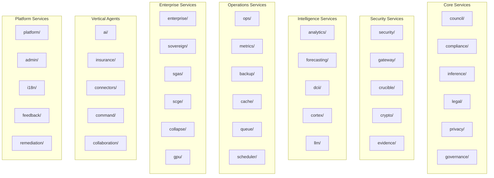

# The Datacendia Bible
## Master Platform Reference — v0.2.4-alpha (April 2026)

> **Authoritative internal reference.** This document covers every product, service, compliance framework, security control, workflow, and architectural decision in the Datacendia platform. Keep this in sync with every sprint.

---

## Table of Contents

1. [Mission & Core Philosophy](#1-mission--core-philosophy)
2. [Platform Architecture](#2-platform-architecture)
3. [Named Products & Brands](#3-named-products--brands)
4. [Service Domain Map](#4-service-domain-map)
5. [Middleware Chain](#5-middleware-chain)
6. [Compliance Coverage](#6-compliance-coverage)
7. [Security Controls](#7-security-controls)
8. [Data Model](#8-data-model)
9. [API Structure](#9-api-structure)
10. [Pricing Tiers](#10-pricing-tiers)
11. [Deployment Architecture](#11-deployment-architecture)
12. [Demo Data Architecture](#12-demo-data-architecture)
13. [AI Inference Layer](#13-ai-inference-layer)
14. [Cryptographic Evidence Chain](#14-cryptographic-evidence-chain)
15. [Audit & Telemetry](#15-audit--telemetry)
16. [External Integrations](#16-external-integrations)
17. [Roadmap & Versioning](#17-roadmap--versioning)
18. [Key Configuration Variables](#18-key-configuration-variables)

---

## 1. Mission & Core Philosophy

**Datacendia** is an AI Governance & Decision Intelligence platform for regulated enterprises. It turns high-stakes decisions into structured, auditable, multi-agent deliberations with cryptographic evidence chains and full regulatory compliance enforcement.

### Core Tenets

| Tenet | Implementation |
|-------|---------------|
| **No black-box AI** | Every AI recommendation is backed by a multi-agent debate with dissent records |
| **Compliance by construction** | Regulatory enforcement is in the middleware — not an afterthought |
| **Cryptographic accountability** | Every decision packet is SHA-256 hashed, Merkle-rooted, and customer-signed |
| **Data sovereignty** | Air-gap capable, customer-owned keys, no training on customer data (CNIL requirement) |
| **Open core** | Community Edition under Apache 2.0; enterprise modules in `datacendia-components` |

---

## 2. Platform Architecture

```
┌─────────────────────────────────────────────────────────────────────┐
│                        CLIENT LAYER                                  │
│  React 18 + TypeScript + Vite + TailwindCSS + Zustand               │
│  175 page components · 91 UI components · Socket.IO real-time        │
└──────────────────────────────┬──────────────────────────────────────┘
                               │  HTTP / WebSocket
┌──────────────────────────────▼──────────────────────────────────────┐
│                     EXPRESS API SERVER (port 3001)                   │
│  Middleware Chain (see §5) · 14 Domain Routers · 158 Route Files    │
└─────────┬──────────────┬────────────────┬────────────────┬──────────┘
          │              │                │                │
┌─────────▼──┐  ┌────────▼──────┐  ┌─────▼──────┐  ┌─────▼──────────┐
│ PostgreSQL │  │     Redis     │  │   Neo4j    │  │  AI Inference  │
│ 260 models │  │ Cache/Sessions│  │ Know.Graph │  │ Ollama/OpenAI  │
│ 37 schemas │  │ Rate Limits   │  │ (optional) │  │ Triton/NIM     │
└────────────┘  └───────────────┘  └────────────┘  └────────────────┘
```

### Stack

| Layer | Technology |
|-------|-----------|
| Frontend | React 18, TypeScript, Vite, TailwindCSS, Zustand, Lucide, Radix UI |
| Backend | Node.js 20, Express.js, TypeScript (ESM), Prisma ORM |
| Database | PostgreSQL 16 (primary), Redis 7 (cache), Neo4j 5 (graph) |
| AI Inference | Ollama (local), OpenAI / Groq / Together (cloud), NVIDIA Triton, NIM |
| Deployment | Railway, Docker (Dockerfile.allinone 3-stage build) |
| Observability | OpenTelemetry tracing, Sentry, Prometheus metrics |
| Email | SendGrid HTTP API (SMTP blocked on Railway) |
| Security | Helmet, CORS, JWT (jose), bcrypt, CSRF, rate limiting, honeypot |

---

## 3. Named Products & Brands

### Core AI Governance Products

| Brand | Service | Route | Purpose |
|-------|---------|-------|---------|
| **The Council™** | CouncilService | `/cortex/council` | Multi-agent deliberation engine (6 AI personas) |
| **CendiaDecide™** | DeliberationService | `/cortex/council/deliberate` | Structured decision workflow with DECIDE framework |
| **CendiaDissent™** | DissentService | `/cortex/crown/dissent` | Formal dissent capture, tracking, ledger preservation |
| **CendiaRecall™** | RecallService | `/cortex/crown/recall` | Decision outcome tracking + retrospectives |
| **CendiaGnosis™** | gnosisService | `/cortex/crown/gnosis` | Cross-decision knowledge synthesis |
| **CendiaEcho™** | echoService | `/cortex/crown/echo` | Echo chamber + groupthink detection |
| **CendiaVox™** | VoxService | `/cortex/crown/vox` | Stakeholder voice capture + weighting |

### Security & Risk Products

| Brand | Service | Route | Purpose |
|-------|---------|-------|---------|
| **CendiaSentry™** | SentryService | via API | AI guardrails: PII, toxicity, bias, hallucination detection |
| **CendiaAegis™** | AegisService | `/cortex/security/aegis` | Defense + threat protection orchestration |
| **CendiaCrucible™** | CrucibleService | `/cortex/security/crucible` | AI stress testing + adversarial red-team |
| **CendiaGateway™** | GatewayService | `/cortex/gateway` | AI proxy with 14 control modules |
| **CendiaPanopticon™** | PanopticonService | `/cortex/monitor` | Organization-wide AI visibility + shadow AI |
| **CendiaWedge™** | Wedge (3 products) | `/cortex/wedge` | Shadow AI Scanner, Governance Report, Incident Forensics |

### Compliance & Legal Products

| Brand | Service | Route | Purpose |
|-------|---------|-------|---------|
| **CendiaCompliance™** | ComplianceService | `/cortex/compliance` | Continuous multi-framework compliance monitoring |
| **CendiaGapScan™** | GapScanService | `/cortex/compliance/gap-scanner` | Gap analysis across 8+ frameworks |
| **CendiaCourt™** | ConstitutionalCourtService | `/cortex/governance/constitutional-court` | Constitutional court / dispute resolution |
| **Privacy API** | PrivacyService | `/api/v1/privacy` | 17 GDPR/CCPA/HIPAA/state-AI-law endpoints |

### Cryptographic & Evidence Products

| Brand | Service | Route | Purpose |
|-------|---------|-------|---------|
| **CendiaVerify™** | VerifyService | `/verify` (public) | Third-party receipt verification portal |
| **CendiaEvidence™** | SelfContainedEvidenceService | Component | Evidence package ZIP/HTML/JSON download |
| **CendiaStamp™** | CendiaStampService | Component | Cryptographic seal SVG renderer |
| **CendiaPrecedent™** | PrecedentService | Component | TF-IDF similar decisions matching |
| **CendiaRedTeam™** | EnterpriseRedTeamService | Component | 6-vector adversarial analysis report |
| **CendiaEscrow™** | DecisionEscrowService | `/cortex/crypto/escrow` | Shamir SSS + VDF time-lock management |
| **CendiaReplay™** | ReplayService | `/cortex/council/replay-theater` | Decision deliberation playback theater |
| **DCII™** | DCIIService | `/cortex/crypto/dcii` | Datacendia Cryptographic Integrity Index |

### Intelligence & Analytics Products

| Brand | Service | Route | Purpose |
|-------|---------|-------|---------|
| **CendiaHorizon™** | HorizonService | `/cortex/intel/horizon` | AI trend forecasting |
| **ChronosAI™** | ChronosService | `/cortex/intel/chronos` | Temporal AI analytics + pattern detection |
| **CendiaIntel™** | DecisionIntelService | `/cortex/intel` | Cross-decision intelligence aggregation |
| **CendiaApotheosis™** | ApotheosisService | `/cortex/crown/apotheosis` | AI excellence benchmarking |
| **CendiaAutopilot™** | AutopilotService | `/cortex/intel/autopilot` | Automated decision monitoring |
| **CendiaOmniTranslate™** | OmniTranslateService | via API | 26-language compliance translation |

### Sovereign & Enterprise Products

| Brand | Service | Route | Purpose |
|-------|---------|-------|---------|
| **CendiaSovereign™** | SovereignService | `/cortex/sovereign` | Air-gapped deployment, data diode, TPM, portable |
| **CendiaMesh™** | MeshService | `/cortex/sovereign/mesh` | Multi-org governance federation |
| **CendiaEternal™** | EternalService | `/cortex/sovereign/eternal` | Long-term AI knowledge preservation |
| **CendiaSymbiont™** | SymbiontService | `/cortex/sovereign/symbiont` | Human-AI collaboration framework |
| **COLLAPSE™** | CollapseService | `/cortex/sovereign/collapse` | Policy stress-testing (12 adversarial agents) |
| **SGAS™** | SGASService | `/cortex/sovereign/sgas` | Self-Governing Agent System |
| **SCGE™** | SCGEService | `/cortex/sovereign/scge` | Synthetic Community Governance Engine |

### Vertical Industry Agents

| Brand | Coverage | Route | Files |
|-------|---------|-------|-------|
| **CendiaVerticals™** | Healthcare, Finance, Legal, Manufacturing, Insurance, Energy, Defense, Sports, Government | `/verticals/*` | 107 files |

---

## 4. Service Domain Map

60 service directories · 356+ service files across the following domains:



### Complete Service Directory

| Directory | Key Services | Purpose |
|-----------|-------------|---------|
| `services/council/` | CouncilService, DeliberationService, DecisionService, PostDeliberationService, DissentService | Multi-agent deliberation engine |
| `services/compliance/` | ComplianceService, AIRegulatoryClassifier, IncidentMaterialityService, ContinuousMonitorService, CrossJurisdictionService, RegulatorySandboxService, RetentionService | All compliance & regulatory enforcement |
| `services/inference/` | InferenceService, OllamaProvider, OpenAIProvider, TritonProvider, NIMProvider, HealthCheckService | AI model routing + provider abstraction |
| `services/legal/` | LegalService, LegalResearchService, ContractService, PolicyService, EvidenceService, ComplianceDocService, TemplateService, LegalAnalyticsService | Legal document management + research |
| `services/privacy/` | PrivacyService, ConsentService, DataSubjectService, PHIService | GDPR/CCPA/HIPAA privacy rights |
| `services/governance/` | GovernanceService, GovernanceReportService, PillarsService, ResponsibilityService | Governance framework + reporting |
| `services/crypto/` | KeyManagementService, MerkleService, StampService, HashingService, SigningService, VDFService | Cryptographic primitives |
| `services/evidence/` | SelfContainedEvidenceService, ContentAddressedReceiptService, EvidenceChainService, ForensicsService | Evidence packaging + chain-of-custody |
| `services/security/` | AuditService, ThreatDetectionService, RBACService, HoneypotService, PolicyEngine | Security hardening + audit |
| `services/gateway/` | GatewayService (14 modules: proxy, PII interceptor, rate limiter, audit, policy, router, cache, transform, metrics, token, filter, fallback, load balancer, health monitor) | AI proxy + governance layer |
| `services/analytics/` | AnalyticsService, ReportingService, MetricsService, DashboardService | Usage analytics + reporting |
| `services/forecasting/` | ForecastingService, HorizonService, TrendService | Predictive intelligence |
| `services/dcii/` | DCIIService, IntegrityIndexService, ScoreService | Datacendia Cryptographic Integrity Index |
| `services/cortex/` | CortexService, PlatformAssistantService, ExecutiveSummaryService | Platform intelligence layer |
| `services/llm/` | LLMService, PromptService, EmbeddingService, TokenizerService, EnhancedLLMService, ChainService | LLM utilities + prompt engineering |
| `services/ops/` | OpsAgentService (Report, Analytics, NLP★, Pipeline★) | Operational AI agents |
| `services/metrics/` | MetricsCollectorService, PrometheusService, TelemetryService | Observability + metrics |
| `services/backup/` | DatabaseBackupService | Automated database backup |
| `services/cache/` | CacheService, RedisSessionService | Redis caching layer |
| `services/queue/` | AgentQueueService, JobQueueService | Async job processing |
| `services/scheduler/` | SchedulerService, CronService | Scheduled task management |
| `services/enterprise/` | EnterpriseService, ConnectorService, LedgerService, AuditPackageService, AIInsuranceService, CascadeService, HRService | Enterprise integrations |
| `services/sovereign/` | SovereignService, MeshService, VaultService, EternalService, SymbiontService, AirGapService | Sovereign deployment modules |
| `services/sgas/` | SGASService, AgentOrchestrationService | Self-Governing Agent System |
| `services/scge/` | SCGEService, CommunitySimulationService, SCGEOrchestratorService | Synthetic Community Governance Engine |
| `services/collapse/` | CollapseService, StressTestService, AdversarialSimService | 12-agent policy stress testing |
| `services/gpu/` | GPUManagementService, CUDAService, RAPIDSService | GPU resource management |
| `services/ai/` | BiasDetectionService, HallucinationService, GuardrailsService, ContentFilterService | AI safety services |
| `services/insurance/` | AIInsuranceService, RiskModelService, UnderwritingService | AI insurance vertical |
| `services/connectors/` | 35+ connectors (SIEM, ERP, CRM, cloud, HR, financial, healthcare) | External system integrations |
| `services/platform/` | PlatformService, HealthService, NotificationService, UploadService, SettingsService | Core platform utilities |
| `services/admin/` | AdminService, UserManagementService, OrgManagementService | Admin operations |
| `services/i18n/` | I18nService, TranslationService, LocaleService | Internationalization (26 languages) |
| `services/feedback/` | FeedbackService, ContinuousImprovementService | User feedback loop |
| `services/remediation/` | RemediationService, TicketingService, AutoHealService | Automated issue remediation |
| `services/collaboration/` | StakeholderPortalService, CollaborationService | Stakeholder engagement |
| `services/SampleDataService/` | SampleDataService | Demo + test data generation |
| `services/CendiaResponsibilityService/` | ResponsibilityService | AI accountability framework |
| `services/core/` | PlatformServices (central service registry) | Service lifecycle management |

---

## 5. Middleware Chain

Every authenticated API request passes through this chain in order:

```
HTTP Request
    │
    ├─► /health, /liveness, /readiness      ← Probe endpoints (no middleware)
    ├─► /metrics                             ← Prometheus (no auth)
    ├─► express.static (dist/)              ← Static assets (MUST be before Helmet)
    │
    ▼
[Helmet]                ← CSP, X-Frame-Options, HSTS, etc.
[CORS]                  ← Origin validation (datacendia.com + localhost)
[Rate Limiter]          ← Redis-backed, per-IP + per-user limits
[Body Parser]           ← JSON + URL-encoded
[Cookie Parser]         ← Cookie parsing for CSRF
[Compression]           ← gzip
[Request Logger]        ← Structured request logging
[customSecurityHeaders] ← Additional security headers
[masterSecurityMiddleware]   ← Central security orchestrator
[preventReplayAttack]        ← Nonce + timestamp validation
[preventDataExfiltration]    ← Output pattern scanning
[threatDetectionMiddleware]  ← Request anomaly scoring
[honeypotMiddleware]         ← Honeypot trap endpoints
[CSRF Protection]            ← CSRF token validation (state-changing requests)
[Input Sanitization]         ← XSS scrubbing
[Path Traversal Protection]  ← Directory traversal blocking
[SQL Injection Detection]    ← SQLi pattern matching
    │
    ▼
[Auth Middleware] ← JWT validation, user/org resolution from PostgreSQL (cached Redis)
                    ↳ calls blockIfDemo() — demo org write protection
    │
    ▼
[requireOrgScope] ← Verifies req.organizationId is set
                    ↳ calls blockIfDemo() — belt-and-suspenders demo guard (v0.2.4+)
    │
    ▼ (AI routes only: /api/v1/council, /deliberations, /inference, /platform-assistant)
[aiRegulatoryMiddleware]   ← Classifies against 6 AI frameworks
                              Hard-blocks EU AI Act Art. 5 prohibited practices (HTTP 451)
                              Hard-blocks IL AIVIA without consent (HTTP 451)
[phiEnforcementMiddleware] ← HIPAA §164.502 + FTC HBNR 2024
                              Blocks health-domain AI without PHI de-identification
    │
    ▼
[Domain Router] → [Route Handler] → [Service Layer] → [Database/AI]
    │
    ▼
[AuditService.log()] ← All regulatory + security events with severity + Merkle hash
[Sentry Error Handler]
[Global Error Handler]
```

### Demo Guard Specifics

The `demoGuardMiddleware` (`backend/src/middleware/demoGuard.ts`) is applied at two layers:

| Layer | When | What it does |
|-------|------|-------------|
| Auth middleware | After JWT resolve | Blocks writes if `req.organizationId` starts with `demo-` or `tutorial-` |
| `requireOrgScope` | After auth, before route | Second check — belt-and-suspenders |

Real client orgs have UUID IDs — `isDemoOrg("a3f7b2c1-...")` returns `false`. SUPER_ADMIN role bypasses for reseeding.

---

## 6. Compliance Coverage

### Active Enforcement (Runtime Middleware)

| Framework | Middleware | Enforcement |
|-----------|-----------|-------------|
| EU AI Act Annex III / Art. 5 | `aiRegulatoryMiddleware` | Hard-block prohibited practices (HTTP 451) |
| IL AIVIA | `aiRegulatoryMiddleware` | Hard-block without user consent (HTTP 451) |
| CO SB 205 | `AIRegulatoryClassifier` + `/privacy/appeal-ai-decision` | Classification + appeal endpoint |
| NYC LL 144 | `AIRegulatoryClassifier` + `/privacy/aedt-disclosure` | AEDT disclosure endpoint |
| GDPR Art. 22 | `AIRegulatoryClassifier` + `/privacy/appeal-ai-decision` | Automated decision rights |
| Germany BDSG §26 | `AIRegulatoryClassifier` | Employee AI classification |
| HIPAA §164.502 | `phiEnforcementMiddleware` | Block PHI without de-identification |
| FTC HBNR 2024 | `phiEnforcementMiddleware` | Health breach notification enforcement |

### Privacy API Coverage (17 Endpoints — `/api/v1/privacy`)

| Endpoint | Legal Basis |
|----------|------------|
| `GET /access` | GDPR Art. 15 — Right of access |
| `PATCH /rectify` | GDPR Art. 16 — Right to rectification |
| `DELETE /erasure` | GDPR Art. 17 — Right to erasure |
| `POST /restrict` | GDPR Art. 18 — Right to restrict processing |
| `GET /export` | GDPR Art. 20 — Data portability |
| `POST /deidentify` | HIPAA §164.514(b) Safe Harbor |
| `POST /appeal-ai-decision` | CO SB 205 §6-1-1703 / VA CDPA |
| `GET /aedt-disclosure` | NYC LL 144 |
| `GET /org-export` | EU Data Act Art. 23 (includes deliberations + agent configs) |
| `POST /opt-out-profiling` | TX TDPSA / VA CDPA / CO CPA |
| `POST /ai-impact-assessment` | CO SB 205 + EU AI Act Art. 9 |
| `POST /classify-ai-use-case` | Developer tool (AIRegulatoryClassifier) |
| `GET /ccpa/notice` | CCPA §1798.130 |
| `POST /ccpa/opt-out` | CCPA §1798.120 |
| `GET /ccpa/status` | CCPA status check |
| `POST /ccpa/limit-sensitive` | CPRA §1798.121 |
| `POST /wa-mhmda-consent` | WA MHMDA RCW 70.02 |

### Multi-Framework Breach Notification (`IncidentMaterialityService`)

14 jurisdictions with automated deadline + draft notice generation:

| Framework | Deadline | Authority |
|-----------|---------|-----------|
| SEC Form 8-K Item 1.05 | 4 business days | SEC |
| NYDFS 23 NYCRR §500 | 72 hours | NYDFS |
| FTC HBNR 2024 | 60 days | FTC |
| GDPR Art. 33 | 72 hours | ICO / DPAs |
| UK GDPR | 72 hours | ICO |
| HIPAA Breach Notification | 60 days | OCR / HHS |
| CCPA/CPRA | Expedient | CA AG |
| Japan APPI | 30 days | PPC |
| Singapore PDPA | 3 days | PDPC |
| Australia NDB Scheme | 30 days | OAIC |
| Nigeria NDPA 2023 | 72 hours | NDPC |
| Brazil LGPD | 2 business days | ANPD |
| CMMC 2.0 | Per incident | DoD DIBCAC |
| NYDFS (Cyber Event) | 72 hours | NYDFS |

### Compliance Frameworks Documented

40+ frameworks across the compliance library (`docs/compliance/`):

- **US Federal:** HIPAA, FTC Act, SEC Rule 17a-4, FINRA 3310, CMMC 2.0
- **US State AI:** CO SB 205, NYC LL 144, IL AIVIA, TX TDPSA, VA CDPA, WA MHMDA
- **EU/UK:** GDPR, UK GDPR, EU AI Act, EU Data Act Art. 23, AI Liability Directive
- **Germany:** BDSG §26, CNIL France AI guidance
- **Financial:** Basel III, NYDFS 23 NYCRR §500, SOX
- **Cloud Security:** ISO 27001, ISO 27017, ISO 27018, ISO 42001, CSA STAR, SOC 2 Type II
- **Risk Frameworks:** NIST CSF 2.0, NIST AI RMF, CIS Controls v8, MITRE ATT&CK v15, MITRE ATLAS
- **Asia-Pacific:** Japan APPI, Singapore PDPA, Australia NDB, Vietnam PDPD, Philippines DPA, Taiwan PDPA
- **Africa:** Nigeria NDPA 2023, South Africa POPIA

---

## 7. Security Controls

### Active Security Modules

| Module | File | Role |
|--------|------|------|
| `masterSecurityMiddleware` | `security/DefenseInDepth.ts` | Central orchestrator, applies all security policies |
| `preventReplayAttack` | `security/DefenseInDepth.ts` | Nonce + timestamp validation, blocks replayed requests |
| `preventDataExfiltration` | `security/DefenseInDepth.ts` | Scans responses for sensitive pattern leakage |
| `threatDetectionMiddleware` | `security/SecurityHardening.ts` | ML-style anomaly scoring per request |
| `honeypotMiddleware` | `security/Honeypot.ts` | Traps and logs automated scanners |
| `csrfProtection` | `middleware/csrf.ts` | CSRF token validation for state-changing requests |
| `inputSanitizationMiddleware` | `middleware/SecurityMiddleware.ts` | XSS scrubbing on all inputs |
| `pathTraversalMiddleware` | `middleware/SecurityMiddleware.ts` | Directory traversal blocking |
| `sqlInjectionMiddleware` | `middleware/SecurityMiddleware.ts` | SQLi pattern detection |
| `PolicyEngine` | `security/PolicyEngine.ts` | Declarative policy enforcement |
| `AuditService` | `security/audit.service.ts` | Merkle-chained tamper-evident audit log |
| `demoGuardMiddleware` | `middleware/demoGuard.ts` | Read-only protection for demo orgs |

### Vulnerability Disclosure

- `/.well-known/security.txt` — NYDFS 23 NYCRR §500.20 compliant
- Contact: `security@datacendia.com`
- Policy: coordinated disclosure, 90-day remedy window
- PGP key on security.txt

### Audit Event Types

All security events are logged with `AuditService` and form a Merkle-chained ledger:

```
auth.*              — login, logout, token refresh, failed attempts
decision.*          — created, approved, rejected, escalated
deliberation.*      — started, completed, agent vote, dissent
ai.*                — inference, regulatory_blocked, regulatory_classified,
                      prohibited_practice_blocked
security.*          — threat_detected, breach_detected, incident_created
data.*              — access, export, erasure, rectification
admin.*             — user management, org settings, tier changes
```

---

## 8. Data Model

**37 Prisma schema files · 260+ models · PostgreSQL 16**

### Core Tables

| Table | Purpose | Key Columns |
|-------|---------|-------------|
| `organizations` | Multi-tenant root | `id` (UUID), `slug`, `settings` (JSON includes `isDemo`) |
| `users` | Platform users | `id`, `organization_id`, `role` (ADMIN/ANALYST/VIEWER), `password_hash` |
| `deliberations` | Council sessions | `id`, `organization_id`, `question`, `status`, `decision` (JSON), `confidence` |
| `deliberation_messages` | Agent transcripts | `deliberation_id`, `agent_id`, `phase`, `content`, `confidence` |
| `agents` | AI agent configs | `id`, `code`, `role`, `system_prompt`, `model_config` (JSON) |
| `decisions` | Decision records | `organization_id`, `user_id`, `title`, `status`, `department` |
| `decision_packets` | Signed evidence artifacts | `deliberation_id`, `merkle_root`, `signature`, `retention_until` |
| `dissents` | Formal dissent records | `organization_id`, `decision_id`, `statement`, `ledger_hash` |
| `audit_logs` | Tamper-evident audit chain | `event_type`, `severity`, `hash`, `previous_hash`, `merkle_position` |
| `metric_definitions` | KPI definitions | `organization_id`, `code`, `unit`, `category` |
| `metric_values` | Time-series KPI values | `metric_id`, `value`, `recorded_at` |

### Multi-Tenancy

All data is scoped by `organization_id`. The Prisma queries include `WHERE organization_id = req.organizationId` enforced at the service layer. `verifyOrgOwnership()` in `tenantIsolation.ts` is used for per-resource access checks.

---

## 9. API Structure

### Base URL
- Production: `https://app.datacendia.com/api/v1`
- Local dev: `http://localhost:3001/api/v1`

### 14 Domain Routers

| Domain | Prefix | Route Files Included |
|--------|--------|---------------------|
| `authDomain` | `/api/v1/auth` | auth.ts, contact.ts |
| `councilDomain` | `/api/v1/council` | council.ts, deliberations.ts, deliberationsApi.ts, decisions.ts, dissent.ts, council-packets.ts, echo.ts, gnosis.ts, red-team, vox |
| `dataDomain` | `/api/v1` | metrics.ts, dataSources.ts, alerts.ts, data-sources |
| `governanceDomain` | `/api/v1` | compliance.ts, governance, panopticon, pillars, responsibility, constitutional-court |
| `securityDomain` | `/api/v1` | crucible.ts, aegis.ts, kms.ts, post-quantum, zkp, adversarial-redteam, redteam |
| `sovereignDomain` | `/api/v1` | sovereign-organs, sovereign-infra, sovereign-arch, vault, evidence, mesh, eternal |
| `enterpriseDomain` | `/api/v1` | enterprise.ts, ledger, audit-packages, ai-insurance, cascade, connectors, hr |
| `legalDomain` | `/api/v1` | legal.ts, legal-research, legal-services |
| `verticalsDomain` | `/api/v1` | financial, healthcare, insurance, energy, defense, sports, vertical-agents |
| `platformDomain` | `/api/v1` | platform, core, cortex, admin, settings, health, i18n, notifications, upload |
| `simulationDomain` | `/api/v1` | sgas.ts, scge.ts, collapse.ts |
| `workflowsDomain` | `/api/v1` | workflows, integrations, scheduler |
| `intelligenceDomain` | `/api/v1` | persona, autopilot, decision-intel, gnosis, apotheosis, visualization |
| `demoDomain` | `/api/v1/demo` | leads, premium, demo-seed (no org scope — public) |

### Standard Response Envelope

```json
{
  "success": true,
  "data": { ... },
  "meta": {
    "total": 100,
    "page": 1,
    "limit": 20
  }
}
```

Error envelope:
```json
{
  "success": false,
  "error": {
    "code": "VALIDATION_ERROR",
    "message": "...",
    "details": [ ... ]
  }
}
```

---

## 10. Pricing Tiers

| Tier | Price | Target | Key Additions |
|------|-------|--------|--------------|
| **Community** | Free (Apache 2.0) | Open source users, developers | Council, Replay, DECIDE, DCII, Gateway, PII, Evidence, 18+ verticals, full privacy/regulatory engine |
| **Pilot** | $50K / year | Early enterprise adopters | Trial of Foundation features, onboarding support |
| **Foundation** | $150K–$500K / year | Mid-market enterprises | CendiaCompliance, GapScan, Echo, Gnosis, OmniTranslate, advanced analytics |
| **Enterprise** | $500K–$1.5M / year | Large regulated enterprises | RedTeam, Escrow, Court, Pulse, Shadow Council, SSO/MFA, SIEM, ZKP |
| **Strategic** | $1.5M+ / year | Sovereigns, critical infra | COLLAPSE, SGAS, full verticals (30 packs), federated mesh, air-gapped |

Gated features: `datacendia-components` repo. Backend uses dynamic `import()` inside try/catch. Frontend shows lock icon → `/cortex/upgrade`.

---

## 11. Deployment Architecture

```
GitHub (datacendia/datacendia-core)
    master branch → git push origin master:production
                              │
                              ▼
                    Railway CI/CD (production branch)
                              │
                              ▼
                    Dockerfile.allinone (3-stage build)
                    Stage 1: npm run build (Vite frontend)
                    Stage 2: npm run build (TypeScript backend)
                    Stage 3: Production Node.js image
                              │
                              ▼
                    Railway Container
                    ├── Express backend (port 3001)
                    ├── express.static serving /dist (frontend)
                    ├── PostgreSQL (Railway managed)
                    └── Redis (Railway managed)
                              │
                              ▼
                    app.datacendia.com (SSL via Railway)
                    CNAME → xj2uqt7t.up.railway.app
```

### Key Build Rules

- Use `npm install` NOT `npm ci` (lockfiles are out of sync)
- Strip BOM from `package.json` (`.replace(/^\uFEFF/,'')` in Dockerfile)
- `express.static` MUST be registered BEFORE Helmet/security middleware
- Minimum Railway plan: Hobby ($5/month) — Free plan OOMs

### Environment Variables

| Variable | Required | Purpose |
|----------|---------|---------|
| `DATABASE_URL` | ✅ | PostgreSQL connection string |
| `JWT_SECRET` | ✅ | JWT signing secret (min 32 chars) |
| `REQUIRE_AUTH` | ✅ | `true` in production |
| `NODE_ENV` | ✅ | `production` |
| `SENDGRID_API_KEY` | ✅ | Email delivery (SMTP blocked on Railway) |
| `OPENAI_API_KEY` | Optional | Cloud AI inference |
| `OPENAI_MODEL` | Optional | Default: `gpt-4o-mini` |
| `OPENAI_BASE_URL` | Optional | For Groq: `https://api.groq.com/openai/v1` |
| `REDIS_URL` | Optional | Redis connection (falls back to in-memory) |
| `NEO4J_URI` | Optional | Neo4j knowledge graph |
| `SENTRY_DSN` | Optional | Error tracking |

---

## 12. Demo Data Architecture

### Isolation Model

Demo and real data share the same PostgreSQL database but are **100% separated** by `organization_id`:

| | Demo Orgs | Real Client Orgs |
|--|-----------|-----------------|
| **ID format** | `demo-org-001`, `tr-demo-meridian`, `tutorial-*` | UUID (`a3f7b2c1-...`) |
| **Detection** | `id.startsWith('demo-')` or `startsWith('tutorial-')` | UUID prefix — no match |
| **Settings flag** | `settings.isDemo = true` | Not present |
| **Writes** | Intercepted → mock response | Passed through normally |

### Demo Organizations

| Org ID | Name | Industry | Scenario |
|--------|------|---------|---------|
| `demo-org-001` | Apex Industries (Demo) | Manufacturing | General governance |
| `tr-demo-meridian` | Meridian Capital Partners | Financial Services | PEP transfer compliance |
| `demo-hospital-001` | MedCenter Health System | Healthcare | HIPAA + PHI |
| `demo-defense-001` | Vanguard Defense Systems | Defense | CMMC + classified |
| `demo-fintech-001` | NovaPay | Financial Technology | SEC + FINRA |
| `demo-energy-001` | GridPower Utilities | Energy | NERC CIP |

### API Endpoints

| Endpoint | Auth | Purpose |
|----------|------|---------|
| `GET /api/v1/demo/status` | None | Check demo data presence |
| `POST /api/v1/demo/seed` | SUPER_ADMIN | Seed all demo data |
| `POST /api/v1/demo/seed/tr` | SUPER_ADMIN | Seed Meridian Capital scenario |
| `DELETE /api/v1/demo/clear` | SUPER_ADMIN | Clear main demo org data |
| `DELETE /api/v1/demo/clear/tr` | SUPER_ADMIN | Clear Meridian Capital data |

---

## 13. AI Inference Layer

### Provider Priority Chain

```
1. OPENAI_API_KEY set?
   YES → OpenAIProvider (works with OpenAI, Groq, Together AI, Mistral)
   NO  → OllamaProvider (local, port 11434)

Fallback chain: Primary → Failover → Log only (graceful degradation)
```

### InferenceService Methods

| Method | Purpose |
|--------|---------|
| `complete(prompt, options)` | Single completion |
| `chat(messages, options)` | Chat completion |
| `embed(text)` | Text embeddings |
| `healthCheck()` | Provider availability + latency |
| `getStatus()` | Active provider + failover state |

### Council Agent Models

Default: `deepseek-r1:32b` (local) or `gpt-4o-mini` (cloud). Each agent has independent `model_config` JSON allowing per-agent model selection.

---

## 14. Cryptographic Evidence Chain

Every Council deliberation produces a **Decision Packet** — a tamper-evident artifact:

```
Deliberation Transcript
    ↓
[SHA-256 hash each agent message]
    ↓
[Build Merkle tree from message hashes]
    ↓
[Attach merkle_root to DecisionPacket]
    ↓
[Sign with customer-owned RSA-SHA256 key]
    ↓
[Store in decision_packets table]
    ↓
[Optional: ContentAddressedReceipt for third-party verification]
    ↓
[CendiaStamp SVG seal for display]
```

### Evidence Services

| Service | Class | Output |
|---------|-------|--------|
| `CendiaStampService` | `StampService` | SVG cryptographic seal |
| `MerkleService` | `MerkleService` | Merkle tree root from array of hashes |
| `SelfContainedEvidenceService` | `SelfContainedEvidenceService` | ZIP archive with HTML + JSON + PDF |
| `ContentAddressedReceiptService` | `ContentAddressedReceiptService` | Public verification receipt |
| `DecisionEscrowService` | `DecisionEscrowService` | Shamir SSS + VDF time-locked escrow |
| `DCII` | `DCIIService` | Composite integrity score (0–100) |

---

## 15. Audit & Telemetry

### AuditService (`backend/src/security/audit.service.ts`)

Every audit entry is:
1. Assigned a `hash` = SHA-256 of event data
2. Linked to `previous_hash` forming a Merkle chain
3. Assigned a `merkle_position` in the current tree
4. Stored in `audit_logs` with `severity` (info/warn/error/critical)

### Telemetry Stack

| Tool | Config | Purpose |
|------|--------|---------|
| OpenTelemetry | `telemetry/tracing.ts` | Distributed tracing (must init first) |
| Sentry | `telemetry/sentry.ts` | Error tracking + performance |
| Prometheus | `/metrics` endpoint | Metrics scraping (no auth) |
| Request Logger | `middleware/requestLogger.ts` | Structured per-request logging |
| Winston Logger | `utils/logger.ts` | Application logging |

---

## 16. External Integrations

### Connectors (`backend/src/connectors/`)

35+ external system connectors organized by industry:

| Category | Connectors |
|---------|-----------|
| `connectors/core/` | REST, GraphQL, WebSocket, gRPC base connectors |
| `connectors/enterprise/` | Salesforce, SAP, ServiceNow, Jira, Slack, Teams |
| `connectors/financial/` | Bloomberg, Reuters, SEC EDGAR, Plaid, Stripe |
| `connectors/healthcare/` | Epic, Cerner, HL7 FHIR, HIPAA gateway |
| `connectors/defense/` | CMMC, DoD data standards, classified network adapters |
| `connectors/energy/` | NERC CIP, OT/ICS systems, grid data |
| `connectors/government/` | FedRAMP, FISMA, government APIs |
| `connectors/supply-chain/` | ERP, logistics, procurement systems |
| `connectors/transportation/` | Aviation, maritime, rail SCADA |
| `connectors/agriculture/` | AgTech platforms, precision farming APIs |
| `connectors/avionics/` | ACARS, ARINC, avionics data standards |
| `connectors/telecommunications/` | Telco APIs, CDR, network management |
| `connectors/international/` | Multi-jurisdiction regulatory gateways |

### Supporting External Services

| Service | Purpose | Config |
|---------|---------|--------|
| SendGrid | Email delivery | `SENDGRID_API_KEY` env var |
| OpenAI / Groq | Cloud AI inference | `OPENAI_API_KEY` env var |
| NVIDIA NIM | Enterprise GPU inference | Optional |
| Kafka | Event streaming | `kafka/` service |
| Apache Flink | CEP stream processing | `flink/` route |
| Apache Druid | OLAP analytics | `druid/` route |
| NVIDIA RAPIDS | GPU analytics | `rapids/` route |
| Temporal.io | Workflow orchestration | `temporal/` route |
| OpenBao/Vault | Secrets management | `openbao/` route |
| OPA | Policy-as-code | `opa/` route |
| NeMo Guardrails | AI safety | `guardrails/` route |

---

## 17. Roadmap & Versioning

### Version History

| Version | Date | Major Features |
|---------|------|---------------|
| v0.1.0 | Q3 2024 | Initial Council engine, basic deliberation |
| v0.2.0 | Q4 2024 | Multi-agent full stack, PostgreSQL persistence |
| v0.2.1 | Q1 2025 | Open-core split, community edition |
| v0.2.2 | Q2 2025 | Cryptographic service UIs (8 components) |
| v0.2.3 | Q3 2025 | ServiceInfoDropdown, Gateway, Sovereign modules |
| v0.2.4-alpha | April 2026 | **Compliance Sprint:** AI regulatory middleware, breach notification planner, 17 privacy endpoints, demo guard global wiring |

### In Progress (v0.2.5 target)

- CSA STAR Level 1 CAIQ submission
- ICO registration (UK GDPR)
- DPO appointment
- ISO 42001 pre-conformity assessment
- EU AI Act pre-conformity assessment
- PHI-before-AI runtime enforcement (FTC HBNR gap)

### Certification Targets

| Certification | Target | Status |
|--------------|--------|--------|
| SOC 2 Type II | Q3 2026 | Gap assessment complete |
| ISO 27001 | Q4 2026 | Controls documented |
| CMMC Level 2 | Q1 2027 | 72% control coverage |
| CSA STAR Level 1 | Q2 2026 | CAIQ ready to submit |
| ISO 42001 | Q2 2027 | Pre-conformity pending |

---

## 18. Key Configuration Variables

### Source Files

| Config | File | Purpose |
|--------|------|---------|
| App config | `backend/src/config/index.ts` | All environment variables with defaults |
| Database | `backend/src/config/database.ts` | Prisma client singleton |
| Redis | `backend/src/config/redis.ts` | Redis client + connection |
| Neo4j | `backend/src/config/neo4j.ts` | Graph database connection |
| Swagger | `backend/src/config/swagger.ts` | OpenAPI spec generation |
| Service info | `src/config/serviceInfo.ts` | 22 service descriptions for UI dropdowns |
| Tier mapping | `TIER-MAPPING.md` | Feature → tier matrix |
| Brand voice | `docs/brand_voice.md` | Marketing tone + messaging |
| Pricing | `docs/PRICING.md` | Full pricing breakdown |

### Demo Credentials (seeded only — not for production)

| Account | Email | Password |
|---------|-------|---------|
| Demo Admin | `demo.ceo@datacendia.com` | `DemoAccess2026!` |
| Demo Analyst | `demo.cfo@datacendia.com` | `DemoAccess2026!` |

---

*Last updated: April 2026 — v0.2.4-alpha*
*Maintained by: Datacendia Engineering*
*Contact: security@datacendia.com · privacy@datacendia.com*
