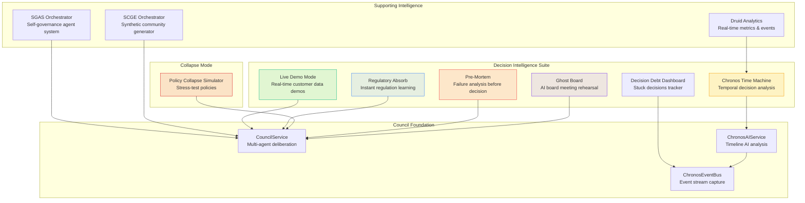
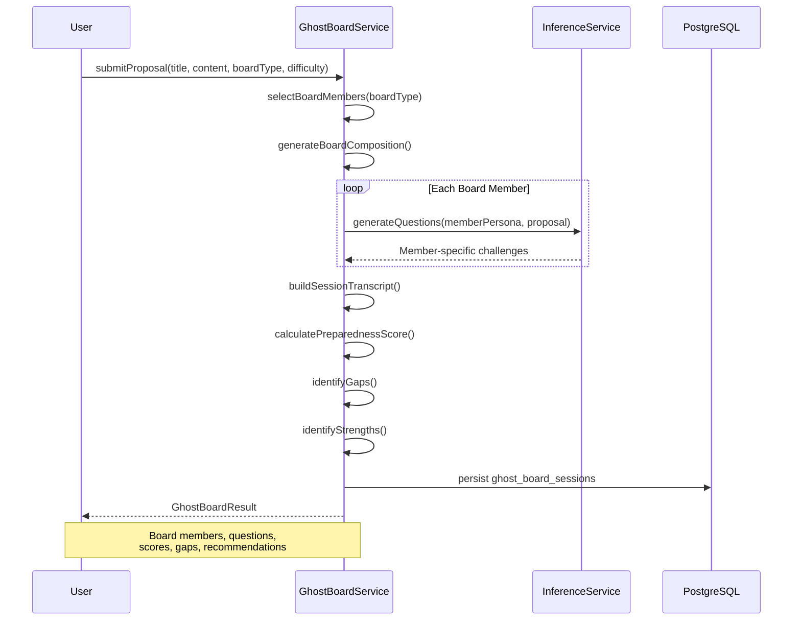
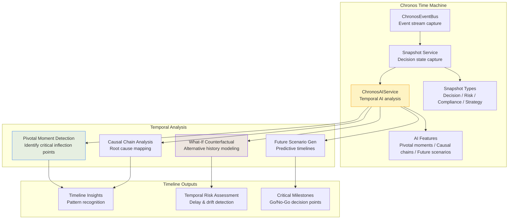
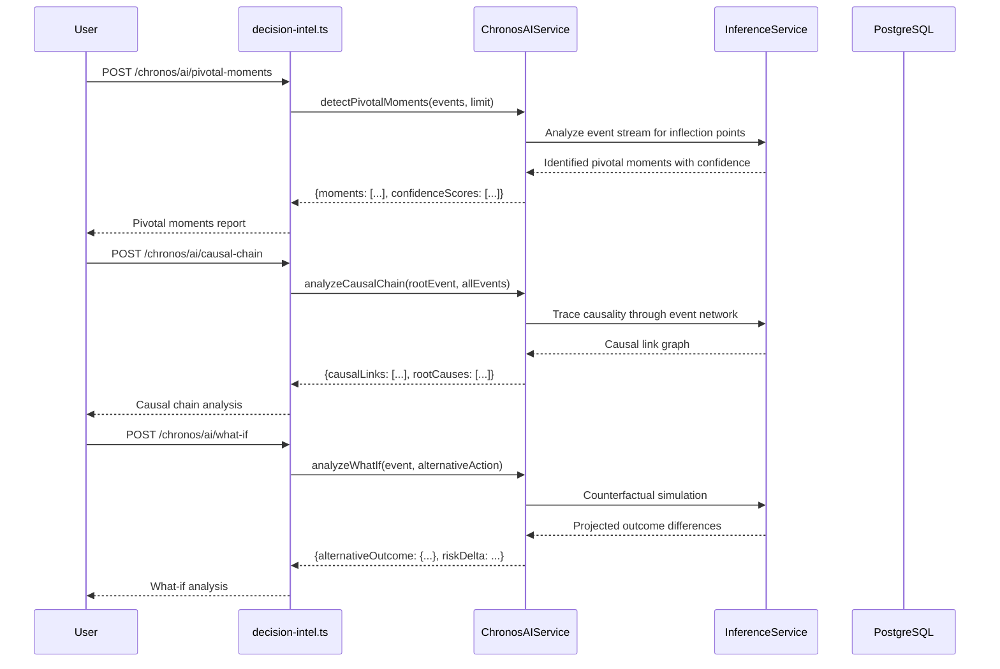
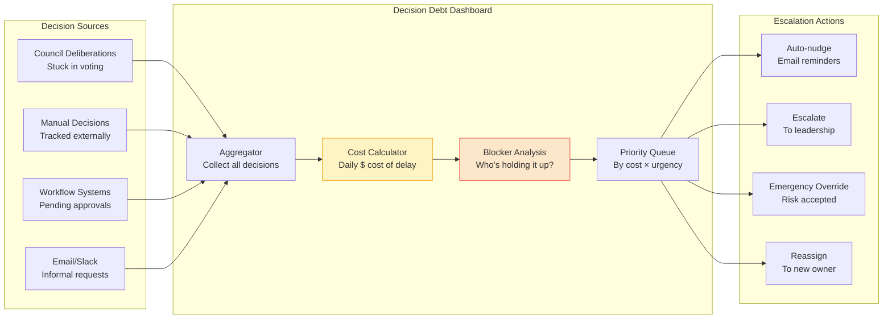
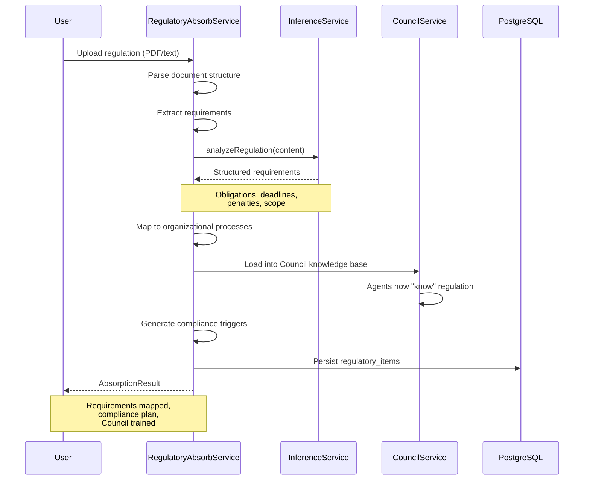
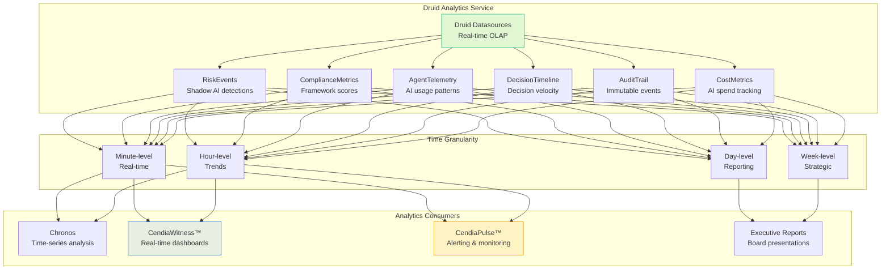
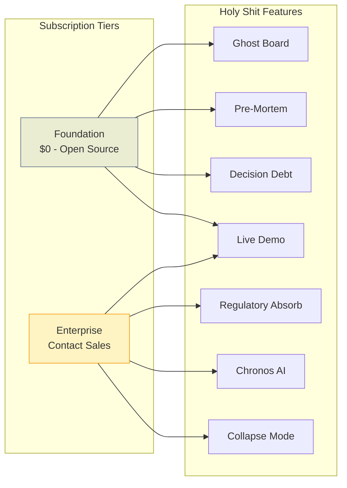

# Advanced Analysis Features ("Holy Shit Features") — Architecture & Workflow Diagrams

## 1. Decision Intelligence Suite Overview



## 2. Ghost Board — AI Board Rehearsal

```mermaid
flowchart TB
    INPUT[Proposal Submission<br/>Title + Content + Difficulty] --> SETUP{Configure Board}

    SETUP --> BOARD_TYPE[Select Board Type<br/>VC-backed / Public / PE / Non-profit]
    BOARD_TYPE --> DIFFICULTY[Select Difficulty<br/>easy / medium / hard / brutal]

    SETUP --> MEMBERS[AI Board Members Generated]
    MEMBERS --> MEMBER_TYPES[
        Skeptical VC (Victoria)<br/>
        Risk-Averse Independent (Robert)<br/>
        Growth Obsessed (Sarah)<br/>
        Industry Expert<br/>
        Financial Hawk<br/>
        Operations Focused<br/>
        Governance Stickler<br/>
        Tech Visionary
    ]

    MEMBER_TYPES --> REHEARSAL[Board Rehearsal Session]
    REHEARSAL --> QUESTIONS[Questions Generated by Category]

    QUESTIONS --> CAT[
        Financial<br/>
        Strategic<br/>
        Operational<br/>
        Market<br/>
        Risk<br/>
        Governance<br/>
        Technical
    ]

    CAT --> SCORE[Preparedness Score<br/>0-100]
    SCORE --> GAPS[Key Gaps Identified]
    SCORE --> STRENGTHS[Strength Areas]
    SCORE --> CRITICAL[Critical Questions List]
    SCORE --> TRANSCRIPT[Full Session Transcript]

    GAPS & STRENGTHS & CRITICAL --> REPORT[Ghost Board Report<br/>Board-ready preparation guide]

    style MEMBER_TYPES fill:#7c3aed20,stroke:#7c3aed
    style SCORE fill:#f59e0b20,stroke:#f59e0b
    style REPORT fill:#10b98120,stroke:#10b981
```

## 3. Ghost Board Sequence



## 4. Chronos Time Machine Architecture



## 5. Chronos AI Analysis Flow



## 6. Pre-Mortem Analysis

```mermaid
flowchart TB
    INPUT[Decision Proposal<br/>+ Context + Budget] --> AGENTS{Select Agents}

    AGENTS --> CFO[CFO Agent<br/>Financial failure modes]
    AGENTS --> CISO[CISO Agent<br/>Security & compliance]
    AGENTS --> PESSIMIST[The Pessimist<br/>General failure scenarios]
    AGENTS --> OPS[Operations Agent<br/>Execution failures]
    AGENTS --> LEGAL[Legal Agent<br/>Regulatory & liability]

    CFO & CISO & PESSIMIST & OPS & LEGAL --> MODES[Analyze Failure Modes]

    MODES --> FAILURES[
        Technical Failures<br/>
        Market Failures<br/>
        Financial Failures<br/>
        Organizational Failures<br/>
        External Failures
    ]

    FAILURES --> SCORE[Score Each Failure<br/>Probability + Cost Impact]
    SCORE --> RANK[Rank by Risk<br/>High probability × high impact]

    RANK --> EARLY[Early Warning Indicators<br/>Detect before too late]
    RANK --> MITIGATE[Mitigation Strategies<br/>Per failure mode]

    EARLY & MITIGATE --> REPORT[Pre-Mortem Report<br/>"This is how we failed"<br/>+ prevention plan]

    style FAILURES fill:#ef444420,stroke:#ef4444
    style MITIGATE fill:#10b98120,stroke:#10b981
    style REPORT fill:#3b82f620,stroke:#3b82f6
```

## 7. Decision Debt Dashboard



## 8. Regulatory Instant-Absorb



## 9. Live Demo Mode

```mermaid
flowchart LR
    CUSTOMER[Customer] --> DEMO{Live Demo Request}
    DEMO --> CONNECTORS[Choose Connector]

    CONNECTORS --> SF[Salesforce]
    CONNECTORS --> HS[HubSpot]
    CONNECTORS --> SL[Slack]
    CONNECTORS --> JIRA[Jira]
    CONNECTORS --> GH[GitHub]
    CONNECTORS --> GA[Google Analytics]

    SF & HS & SL & JIRA & GH & GA --> OAUTH[OAuth Connection<br/>Read-only access]
    OAUTH --> INGEST[Real-time Data Ingestion<br/>Sanitized for demo]
    INGEST --> COUNCIL[Council Deliberation<br/>On their actual data]

    COUNCIL --> SHOW[Live Demo Execution<br/>Real insights on real data]

    SHOW --> CLOSE[🎯 Close Deal<br/>"We just analyzed YOUR data"]

    style COUNCIL fill:#3b82f620,stroke:#3b82f6
    style CLOSE fill:#10b98120,stroke:#10b981
    style OAUTH fill:#f59e0b20,stroke:#f59e0b
```

## 10. Collapse Mode — Policy Stress Testing

```mermaid
graph TB
    subgraph Collapse["Policy Collapse Simulator"]
        INPUT[Policy Decision<br/>+ Context + Population] --> AGENTS[Collapse Agents]

        AGENTS --> INST[Institutionalist Agent<br/>"What breaks the system?"]
        AGENTS --> POP[Population Advocate<br/>"Who gets hurt?"]
        AGENTS --> ECON[Economic Realist<br/>"What are the true costs?"]
        AGENTS --> EDGE[Edge Case Hunter<br/>"What edge cases explode?"]
        AGENTS --> HIST[Historical Analogist<br/>"When has this failed before?"]

        INST & POP & ECON & EDGE & HIST --> STRESS[Stress Test Scenarios]
    end

    subgraph FailureModes["Failure Analysis"]
        LEGITIMACY[Legitimacy Collapse<br/>Public trust erosion]
        OPERATIONAL[Operational Collapse<br/>Implementation impossible]
        FINANCIAL[Financial Collapse<br/>Budget overrun]
        POLITICAL[Political Collapse<br/>Support evaporates]
        LEGAL[Legal Collapse<br/>Court strikes down]
    end

    subgraph Output["Failure Envelope"]
        ENVELOPE[Failure Envelope<br/>Documented failure conditions]
        VERIFY[Deterministic Replay<br/>Verify results are reproducible]
        SIGN[Signed Attestation<br/>Cryptographic proof of analysis]
    end

    STRESS --> LEGITIMACY & OPERATIONAL & FINANCIAL & POLITICAL & LEGAL
    LEGITIMACY & OPERATIONAL & FINANCIAL --> ENVELOPE --> VERIFY --> SIGN

    style COLLAPSE fill:#dc262620,stroke:#dc2626
    style ENVELOPE fill:#ef444420,stroke:#ef4444
    style SIGN fill:#7c3aed20,stroke:#7c3aed
```

## 11. Druid Analytics Architecture



## 12. Feature Availability by Tier


