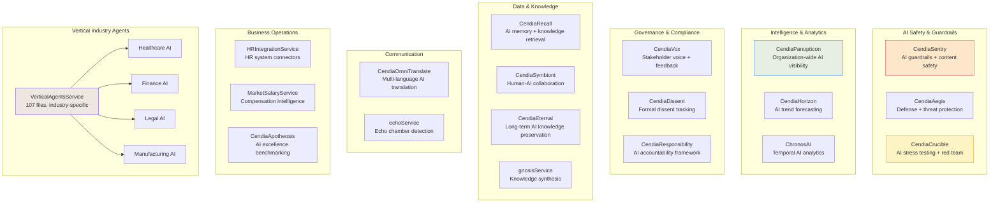
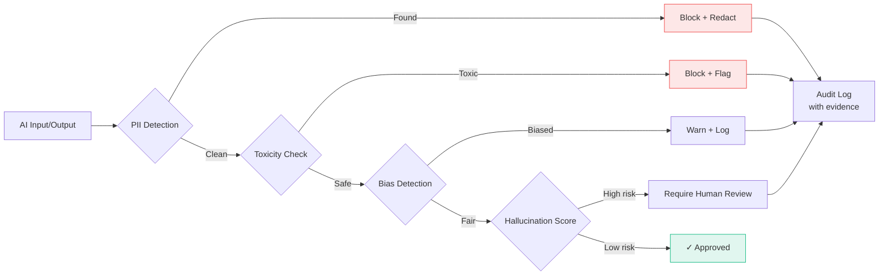
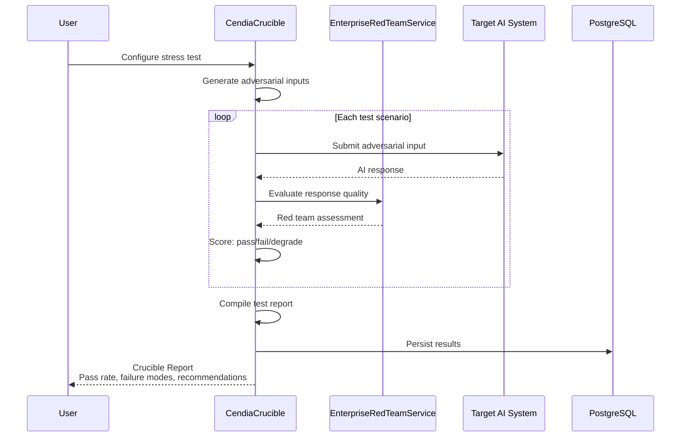
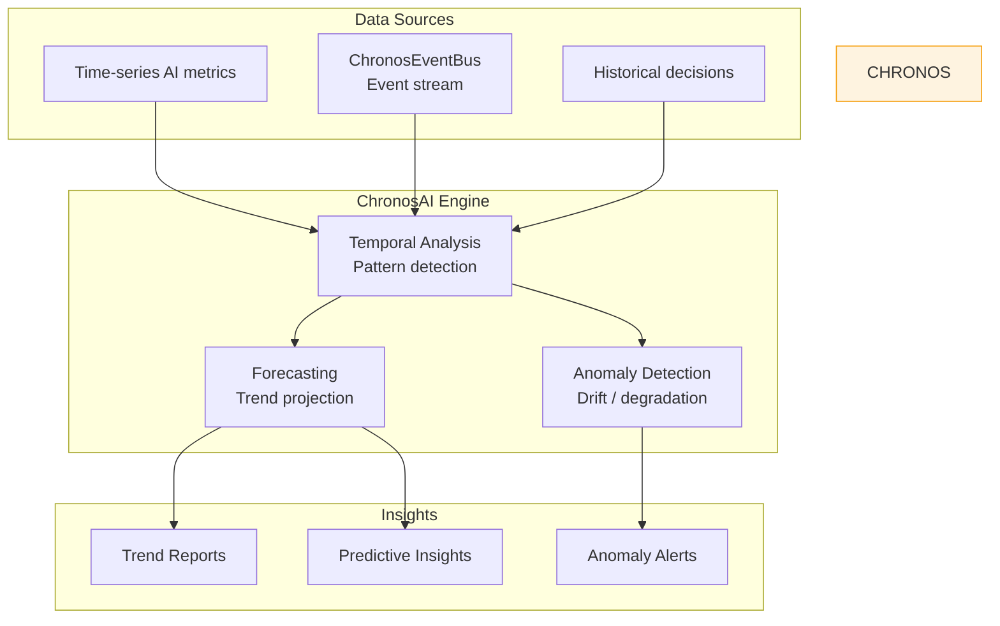

# Cendia Product Services — Architecture & Workflow Diagrams

## 1. Product Services Map

## 2. CendiaSentry — AI Guardrails Pipeline

## 3. CendiaCrucible — AI Stress Testing

## 4. ChronosAI — Temporal Intelligence

