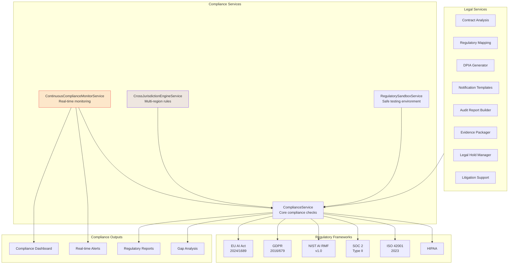
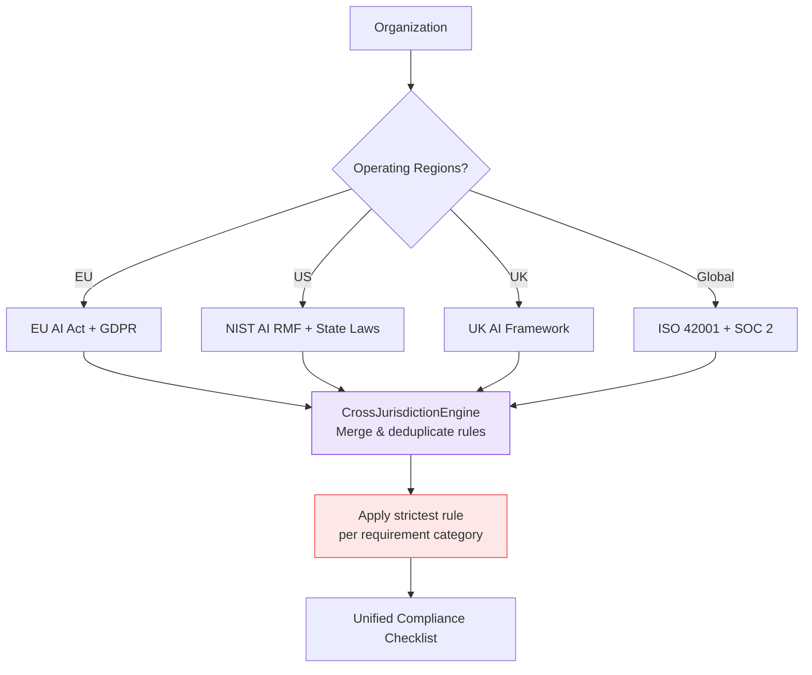

# Compliance & Legal Services — Architecture & Workflow Diagrams

## 1. Compliance Engine Architecture

```mermaid
graph TB
    subgraph Compliance["Compliance Services"]
        CS[ComplianceService<br/>Core compliance checks]
        CCM[ContinuousComplianceMonitorService<br/>Real-time monitoring]
        CJE[CrossJurisdictionEngineService<br/>Multi-region rules]
        RS[RegulatorySandboxService<br/>Safe testing environment]
    end

    subgraph Legal["Legal Services"]
        L1[Contract Analysis]
        L2[Regulatory Mapping]
        L3[DPIA Generator]
        L4[Notification Templates]
        L5[Audit Report Builder]
        L6[Evidence Packager]
        L7[Legal Hold Manager]
        L8[Litigation Support]
    end

    subgraph Frameworks["Regulatory Frameworks"]
        EU[EU AI Act<br/>2024/1689]
        GDPR[GDPR<br/>2016/679]
        NIST[NIST AI RMF<br/>v1.0]
        SOC[SOC 2<br/>Type II]
        ISO[ISO 42001<br/>2023]
        HIPAA[HIPAA]
    end

    subgraph Outputs["Compliance Outputs"]
        DASH[Compliance Dashboard]
        ALERTS[Real-time Alerts]
        REPORTS[Regulatory Reports]
        GAPS[Gap Analysis]
    end

    CS --> EU & GDPR & NIST & SOC & ISO & HIPAA
    CCM --> CS
    CJE --> CS
    CCM --> ALERTS & DASH
    CS --> REPORTS & GAPS
    RS --> CS
    Legal --> CS

    style CCM fill:#ef444420,stroke:#ef4444
    style CJE fill:#7c3aed20,stroke:#7c3aed
```

## 2. Continuous Compliance Monitoring

```mermaid
sequenceDiagram
    participant CCM as ContinuousComplianceMonitor
    participant CS as ComplianceService
    participant CJE as CrossJurisdictionEngine
    participant NS as NotificationService
    participant DB as PostgreSQL

    loop Every monitoring interval
        CCM->>CS: evaluateCompliance(orgState)
        CS->>CJE: getApplicableFrameworks(regions)
        CJE-->>CS: Framework requirements

        loop Each framework
            CS->>CS: Check requirement vs org state
            CS->>CS: Score: compliant/partial/non_compliant
        end

        CS-->>CCM: ComplianceReport

        alt New violations detected
            CCM->>NS: sendAlert(violations)
            NS-->>CCM: Alert sent
        end

        CCM->>DB: persistComplianceState()
    end
```

## 3. Cross-Jurisdiction Resolution

```mermaid
flowchart TD
    ORG[Organization] --> REG{Operating Regions?}
    REG -->|EU| EU_RULES[EU AI Act + GDPR]
    REG -->|US| US_RULES[NIST AI RMF + State Laws]
    REG -->|UK| UK_RULES[UK AI Framework]
    REG -->|Global| GLOBAL[ISO 42001 + SOC 2]

    EU_RULES & US_RULES & UK_RULES & GLOBAL --> MERGE[CrossJurisdictionEngine<br/>Merge & deduplicate rules]

    MERGE --> STRICT[Apply strictest rule<br/>per requirement category]
    STRICT --> UNIFIED[Unified Compliance Checklist]

    style MERGE fill:#7c3aed20,stroke:#7c3aed
    style STRICT fill:#ef444420,stroke:#ef4444
```
