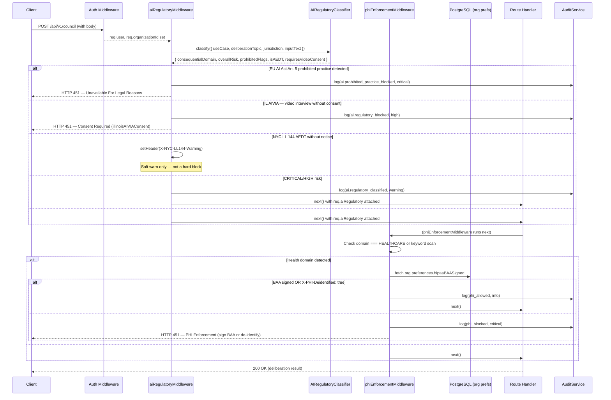
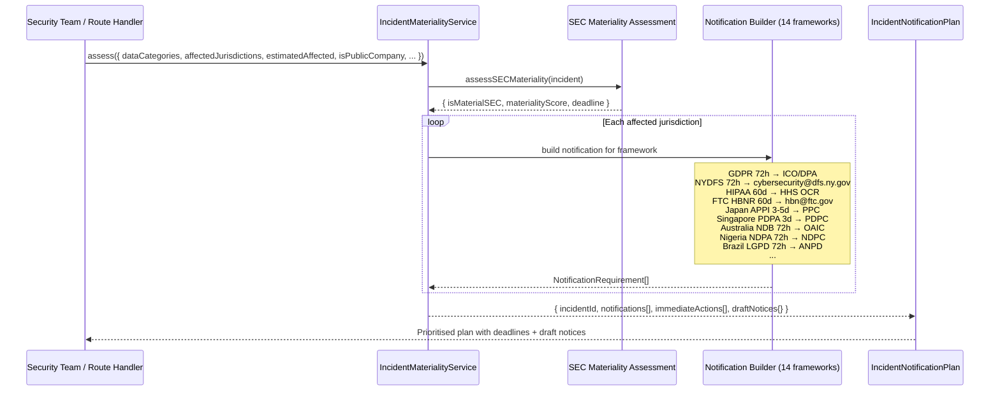
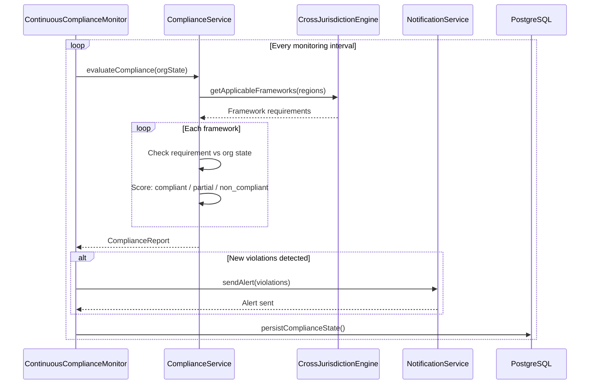

# Compliance & Legal Services — Architecture & Workflow Diagrams

**Last updated:** v0.2.4-alpha — April 2026

---

## 1. Overall Compliance Architecture

```mermaid
graph TB
    subgraph Runtime["Runtime Enforcement (AI Routes)"]
        ARM[aiRegulatoryMiddleware<br/>CO SB 205, NYC LL 144, IL AIVIA<br/>EU AI Act Art. 5, BDSG §26]
        PHI[phiEnforcementMiddleware<br/>HIPAA §164.502 + FTC HBNR 2024]
    end

    subgraph Classifier["AIRegulatoryClassifier"]
        CLS[classify(context)<br/>→ ConsequentialDomain<br/>→ RegulatoryRisk<br/>→ ProhibitedFlags<br/>→ RequiredConsents<br/>→ BiasAuditRequirements]
    end

    subgraph Services["Compliance Services"]
        IMS[IncidentMaterialityService<br/>14-framework breach notification]
        CS[ComplianceService<br/>Core compliance checks]
        CCM[ContinuousComplianceMonitorService<br/>Real-time monitoring]
        CJE[CrossJurisdictionEngineService<br/>Multi-region rules]
    end

    subgraph PrivacyAPI["Privacy API (/api/v1/privacy)"]
        P1[GET /access — GDPR Art. 15]
        P2[DELETE /erasure — GDPR Art. 17]
        P3[POST /appeal-ai-decision — CO SB 205]
        P4[GET /aedt-disclosure — NYC LL 144]
        P5[GET /org-export — EU Data Act Art. 23]
        P6[POST /ai-impact-assessment — CO SB 205 / EU AI Act Art. 9]
        P7[POST /ccpa/limit-sensitive — CPRA §1798.121]
        P8[POST /wa-mhmda-consent — WA MHMDA]
    end

    subgraph Frameworks["Regulatory Frameworks Covered"]
        F1[EU AI Act 2024/1689]
        F2[GDPR / UK GDPR]
        F3[HIPAA + FTC HBNR 2024]
        F4[CO SB 205 / NYC LL 144 / IL AIVIA]
        F5[CPRA / WA MHMDA / TX TDPSA]
        F6[NYDFS 500 / SEC 2023]
        F7[Nigeria NDPA / LGPD / Japan APPI]
        F8[NIST AI RMF / ISO 42001]
    end

    ARM --> CLS
    ARM --> F1 & F4
    PHI --> F3
    CLS --> F1 & F2 & F4
    IMS --> F2 & F3 & F6 & F7
    PrivacyAPI --> CLS
    PrivacyAPI --> F2 & F4 & F5

    style ARM fill:#ef444420,stroke:#ef4444
    style PHI fill:#f9731620,stroke:#f97316
    style CLS fill:#7c3aed20,stroke:#7c3aed
    style IMS fill:#0ea5e920,stroke:#0ea5e9
```

---

## 2. AI Request Regulatory Enforcement Flow



---

## 3. Breach Notification Planning Flow (IncidentMaterialityService)



---

## 4. Privacy Rights Request Flow

```mermaid
flowchart TD
    USER[Authenticated User] --> REQ{Right Exercised}

    REQ -->|Access / Export| ACCESS["GET /access (GDPR Art. 15)\nGET /export (Art. 20)\nGET /org-export (EU Data Act Art. 23)"]
    REQ -->|Erasure| ERASE["DELETE /erasure (GDPR Art. 17 / CCPA §1798.105)\nTriggers RetentionService cascade delete"]
    REQ -->|Rectification| RECT["PATCH /rectify (GDPR Art. 16)\nUpdates user record + audit log"]
    REQ -->|Restriction| RESTR["POST /restrict (GDPR Art. 18)\nSets processingRestricted flag in preferences"]
    REQ -->|AI Decision Appeal| APPEAL["POST /appeal-ai-decision (CO SB 205 §6-1-1703)\n45-day human review SLA\nLogs to audit trail"]
    REQ -->|AEDT Disclosure| AEDT["GET /aedt-disclosure (NYC LL 144)\nMachine-readable notice with opt-out path"]
    REQ -->|AI Impact Assessment| AIA["POST /ai-impact-assessment (CO SB 205 / EU AI Act Art. 9)\nUses AIRegulatoryClassifier to generate\npre-filled assessment template"]
    REQ -->|CCPA Opt-Out| CCPA["POST /ccpa/opt-out (CCPA §1798.120)\nPOST /ccpa/limit-sensitive (CPRA §1798.121)\nUpdates preferences + audit log"]
    REQ -->|Health Consent| HEALTH["POST /wa-mhmda-consent (WA MHMDA RCW 70.02)\nUpdates waHealthDataConsent flag"]
    REQ -->|Profiling Opt-Out| PROFILE["POST /opt-out-profiling (TX/VA/CO/CT/OR)\nScope: all / ai_deliberation / recommendations"]

    ACCESS --> DB[(PostgreSQL)]
    ERASE --> DB
    RECT --> DB
    RESTR --> DB
    APPEAL --> DB
    CCPA --> DB
    HEALTH --> DB
    PROFILE --> DB

    DB --> AUDIT[AuditService.log()]

    style APPEAL fill:#7c3aed20,stroke:#7c3aed
    style HEALTH fill:#0ea5e920,stroke:#0ea5e9
```

---

## 5. Cross-Jurisdiction Resolution

```mermaid
flowchart TD
    ORG[Organization] --> REG{Operating Regions?}
    REG -->|EU/EEA| EU_RULES[EU AI Act + GDPR Art. 33/34<br/>72h to lead DPA]
    REG -->|UK| UK_RULES[UK GDPR + ICO<br/>72h to ICO]
    REG -->|US-NY| NY_RULES[NYDFS 500 §500.17<br/>72h to DFS]
    REG -->|US-CA| CA_RULES[CCPA/CPRA<br/>45d to CA AG if >500 residents]
    REG -->|US (public co.)| SEC_RULES[SEC Form 8-K Item 1.05<br/>4 business days if material]
    REG -->|JP| JP_RULES[Japan APPI<br/>3-5d to PPC]
    REG -->|SG| SG_RULES[Singapore PDPA<br/>3d to PDPC if >500 affected]
    REG -->|AU| AU_RULES[Australia NDB<br/>72h to OAIC]
    REG -->|NG| NG_RULES[Nigeria NDPA<br/>72h to NDPC]
    REG -->|BR| BR_RULES[Brazil LGPD<br/>72h to ANPD]
    REG -->|Global| GLOBAL[ISO 42001 + SOC 2<br/>NIST AI RMF]

    EU_RULES & UK_RULES & NY_RULES & CA_RULES & SEC_RULES & JP_RULES & SG_RULES & AU_RULES & NG_RULES & BR_RULES & GLOBAL --> IMS[IncidentMaterialityService<br/>Merge, sort by deadline, generate plan]

    IMS --> PLAN[Prioritised Notification Plan<br/>Sorted by earliest deadline first]

    style IMS fill:#0ea5e920,stroke:#0ea5e9
    style PLAN fill:#22c55e20,stroke:#22c55e
```

---

## 6. Continuous Compliance Monitoring



---

## 7. Document Library

| Category | Document | Purpose |
|---|---|---|
| **Code** | `AIRegulatoryClassifier.ts` | Runtime AI regulation classifier |
| **Code** | `IncidentMaterialityService.ts` | Multi-framework breach notification planner |
| **Code** | `aiRegulatoryMiddleware.ts` | AI route regulatory enforcement |
| **Code** | `phiEnforcementMiddleware.ts` | PHI before AI enforcement |
| **Code** | `privacy.ts` (routes) | 17 privacy API endpoints |
| **Compliance** | `MASTER-COMPLIANCE-TRACKER.md` | 50+ obligations across all frameworks |
| **Compliance** | `state-ai-laws-implementation.md` | CO SB 205, NYC LL 144, IL AIVIA guide |
| **Compliance** | `nydfs-sec-compliance.md` | NYDFS 500 + SEC disclosure guide |
| **Compliance** | `cmmc-ftc-hbnr.md` | CMMC 2.0 gap assessment + FTC HBNR guide |
| **Compliance** | `eu-data-act-ai-liability.md` | EU Data Act Art. 23 + AI Liability Directive |
| **Compliance** | `germany-bdsg-france-cnil.md` | BDSG works council + CNIL AI guidance |
| **Compliance** | `asia-pacific-supplement-2.md` | Vietnam, Philippines, Taiwan, HK, Malaysia |
| **Compliance** | `nigeria-ndpa.md` | Nigeria NDPA 2023 + Africa overview |
| **Compliance** | `cis-controls-v8.md` | CIS Controls IG1+IG2 mapping |
| **Compliance** | `mitre-attack-mapping.md` | ATT&CK v15 + ATLAS AI threat mapping |
| **Compliance** | `emerging-regulations-watchlist.md` | 15-item forward-looking watch list |
| **ISO 27001** | `iso27001/` directory | ISMS scope, asset register, risk register, SoA |
| **ISO 27001** | `management-review-template.md` | Clause 9.3 management review template |
| **ISO 27001** | `employee-security-training-record.md` | §7.2 training register |
| **NIST** | `nist-ai-rmf/ai-rmf-profile.md` | AI RMF 68% alignment profile |
| **NIST** | `nist-csf2-mapping.md` | CSF 2.0 all-function mapping |
| **Legal** | `dpia-template.md` | GDPR Art. 35 / Quebec Law 25 DPIA |
| **Legal** | `quebec-pia-template.md` | Quebec Law 25 §3.3 PIA template |
| **Legal** | `ropa-record-of-processing-activities.md` | GDPR Art. 30 ROPA |
| **Legal** | `hipaa-baa-template.md` | HIPAA Business Associate Agreement |
| **Legal** | `dpa-signing-guide.md` | DPA checklist for 5 subprocessors |
| **Policy** | `incident-response-policy.md` | IR policy v2.0 — 13-jurisdiction matrix |
| **Vuln Disclosure** | `public/.well-known/security.txt` | NYDFS §500.20 machine-readable policy |
