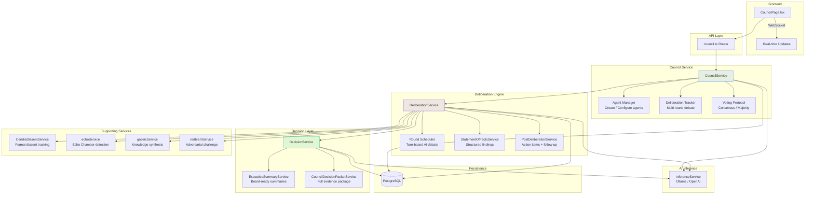
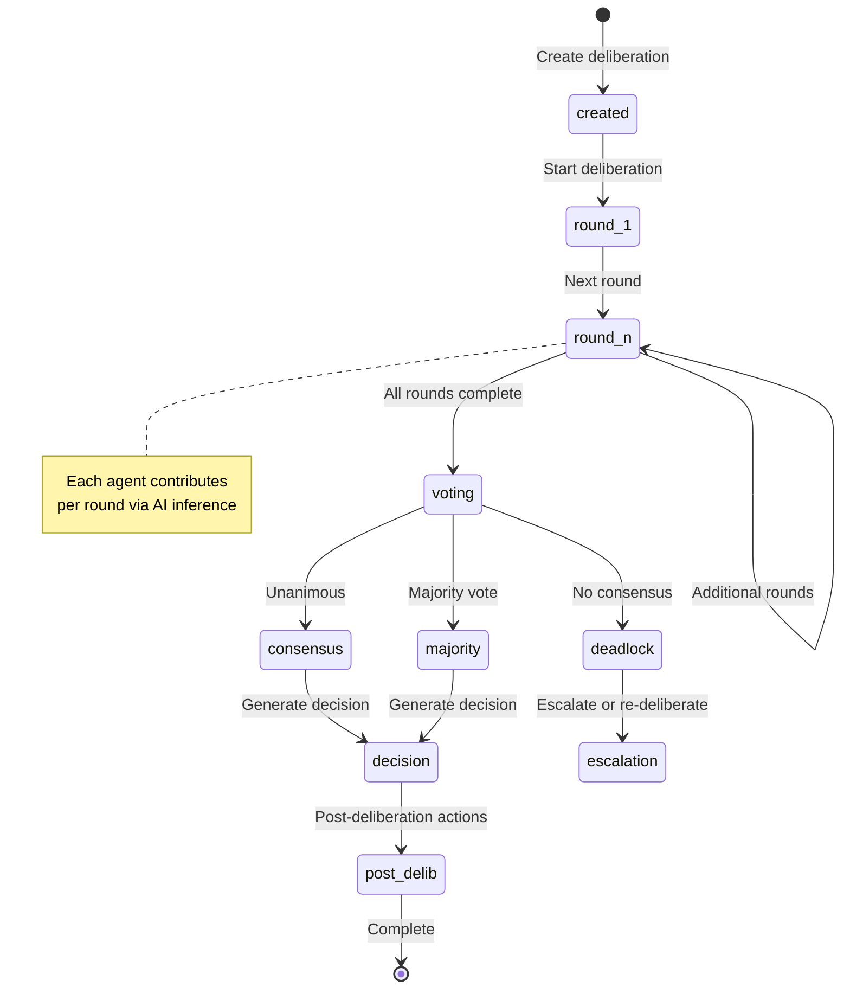
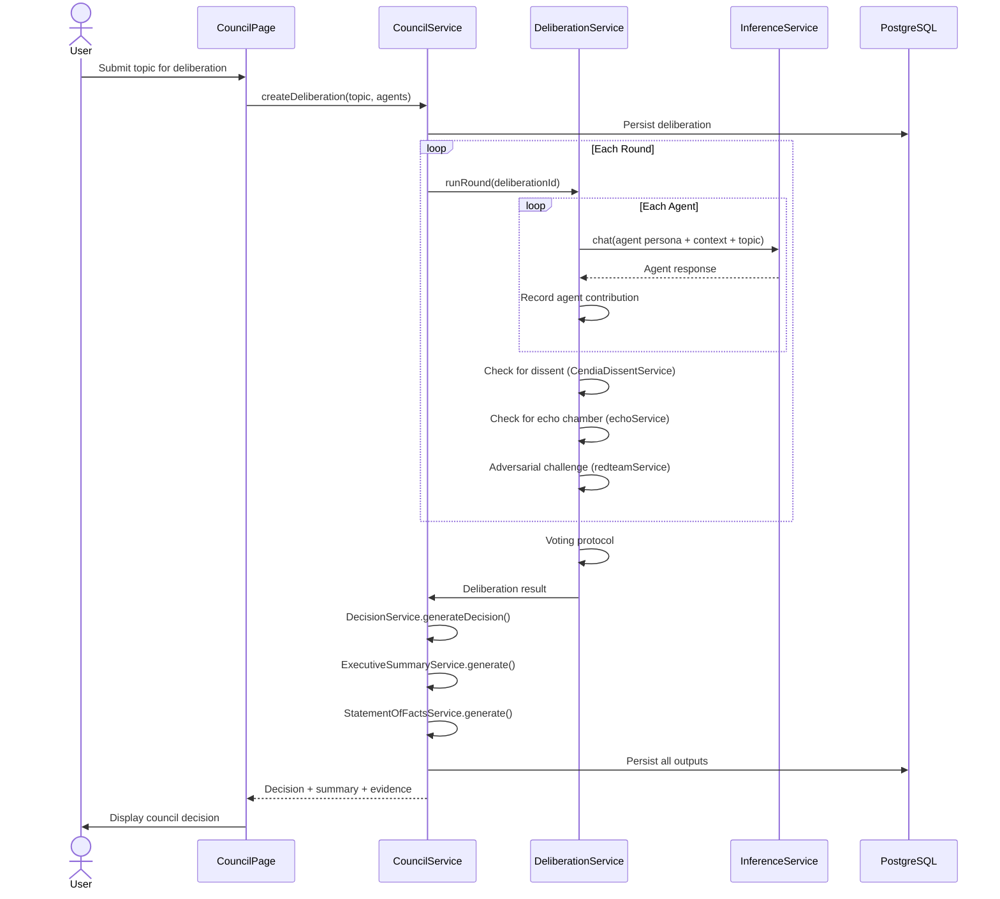

# Council & Deliberation — Architecture & Workflow Diagrams

## 1. Council System Architecture

```mermaid
graph TB
    subgraph Frontend["Frontend"]
        CP[CouncilPage.tsx]
        CP --> |"WebSocket"| RT[Real-time Updates]
    end

    subgraph API["API Layer"]
        CR[council.ts Router]
    end

    subgraph Council["Council Service"]
        CS[CouncilService]
        CS --> AG[Agent Manager<br/>Create / Configure agents]
        CS --> DT[Deliberation Tracker<br/>Multi-round debate]
        CS --> VP[Voting Protocol<br/>Consensus / Majority]
    end

    subgraph Deliberation["Deliberation Engine"]
        DS[DeliberationService]
        DS --> RS[Round Scheduler<br/>Turn-based AI debate]
        DS --> SoF[StatementOfFactsService<br/>Structured findings]
        DS --> PD[PostDeliberationService<br/>Action items + follow-up]
    end

    subgraph Decision["Decision Layer"]
        DEC[DecisionService]
        DEC --> EX[ExecutiveSummaryService<br/>Board-ready summaries]
        DEC --> CDP[CouncilDecisionPacketService<br/>Full evidence package]
    end

    subgraph Support["Supporting Services"]
        DIS[CendiaDissentService<br/>Formal dissent tracking]
        ES[echoService<br/>Echo Chamber detection]
        GN[gnosisService<br/>Knowledge synthesis]
        RT2[redteamService<br/>Adversarial challenge]
    end

    subgraph AI["AI Inference"]
        INF[InferenceService<br/>Ollama / OpenAI]
    end

    subgraph DB["Persistence"]
        PG[(PostgreSQL)]
    end

    CP --> CR --> CS
    CS --> DS --> DEC
    DS --> DIS & ES & GN & RT2
    CS & DS & DEC --> INF
    CS & DS & DEC --> PG

    style CS fill:#3b82f620,stroke:#3b82f6
    style DS fill:#7c3aed20,stroke:#7c3aed
    style DEC fill:#10b98120,stroke:#10b981
```

## 2. Deliberation Lifecycle

```mermaid
stateDiagram-v2
    [*] --> created: Create deliberation
    created --> round_1: Start deliberation
    round_1 --> round_n: Next round
    round_n --> round_n: Additional rounds
    round_n --> voting: All rounds complete
    voting --> consensus: Unanimous
    voting --> majority: Majority vote
    voting --> deadlock: No consensus
    consensus --> decision: Generate decision
    majority --> decision: Generate decision
    deadlock --> escalation: Escalate or re-deliberate
    decision --> post_delib: Post-deliberation actions
    post_delib --> [*]: Complete

    note right of round_n
        Each agent contributes
        per round via AI inference
    end note
```

## 3. Deliberation Sequence

```mermaid
sequenceDiagram
    actor User
    participant UI as CouncilPage
    participant CS as CouncilService
    participant DS as DeliberationService
    participant AI as InferenceService
    participant DB as PostgreSQL

    User->>UI: Submit topic for deliberation
    UI->>CS: createDeliberation(topic, agents)
    CS->>DB: Persist deliberation

    loop Each Round
        CS->>DS: runRound(deliberationId)
        loop Each Agent
            DS->>AI: chat(agent persona + context + topic)
            AI-->>DS: Agent response
            DS->>DS: Record agent contribution
        end
        DS->>DS: Check for dissent (CendiaDissentService)
        DS->>DS: Check for echo chamber (echoService)
        DS->>DS: Adversarial challenge (redteamService)
    end

    DS->>DS: Voting protocol
    DS->>CS: Deliberation result

    CS->>CS: DecisionService.generateDecision()
    CS->>CS: ExecutiveSummaryService.generate()
    CS->>CS: StatementOfFactsService.generate()
    CS->>DB: Persist all outputs

    CS-->>UI: Decision + summary + evidence
    UI->>User: Display council decision
```
