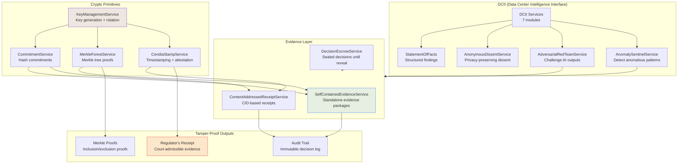
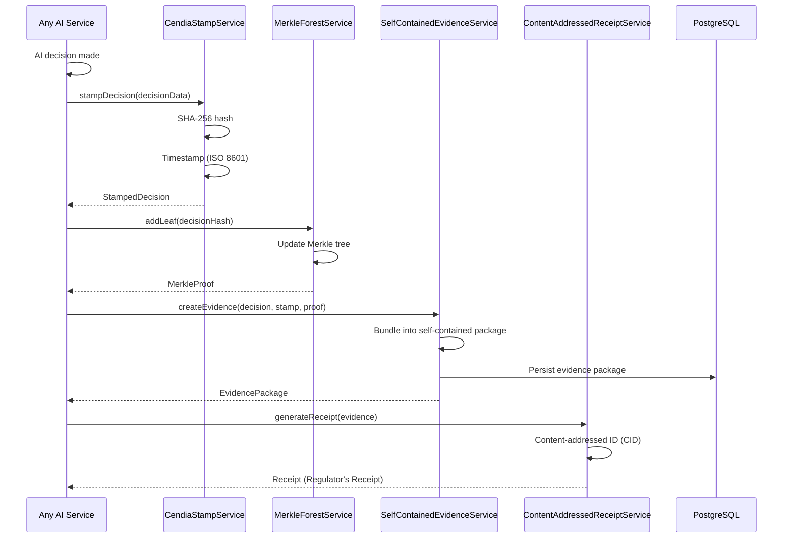
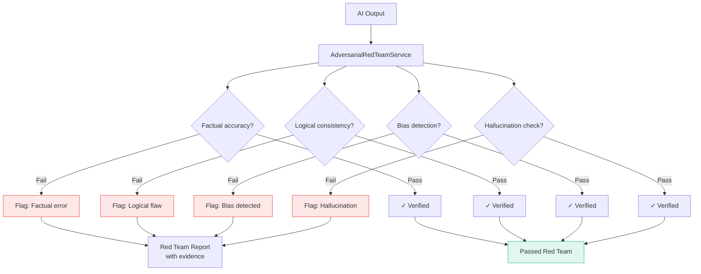

# Cryptographic Evidence & DCII — Architecture & Workflow Diagrams

## 1. Crypto Services Architecture

```mermaid
graph TB
    subgraph CryptoCore["Crypto Primitives"]
        KMS[KeyManagementService<br/>Key generation + rotation]
        COMMIT[CommitmentService<br/>Hash commitments]
        MERKLE[MerkleForestService<br/>Merkle tree proofs]
        STAMP[CendiaStampService<br/>Timestamping + attestation]
    end

    subgraph Evidence["Evidence Layer"]
        SCE[SelfContainedEvidenceService<br/>Standalone evidence packages]
        CAR[ContentAddressedReceiptService<br/>CID-based receipts]
        DE[DecisionEscrowService<br/>Sealed decisions until reveal]
    end

    subgraph DCII["DCII (Data Center Intelligence Interface)"]
        DCII_SVC[DCII Services<br/>7 modules]
        SoF[StatementOfFacts<br/>Structured findings]
        AD[AnonymousDissentService<br/>Privacy-preserving dissent]
        ART[AdversarialRedTeamService<br/>Challenge AI outputs]
        AS[AnomalySentinelService<br/>Detect anomalous patterns]
    end

    subgraph Output["Tamper-Proof Outputs"]
        REG[Regulator's Receipt<br/>Court-admissible evidence]
        AUDIT[Audit Trail<br/>Immutable decision log]
        PROOF[Merkle Proofs<br/>Inclusion/exclusion proofs]
    end

    KMS --> COMMIT & MERKLE & STAMP
    COMMIT --> SCE & CAR
    MERKLE --> SCE & PROOF
    STAMP --> CAR & REG
    SCE & CAR --> AUDIT
    DE --> Evidence
    DCII_SVC --> SoF & AD & ART & AS
    ART & AS --> Evidence

    style KMS fill:#7c3aed20,stroke:#7c3aed
    style SCE fill:#3b82f620,stroke:#3b82f6
    style REG fill:#ef444420,stroke:#ef4444
```

## 2. Evidence Generation Flow

```mermaid
sequenceDiagram
    participant SVC as Any AI Service
    participant STAMP as CendiaStampService
    participant MERKLE as MerkleForestService
    participant SCE as SelfContainedEvidenceService
    participant CAR as ContentAddressedReceiptService
    participant DB as PostgreSQL

    SVC->>SVC: AI decision made
    SVC->>STAMP: stampDecision(decisionData)
    STAMP->>STAMP: SHA-256 hash
    STAMP->>STAMP: Timestamp (ISO 8601)
    STAMP-->>SVC: StampedDecision

    SVC->>MERKLE: addLeaf(decisionHash)
    MERKLE->>MERKLE: Update Merkle tree
    MERKLE-->>SVC: MerkleProof

    SVC->>SCE: createEvidence(decision, stamp, proof)
    SCE->>SCE: Bundle into self-contained package
    SCE->>DB: Persist evidence package
    SCE-->>SVC: EvidencePackage

    SVC->>CAR: generateReceipt(evidence)
    CAR->>CAR: Content-addressed ID (CID)
    CAR-->>SVC: Receipt (Regulator's Receipt)
```

## 3. Adversarial Red Team Flow

```mermaid
flowchart TD
    INPUT[AI Output] --> RT[AdversarialRedTeamService]
    RT --> C1{Factual accuracy?}
    RT --> C2{Logical consistency?}
    RT --> C3{Bias detection?}
    RT --> C4{Hallucination check?}

    C1 -->|Fail| F1[Flag: Factual error]
    C1 -->|Pass| P1[✓ Verified]

    C2 -->|Fail| F2[Flag: Logical flaw]
    C2 -->|Pass| P2[✓ Verified]

    C3 -->|Fail| F3[Flag: Bias detected]
    C3 -->|Pass| P3[✓ Verified]

    C4 -->|Fail| F4[Flag: Hallucination]
    C4 -->|Pass| P4[✓ Verified]

    F1 & F2 & F3 & F4 --> REPORT[Red Team Report<br/>with evidence]
    P1 & P2 & P3 & P4 --> PASS[Passed Red Team]

    style F1 fill:#ef444420,stroke:#ef4444
    style F2 fill:#ef444420,stroke:#ef4444
    style F3 fill:#ef444420,stroke:#ef4444
    style F4 fill:#ef444420,stroke:#ef4444
    style PASS fill:#10b98120,stroke:#10b981
```
