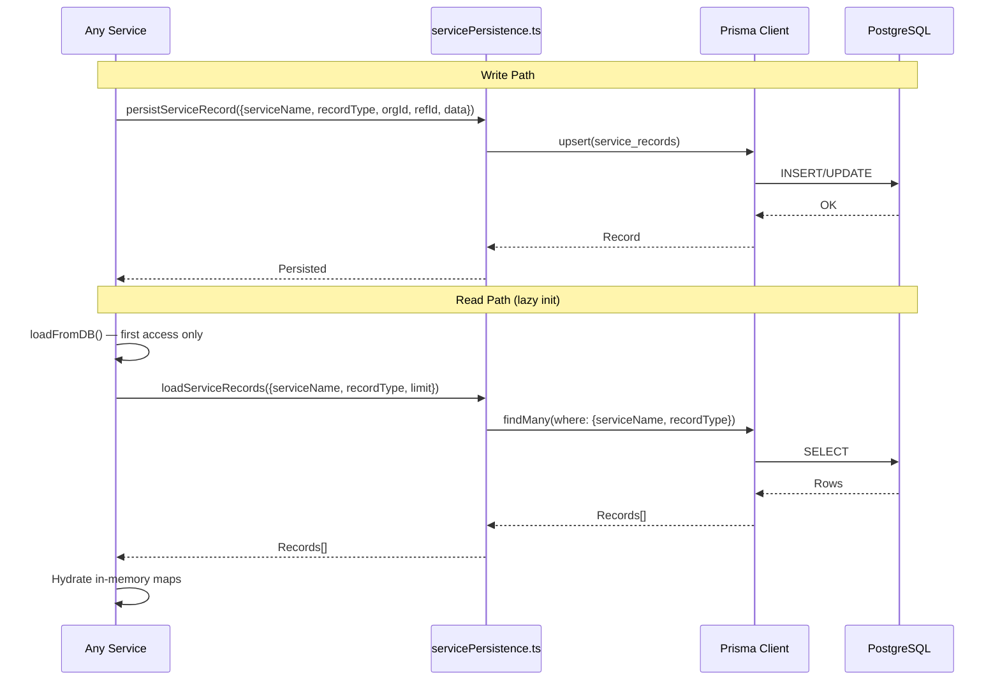
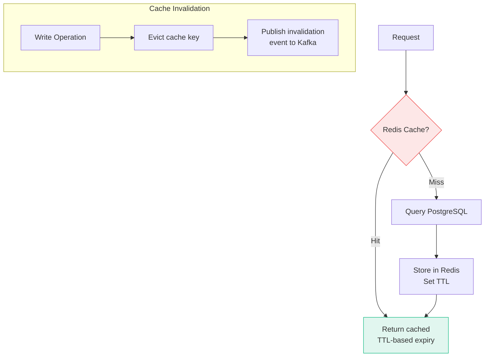
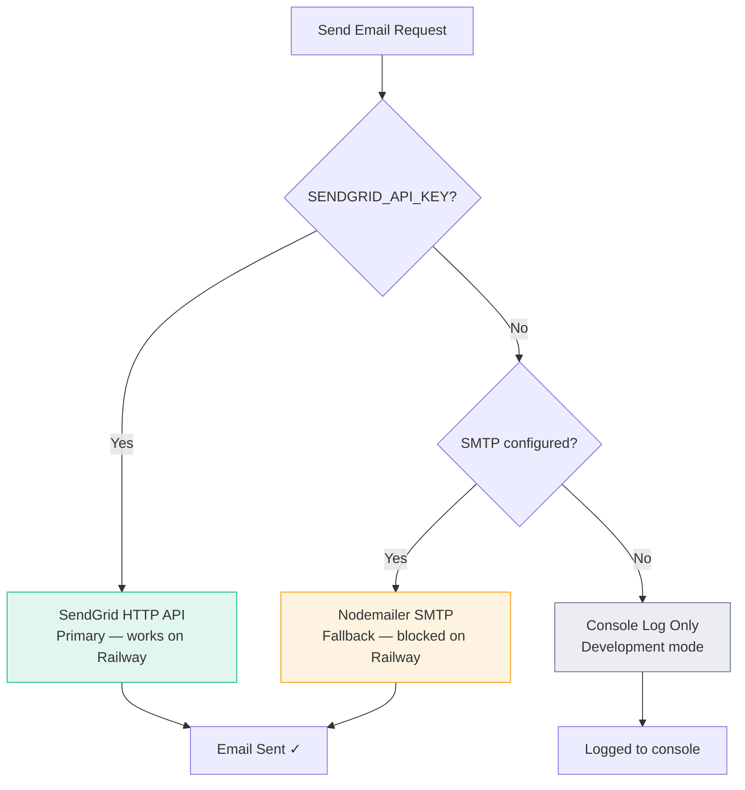
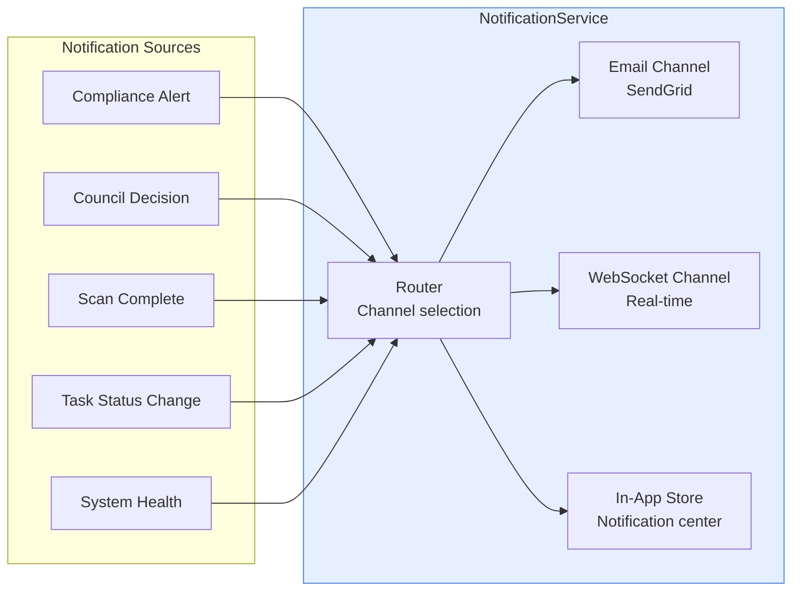

# Data & Infrastructure — Architecture & Workflow Diagrams

## 1. Data Layer Architecture

```mermaid
graph TB
    subgraph Storage["Storage Services"]
        PG[(PostgreSQL<br/>Prisma ORM)]
        REDIS[RedisCacheService<br/>Hot data cache]
        VECTOR[VectorDB Service<br/>Embedding search]
        OBJ[Object Storage<br/>Files + artifacts]
    end

    subgraph Ingestion["Data Ingestion"]
        GRAPH[graphIngestion<br/>Knowledge graph builder]
        DOC[DocumentService<br/>PDF/text processing]
        SAMPLE[SampleDataService<br/>Demo data seeding]
    end

    subgraph Streaming["Event Streaming"]
        KAFKA[KafkaService<br/>Event bus (4 modules)]
        DRUID[DruidEventStream<br/>Real-time analytics]
        CHRONOS_EB[ChronosEventBus<br/>Temporal events]
        STREAM[StreamingService<br/>WebSocket feeds]
    end

    subgraph Persistence["Service Persistence"]
        SP[servicePersistence.ts<br/>Generic record store]
        SP --> |"persistServiceRecord()"| PG
        SP --> |"loadServiceRecords()"| PG
    end

    subgraph Backup["Backup & Recovery"]
        BK[BackupService<br/>Scheduled backups]
        BK --> PG
    end

    GRAPH --> PG & VECTOR
    DOC --> VECTOR & OBJ
    KAFKA --> DRUID & CHRONOS_EB

    style PG fill:#10b98120,stroke:#10b981
    style REDIS fill:#ef444420,stroke:#ef4444
    style VECTOR fill:#7c3aed20,stroke:#7c3aed
    style KAFKA fill:#f59e0b20,stroke:#f59e0b
```

## 2. Service Persistence Pattern



## 3. Caching Strategy



## 4. Email Service Architecture



## 5. Notification Service


