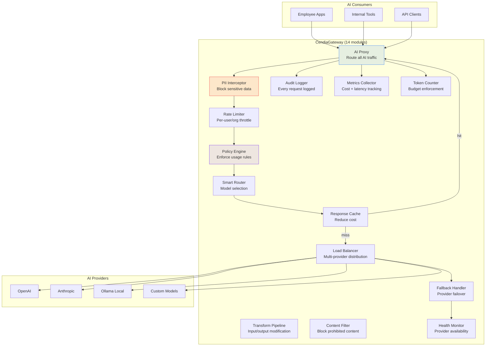
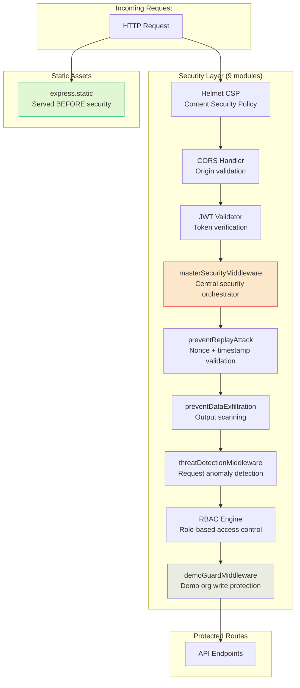
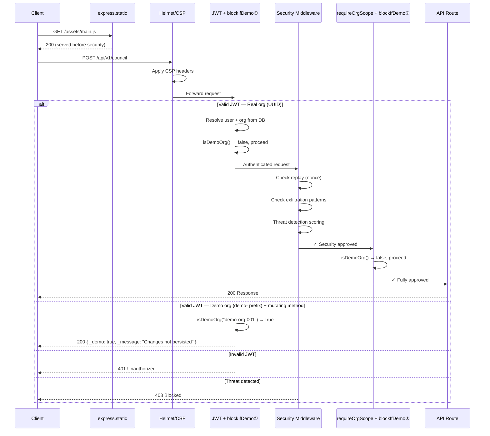
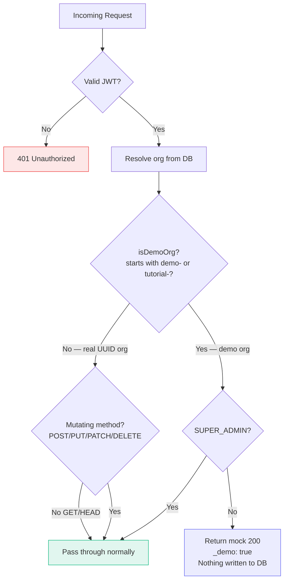
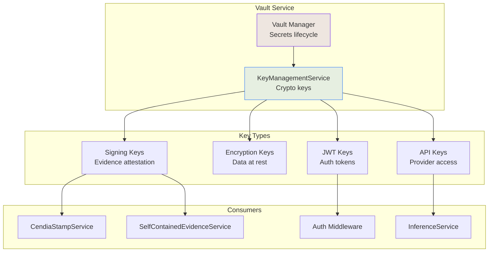

# Gateway & Security — Architecture & Workflow Diagrams

## 1. Gateway Architecture

## 2. Security Services Architecture

## 3. Request Security Flow

## 5. Demo Guard — Tenant Protection Flow

## 4. Vault & Key Management

