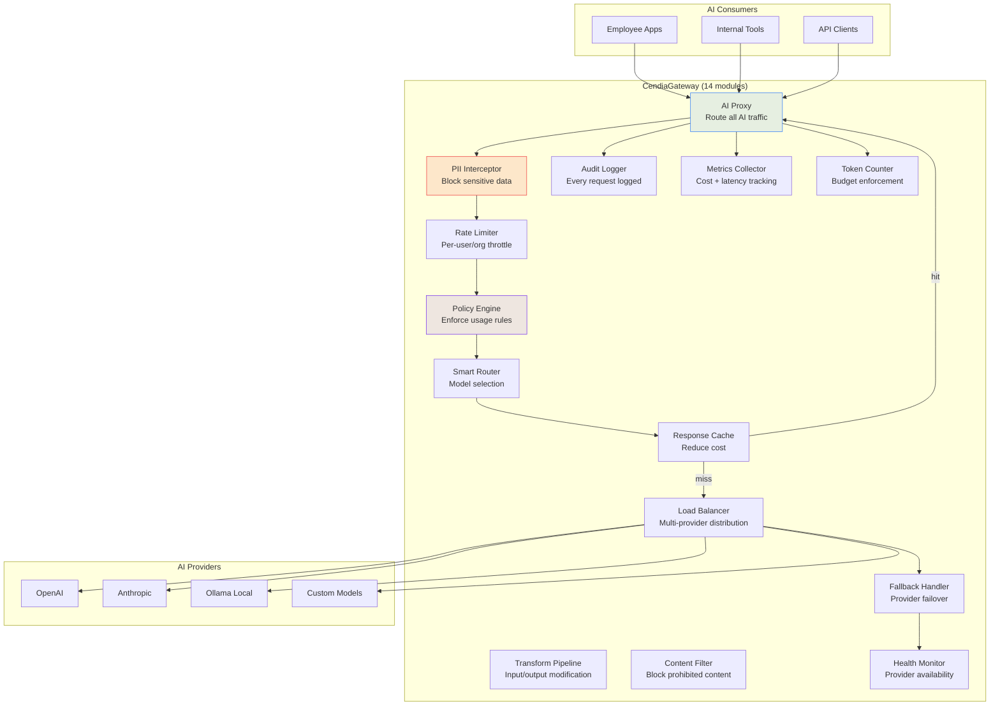
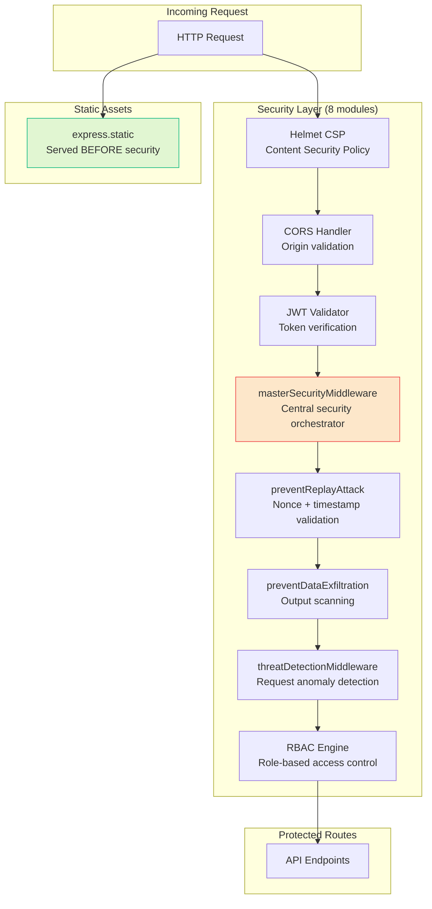
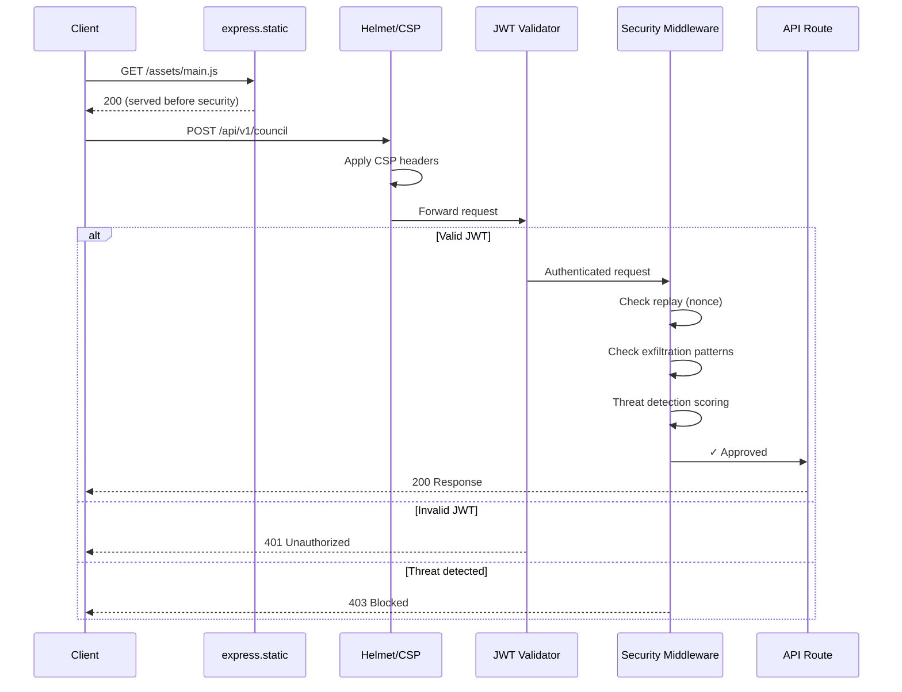
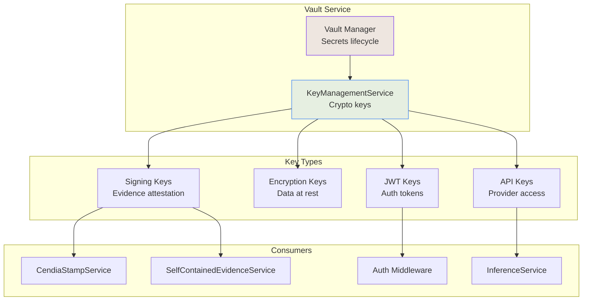

# Gateway & Security — Architecture & Workflow Diagrams

## 1. Gateway Architecture

```mermaid
graph TB
    subgraph Gateway["CendiaGateway (14 modules)"]
        PROXY[AI Proxy<br/>Route all AI traffic]
        PII[PII Interceptor<br/>Block sensitive data]
        RATE[Rate Limiter<br/>Per-user/org throttle]
        AUDIT[Audit Logger<br/>Every request logged]
        POLICY[Policy Engine<br/>Enforce usage rules]
        ROUTE[Smart Router<br/>Model selection]
        CACHE[Response Cache<br/>Reduce cost]
        TRANS[Transform Pipeline<br/>Input/output modification]
        METRIC[Metrics Collector<br/>Cost + latency tracking]
        TOKEN[Token Counter<br/>Budget enforcement]
        FILTER[Content Filter<br/>Block prohibited content]
        FALLBACK[Fallback Handler<br/>Provider failover]
        LOAD[Load Balancer<br/>Multi-provider distribution]
        HEALTH[Health Monitor<br/>Provider availability]
    end

    subgraph Clients["AI Consumers"]
        EMP[Employee Apps]
        INT[Internal Tools]
        API_C[API Clients]
    end

    subgraph Providers["AI Providers"]
        P1[OpenAI]
        P2[Anthropic]
        P3[Ollama Local]
        P4[Custom Models]
    end

    EMP & INT & API_C --> PROXY
    PROXY --> PII --> RATE --> POLICY --> ROUTE
    ROUTE --> CACHE
    CACHE -->|miss| LOAD --> P1 & P2 & P3 & P4
    CACHE -->|hit| PROXY
    LOAD --> FALLBACK --> HEALTH
    PROXY --> AUDIT & METRIC & TOKEN

    style PROXY fill:#3b82f620,stroke:#3b82f6
    style PII fill:#ef444420,stroke:#ef4444
    style POLICY fill:#7c3aed20,stroke:#7c3aed
```

## 2. Security Services Architecture

```mermaid
graph TB
    subgraph Security["Security Layer (8 modules)"]
        MASTER[masterSecurityMiddleware<br/>Central security orchestrator]
        REPLAY[preventReplayAttack<br/>Nonce + timestamp validation]
        EXFIL[preventDataExfiltration<br/>Output scanning]
        THREAT[threatDetectionMiddleware<br/>Request anomaly detection]
        RBAC[RBAC Engine<br/>Role-based access control]
        JWT_V[JWT Validator<br/>Token verification]
        CORS_V[CORS Handler<br/>Origin validation]
        HELMET[Helmet CSP<br/>Content Security Policy]
    end

    subgraph Request["Incoming Request"]
        REQ[HTTP Request]
    end

    subgraph Static["Static Assets"]
        ASSETS[express.static<br/>Served BEFORE security]
    end

    subgraph Protected["Protected Routes"]
        API[API Endpoints]
    end

    REQ --> ASSETS
    REQ --> HELMET --> CORS_V --> JWT_V --> MASTER
    MASTER --> REPLAY --> EXFIL --> THREAT --> RBAC --> API

    style MASTER fill:#ef444420,stroke:#ef4444
    style ASSETS fill:#10b98120,stroke:#10b981
```

## 3. Request Security Flow

```mermaid
sequenceDiagram
    participant Client
    participant Static as express.static
    participant Helmet as Helmet/CSP
    participant Auth as JWT Validator
    participant Sec as Security Middleware
    participant Route as API Route

    Client->>Static: GET /assets/main.js
    Static-->>Client: 200 (served before security)

    Client->>Helmet: POST /api/v1/council
    Helmet->>Helmet: Apply CSP headers
    Helmet->>Auth: Forward request

    alt Valid JWT
        Auth->>Sec: Authenticated request
        Sec->>Sec: Check replay (nonce)
        Sec->>Sec: Check exfiltration patterns
        Sec->>Sec: Threat detection scoring
        Sec->>Route: ✓ Approved
        Route-->>Client: 200 Response
    else Invalid JWT
        Auth-->>Client: 401 Unauthorized
    else Threat detected
        Sec-->>Client: 403 Blocked
    end
```

## 4. Vault & Key Management

```mermaid
graph TB
    subgraph Vault["Vault Service"]
        VS[Vault Manager<br/>Secrets lifecycle]
        KMS[KeyManagementService<br/>Crypto keys]
    end

    subgraph Keys["Key Types"]
        SIGN[Signing Keys<br/>Evidence attestation]
        ENC[Encryption Keys<br/>Data at rest]
        JWT_K[JWT Keys<br/>Auth tokens]
        API_K[API Keys<br/>Provider access]
    end

    subgraph Consumers["Consumers"]
        STAMP[CendiaStampService]
        SCE[SelfContainedEvidenceService]
        AUTH[Auth Middleware]
        INF[InferenceService]
    end

    VS --> KMS
    KMS --> SIGN & ENC & JWT_K & API_K
    SIGN --> STAMP & SCE
    JWT_K --> AUTH
    API_K --> INF

    style VS fill:#7c3aed20,stroke:#7c3aed
    style KMS fill:#3b82f620,stroke:#3b82f6
```
