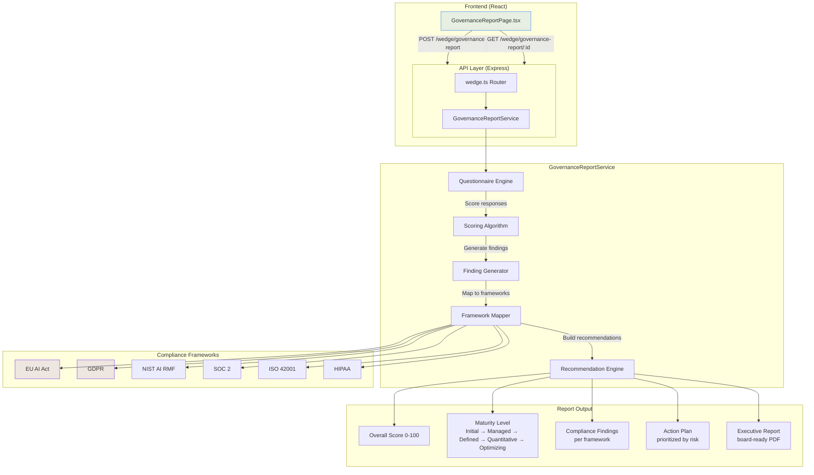
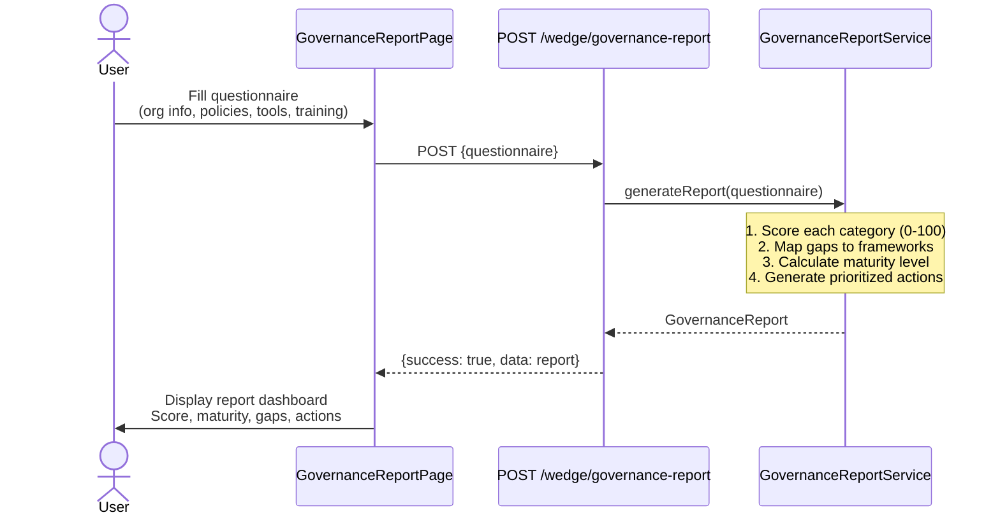

# AI Governance Report — Architecture & Workflow Diagrams

## 1. System Architecture

```mermaid
graph TB
    subgraph Frontend["Frontend (React)"]
        GRP[GovernanceReportPage.tsx]
        GRP --> |"POST /wedge/governance-report"| API
        GRP --> |"GET /wedge/governance-report/:id"| API
    end

    subgraph API["API Layer (Express)"]
        R["wedge.ts Router"]
        R --> GRS[GovernanceReportService]
    end

    subgraph Service["GovernanceReportService"]
        GRS --> QE[Questionnaire Engine]
        QE --> |"Score responses"| SA[Scoring Algorithm]
        SA --> |"Generate findings"| FG[Finding Generator]
        FG --> |"Map to frameworks"| FM[Framework Mapper]
        FM --> |"Build recommendations"| REC[Recommendation Engine]
    end

    subgraph Frameworks["Compliance Frameworks"]
        F1[EU AI Act]
        F2[GDPR]
        F3[NIST AI RMF]
        F4[SOC 2]
        F5[ISO 42001]
        F6[HIPAA]
    end

    subgraph Output["Report Output"]
        OS[Overall Score 0-100]
        MS[Maturity Level<br/>Initial → Managed → Defined → Quantitative → Optimizing]
        CF[Compliance Findings<br/>per framework]
        AP[Action Plan<br/>prioritized by risk]
        ER[Executive Report<br/>board-ready PDF]
    end

    FM --> F1 & F2 & F3 & F4 & F5 & F6
    REC --> OS & MS & CF & AP & ER

    style GRP fill:#3b82f620,stroke:#3b82f6
    style F1 fill:#7c3aed20,stroke:#7c3aed
    style F2 fill:#7c3aed20,stroke:#7c3aed
```

## 2. Report Generation Workflow

```mermaid
sequenceDiagram
    actor User
    participant UI as GovernanceReportPage
    participant API as POST /wedge/governance-report
    participant SVC as GovernanceReportService

    User->>UI: Fill questionnaire<br/>(org info, policies, tools, training)
    UI->>API: POST {questionnaire}
    API->>SVC: generateReport(questionnaire)

    Note over SVC: 1. Score each category (0-100)<br/>2. Map gaps to frameworks<br/>3. Calculate maturity level<br/>4. Generate prioritized actions

    SVC-->>API: GovernanceReport
    API-->>UI: {success: true, data: report}

    UI->>User: Display report dashboard<br/>Score, maturity, gaps, actions
```
