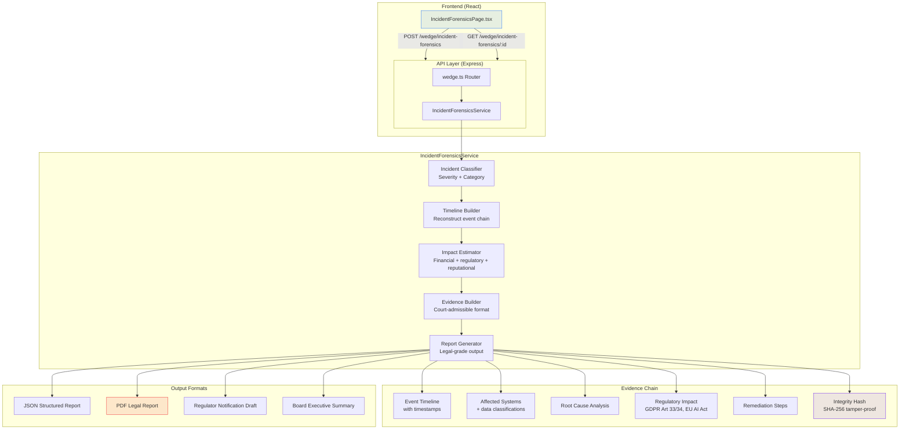
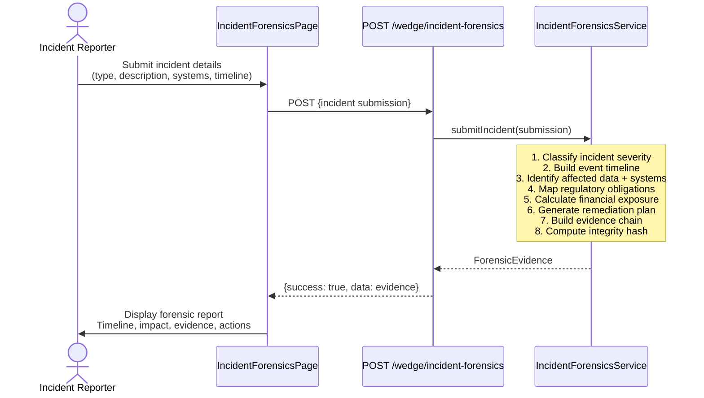
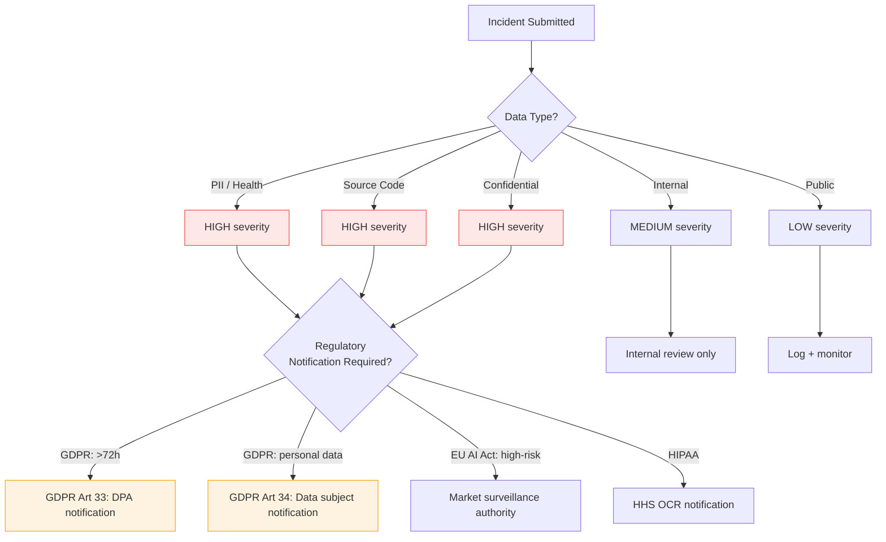

# AI Incident Forensics — Architecture & Workflow Diagrams

## 1. System Architecture

```mermaid
graph TB
    subgraph Frontend["Frontend (React)"]
        IFP[IncidentForensicsPage.tsx]
        IFP --> |"POST /wedge/incident-forensics"| API
        IFP --> |"GET /wedge/incident-forensics/:id"| API
    end

    subgraph API["API Layer (Express)"]
        R["wedge.ts Router"]
        R --> IFS[IncidentForensicsService]
    end

    subgraph Service["IncidentForensicsService"]
        IFS --> IC[Incident Classifier<br/>Severity + Category]
        IC --> TL[Timeline Builder<br/>Reconstruct event chain]
        TL --> IE[Impact Estimator<br/>Financial + regulatory + reputational]
        IE --> EB[Evidence Builder<br/>Court-admissible format]
        EB --> RG[Report Generator<br/>Legal-grade output]
    end

    subgraph Evidence["Evidence Chain"]
        E1[Event Timeline<br/>with timestamps]
        E2[Affected Systems<br/>+ data classifications]
        E3[Root Cause Analysis]
        E4[Regulatory Impact<br/>GDPR Art 33/34, EU AI Act]
        E5[Remediation Steps]
        E6[Integrity Hash<br/>SHA-256 tamper-proof]
    end

    subgraph OutputFormats["Output Formats"]
        OF1[JSON Structured Report]
        OF2[PDF Legal Report]
        OF3[Regulator Notification Draft]
        OF4[Board Executive Summary]
    end

    RG --> E1 & E2 & E3 & E4 & E5 & E6
    RG --> OF1 & OF2 & OF3 & OF4

    style IFP fill:#3b82f620,stroke:#3b82f6
    style E6 fill:#7c3aed20,stroke:#7c3aed
    style OF2 fill:#ef444420,stroke:#ef4444
```

## 2. Incident Analysis Workflow

```mermaid
sequenceDiagram
    actor User as Incident Reporter
    participant UI as IncidentForensicsPage
    participant API as POST /wedge/incident-forensics
    participant SVC as IncidentForensicsService

    User->>UI: Submit incident details<br/>(type, description, systems, timeline)
    UI->>API: POST {incident submission}
    API->>SVC: submitIncident(submission)

    Note over SVC: 1. Classify incident severity<br/>2. Build event timeline<br/>3. Identify affected data + systems<br/>4. Map regulatory obligations<br/>5. Calculate financial exposure<br/>6. Generate remediation plan<br/>7. Build evidence chain<br/>8. Compute integrity hash

    SVC-->>API: ForensicEvidence
    API-->>UI: {success: true, data: evidence}

    UI->>User: Display forensic report<br/>Timeline, impact, evidence, actions
```

## 3. Incident Severity Classification

```mermaid
flowchart TD
    I[Incident Submitted] --> C{Data Type?}

    C -->|PII / Health| S1[HIGH severity]
    C -->|Source Code| S2[HIGH severity]
    C -->|Confidential| S3[HIGH severity]
    C -->|Internal| S4[MEDIUM severity]
    C -->|Public| S5[LOW severity]

    S1 & S2 & S3 --> R1{Regulatory<br/>Notification Required?}
    R1 -->|GDPR: >72h| N1[GDPR Art 33: DPA notification]
    R1 -->|GDPR: personal data| N2[GDPR Art 34: Data subject notification]
    R1 -->|EU AI Act: high-risk| N3[Market surveillance authority]
    R1 -->|HIPAA| N4[HHS OCR notification]

    S4 --> R2[Internal review only]
    S5 --> R3[Log + monitor]

    style S1 fill:#ef444420,stroke:#ef4444
    style S2 fill:#ef444420,stroke:#ef4444
    style S3 fill:#ef444420,stroke:#ef4444
    style N1 fill:#f59e0b20,stroke:#f59e0b
    style N2 fill:#f59e0b20,stroke:#f59e0b
```
