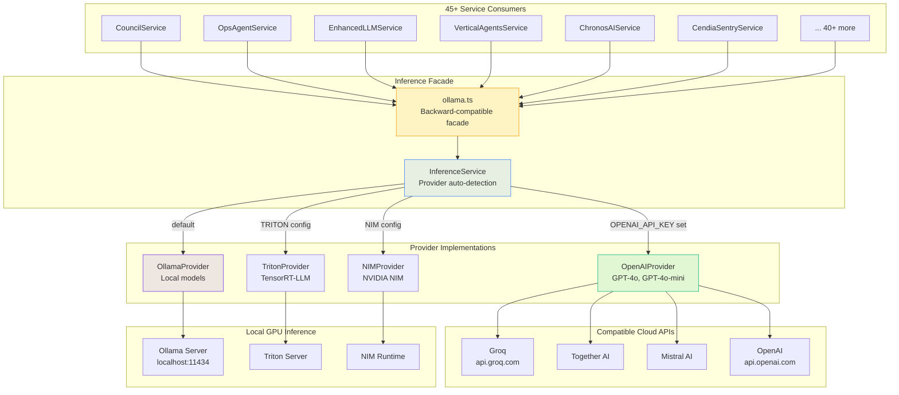
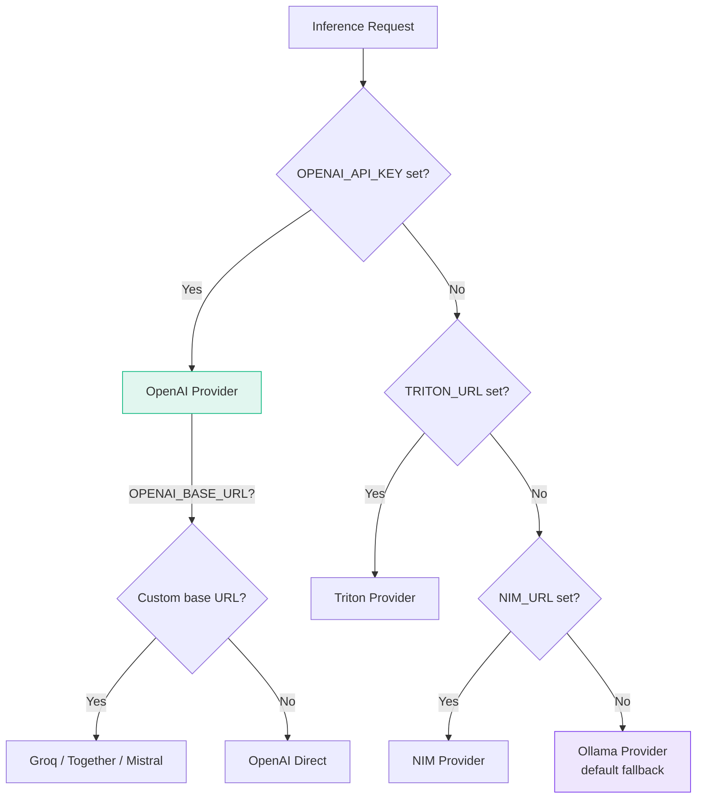
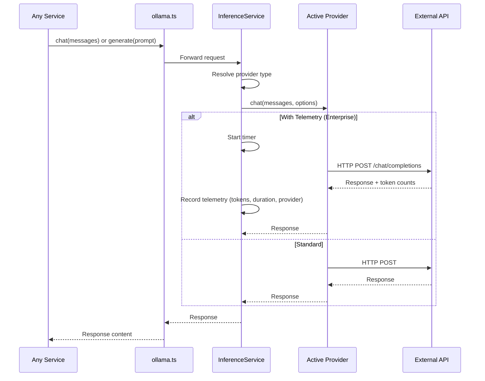
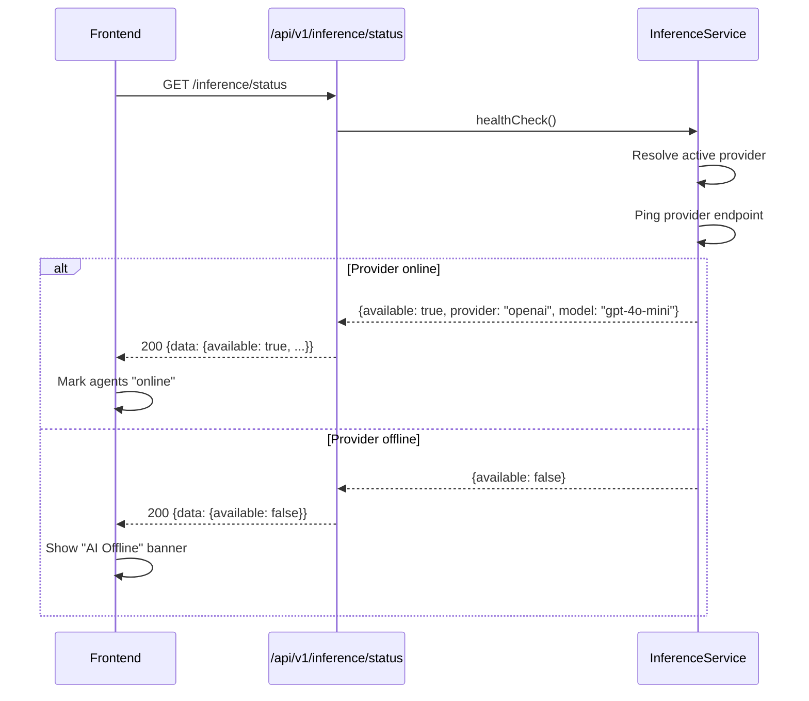

# Inference Layer — Architecture & Workflow Diagrams

## 1. Multi-Provider Inference Architecture

```mermaid
graph TB
    subgraph Consumers["45+ Service Consumers"]
        C1[CouncilService]
        C2[OpsAgentService]
        C3[EnhancedLLMService]
        C4[VerticalAgentsService]
        C5[ChronosAIService]
        C6[CendiaSentryService]
        CN[... 40+ more]
    end

    subgraph Facade["Inference Facade"]
        OL[ollama.ts<br/>Backward-compatible facade]
        OL --> IS[InferenceService<br/>Provider auto-detection]
    end

    subgraph Providers["Provider Implementations"]
        IS --> |"OPENAI_API_KEY set"| OAI[OpenAIProvider<br/>GPT-4o, GPT-4o-mini]
        IS --> |"default"| OLLAMA[OllamaProvider<br/>Local models]
        IS --> |"TRITON config"| TRITON[TritonProvider<br/>TensorRT-LLM]
        IS --> |"NIM config"| NIM[NIMProvider<br/>NVIDIA NIM]
    end

    subgraph CloudAPIs["Compatible Cloud APIs"]
        OAI --> G[Groq<br/>api.groq.com]
        OAI --> T[Together AI]
        OAI --> M[Mistral AI]
        OAI --> O[OpenAI<br/>api.openai.com]
    end

    subgraph LocalGPU["Local GPU Inference"]
        OLLAMA --> L[Ollama Server<br/>localhost:11434]
        TRITON --> TR[Triton Server]
        NIM --> NR[NIM Runtime]
    end

    C1 & C2 & C3 & C4 & C5 & C6 & CN --> OL

    style OL fill:#f59e0b20,stroke:#f59e0b
    style IS fill:#3b82f620,stroke:#3b82f6
    style OAI fill:#10b98120,stroke:#10b981
    style OLLAMA fill:#7c3aed20,stroke:#7c3aed
```

## 2. Provider Resolution Flow

```mermaid
flowchart TD
    REQ[Inference Request] --> CHECK{OPENAI_API_KEY set?}
    CHECK -->|Yes| OAI[OpenAI Provider]
    CHECK -->|No| CHECK2{TRITON_URL set?}
    CHECK2 -->|Yes| TRT[Triton Provider]
    CHECK2 -->|No| CHECK3{NIM_URL set?}
    CHECK3 -->|Yes| NIM[NIM Provider]
    CHECK3 -->|No| OLL[Ollama Provider<br/>default fallback]

    OAI --> |"OPENAI_BASE_URL?"| CUSTOM{Custom base URL?}
    CUSTOM -->|Yes| GROQ[Groq / Together / Mistral]
    CUSTOM -->|No| OPENAI[OpenAI Direct]

    style OAI fill:#10b98120,stroke:#10b981
    style OLL fill:#7c3aed20,stroke:#7c3aed
```

## 3. Request Lifecycle

```mermaid
sequenceDiagram
    participant SVC as Any Service
    participant Facade as ollama.ts
    participant IS as InferenceService
    participant Provider as Active Provider
    participant API as External API

    SVC->>Facade: chat(messages) or generate(prompt)
    Facade->>IS: Forward request
    IS->>IS: Resolve provider type
    IS->>Provider: chat(messages, options)

    alt With Telemetry (Enterprise)
        IS->>IS: Start timer
        Provider->>API: HTTP POST /chat/completions
        API-->>Provider: Response + token counts
        IS->>IS: Record telemetry (tokens, duration, provider)
        Provider-->>IS: Response
    else Standard
        Provider->>API: HTTP POST
        API-->>Provider: Response
        Provider-->>IS: Response
    end

    IS-->>Facade: Response
    Facade-->>SVC: Response content
```

## 4. Health Check Flow

```mermaid
sequenceDiagram
    participant FE as Frontend
    participant BE as /api/v1/inference/status
    participant IS as InferenceService

    FE->>BE: GET /inference/status
    BE->>IS: healthCheck()
    IS->>IS: Resolve active provider
    IS->>IS: Ping provider endpoint

    alt Provider online
        IS-->>BE: {available: true, provider: "openai", model: "gpt-4o-mini"}
        BE-->>FE: 200 {data: {available: true, ...}}
        FE->>FE: Mark agents "online"
    else Provider offline
        IS-->>BE: {available: false}
        BE-->>FE: 200 {data: {available: false}}
        FE->>FE: Show "AI Offline" banner
    end
```
