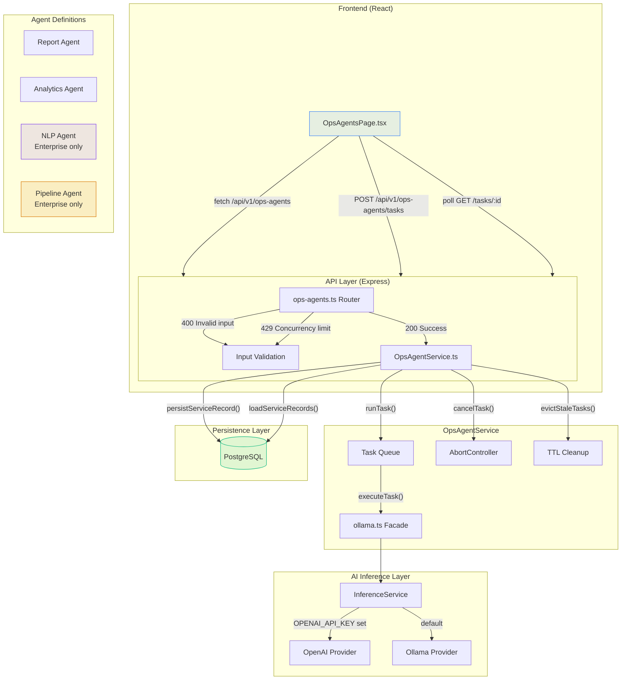
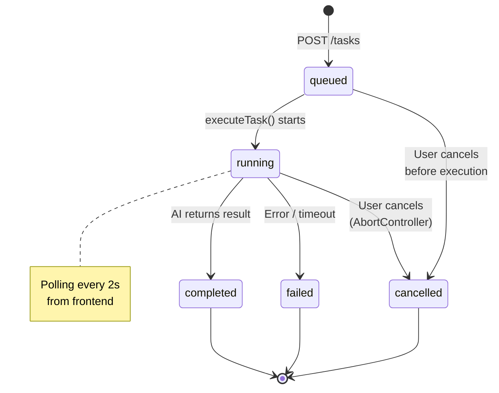
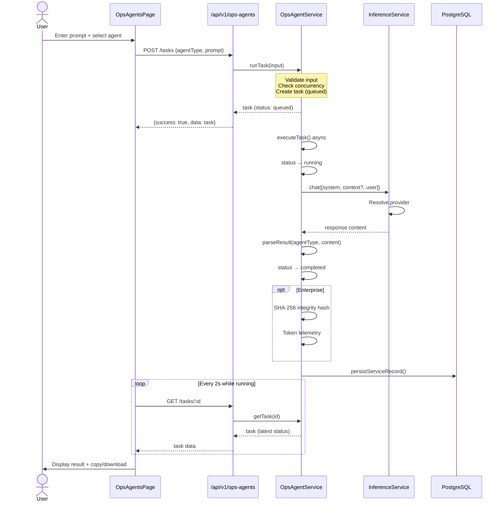
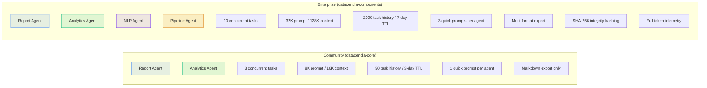

# Ops Agents — Architecture & Workflow Diagrams

## 1. System Architecture

```mermaid
graph TB
    subgraph Frontend["Frontend (React)"]
        OAP[OpsAgentsPage.tsx]
        OAP --> |"fetch /api/v1/ops-agents"| API
        OAP --> |"POST /api/v1/ops-agents/tasks"| API
        OAP --> |"poll GET /tasks/:id"| API
    end

    subgraph API["API Layer (Express)"]
        R[ops-agents.ts Router]
        R --> |"400 Invalid input"| V[Input Validation]
        R --> |"429 Concurrency limit"| V
        R --> |"200 Success"| OAS
    end

    subgraph Service["OpsAgentService"]
        OAS[OpsAgentService.ts]
        OAS --> |"runTask()"| Q[Task Queue]
        Q --> |"executeTask()"| AI
        OAS --> |"cancelTask()"| AC[AbortController]
        OAS --> |"evictStaleTasks()"| TTL[TTL Cleanup]
    end

    subgraph Inference["AI Inference Layer"]
        AI[ollama.ts Facade]
        AI --> IS[InferenceService]
        IS --> |"OPENAI_API_KEY set"| OAI[OpenAI Provider]
        IS --> |"default"| OLL[Ollama Provider]
    end

    subgraph Persistence["Persistence Layer"]
        OAS --> |"persistServiceRecord()"| DB[(PostgreSQL)]
        OAS --> |"loadServiceRecords()"| DB
    end

    subgraph Agents["Agent Definitions"]
        RA[Report Agent]
        AA[Analytics Agent]
        NLP[NLP Agent<br/>Enterprise only]
        PA[Pipeline Agent<br/>Enterprise only]
    end

    style NLP fill:#7c3aed20,stroke:#7c3aed
    style PA fill:#d9770620,stroke:#d97706
    style OAP fill:#3b82f620,stroke:#3b82f6
    style DB fill:#10b98120,stroke:#10b981
```

## 2. Task Lifecycle (State Machine)

```mermaid
stateDiagram-v2
    [*] --> queued: POST /tasks
    queued --> running: executeTask() starts
    running --> completed: AI returns result
    running --> failed: Error / timeout
    running --> cancelled: User cancels<br/>(AbortController)
    queued --> cancelled: User cancels<br/>before execution
    completed --> [*]
    failed --> [*]
    cancelled --> [*]

    note right of running
        Polling every 2s
        from frontend
    end note
```

## 3. Task Execution Workflow

```mermaid
sequenceDiagram
    actor User
    participant UI as OpsAgentsPage
    participant API as /api/v1/ops-agents
    participant SVC as OpsAgentService
    participant AI as InferenceService
    participant DB as PostgreSQL

    User->>UI: Enter prompt + select agent
    UI->>API: POST /tasks {agentType, prompt}
    API->>SVC: runTask(input)

    Note over SVC: Validate input<br/>Check concurrency<br/>Create task (queued)

    SVC-->>API: task (status: queued)
    API-->>UI: {success: true, data: task}

    SVC->>SVC: executeTask() async
    SVC->>SVC: status → running

    SVC->>AI: chat([system, context?, user])
    AI->>AI: Resolve provider
    AI-->>SVC: response content

    SVC->>SVC: parseResult(agentType, content)
    SVC->>SVC: status → completed

    opt Enterprise
        SVC->>SVC: SHA-256 integrity hash
        SVC->>SVC: Token telemetry
    end

    SVC->>DB: persistServiceRecord()

    loop Every 2s while running
        UI->>API: GET /tasks/:id
        API->>SVC: getTask(id)
        SVC-->>API: task (latest status)
        API-->>UI: task data
    end

    UI->>User: Display result + copy/download
```

## 4. Community vs Enterprise Feature Matrix

```mermaid
graph LR
    subgraph Community["Community (datacendia-core)"]
        C1[Report Agent]
        C2[Analytics Agent]
        C3["3 concurrent tasks"]
        C4["8K prompt / 16K context"]
        C5["50 task history / 3-day TTL"]
        C6["1 quick prompt per agent"]
        C7["Markdown export only"]
    end

    subgraph Enterprise["Enterprise (datacendia-components)"]
        E1[Report Agent]
        E2[Analytics Agent]
        E3[NLP Agent]
        E4[Pipeline Agent]
        E5["10 concurrent tasks"]
        E6["32K prompt / 128K context"]
        E7["2000 task history / 7-day TTL"]
        E8["3 quick prompts per agent"]
        E9["Multi-format export"]
        E10["SHA-256 integrity hashing"]
        E11["Full token telemetry"]
    end

    style C1 fill:#3b82f620,stroke:#3b82f6
    style C2 fill:#10b98120,stroke:#10b981
    style E1 fill:#3b82f620,stroke:#3b82f6
    style E2 fill:#10b98120,stroke:#10b981
    style E3 fill:#7c3aed20,stroke:#7c3aed
    style E4 fill:#d9770620,stroke:#d97706
```
