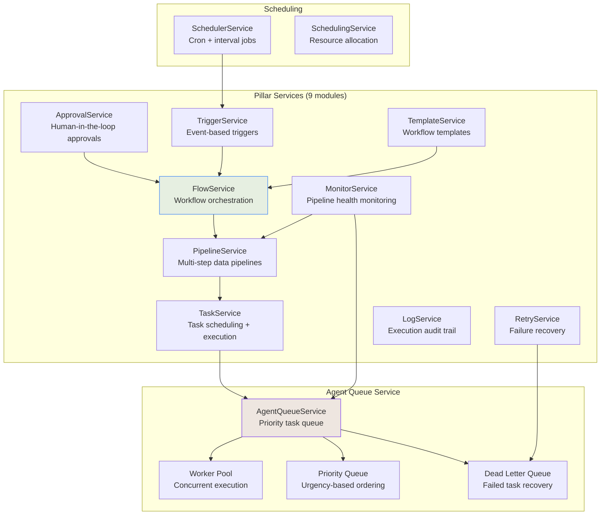
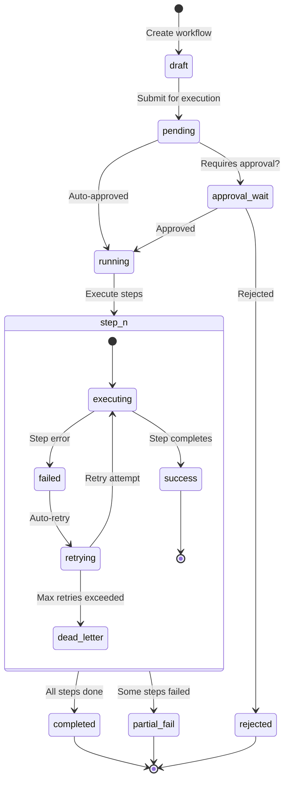
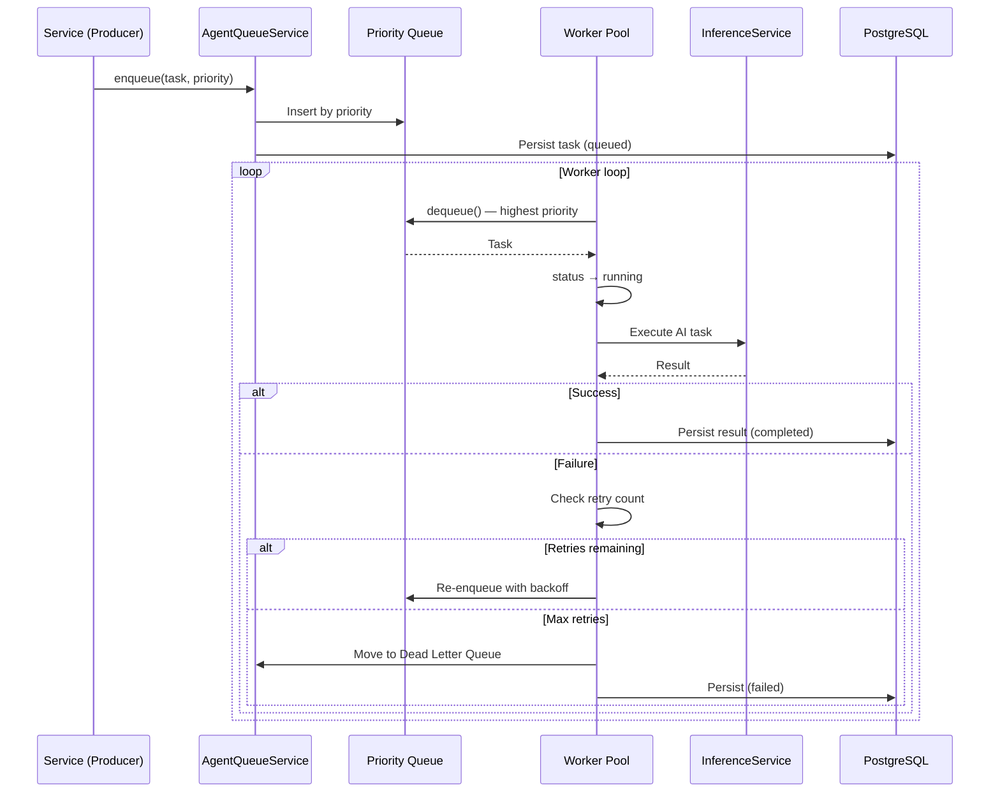

# Pillars, Flow & Queue — Architecture & Workflow Diagrams

## 1. Pillars Architecture

```mermaid
graph TB
    subgraph Pillars["Pillar Services (9 modules)"]
        FLOW[FlowService<br/>Workflow orchestration]
        PIPE[PipelineService<br/>Multi-step data pipelines]
        TASK[TaskService<br/>Task scheduling + execution]
        APPROVAL[ApprovalService<br/>Human-in-the-loop approvals]
        TEMPLATE[TemplateService<br/>Workflow templates]
        TRIGGER[TriggerService<br/>Event-based triggers]
        MONITOR[MonitorService<br/>Pipeline health monitoring]
        RETRY[RetryService<br/>Failure recovery]
        LOG[LogService<br/>Execution audit trail]
    end

    subgraph Queue["Agent Queue Service"]
        AQ[AgentQueueService<br/>Priority task queue]
        AQ --> WK[Worker Pool<br/>Concurrent execution]
        AQ --> PQ[Priority Queue<br/>Urgency-based ordering]
        AQ --> DLQ[Dead Letter Queue<br/>Failed task recovery]
    end

    subgraph Scheduler["Scheduling"]
        SCHED[SchedulerService<br/>Cron + interval jobs]
        SCHED_ENT[SchedulingService<br/>Resource allocation]
    end

    FLOW --> PIPE --> TASK
    TASK --> AQ
    APPROVAL --> FLOW
    TRIGGER --> FLOW
    SCHED --> TRIGGER
    TEMPLATE --> FLOW
    MONITOR --> PIPE & AQ
    RETRY --> DLQ

    style FLOW fill:#3b82f620,stroke:#3b82f6
    style AQ fill:#7c3aed20,stroke:#7c3aed
```

## 2. Flow Execution Lifecycle

```mermaid
stateDiagram-v2
    [*] --> draft: Create workflow
    draft --> pending: Submit for execution
    pending --> approval_wait: Requires approval?
    pending --> running: Auto-approved
    approval_wait --> running: Approved
    approval_wait --> rejected: Rejected
    running --> step_n: Execute steps

    state step_n {
        [*] --> executing
        executing --> success: Step completes
        executing --> failed: Step error
        failed --> retrying: Auto-retry
        retrying --> executing: Retry attempt
        retrying --> dead_letter: Max retries exceeded
        success --> [*]
    }

    step_n --> completed: All steps done
    step_n --> partial_fail: Some steps failed
    completed --> [*]
    partial_fail --> [*]
    rejected --> [*]
```

## 3. Agent Queue Processing

```mermaid
sequenceDiagram
    participant Producer as Service (Producer)
    participant AQ as AgentQueueService
    participant PQ as Priority Queue
    participant Worker as Worker Pool
    participant AI as InferenceService
    participant DB as PostgreSQL

    Producer->>AQ: enqueue(task, priority)
    AQ->>PQ: Insert by priority
    AQ->>DB: Persist task (queued)

    loop Worker loop
        Worker->>PQ: dequeue() — highest priority
        PQ-->>Worker: Task

        Worker->>Worker: status → running
        Worker->>AI: Execute AI task
        AI-->>Worker: Result

        alt Success
            Worker->>DB: Persist result (completed)
        else Failure
            Worker->>Worker: Check retry count
            alt Retries remaining
                Worker->>PQ: Re-enqueue with backoff
            else Max retries
                Worker->>AQ: Move to Dead Letter Queue
                Worker->>DB: Persist (failed)
            end
        end
    end
```
