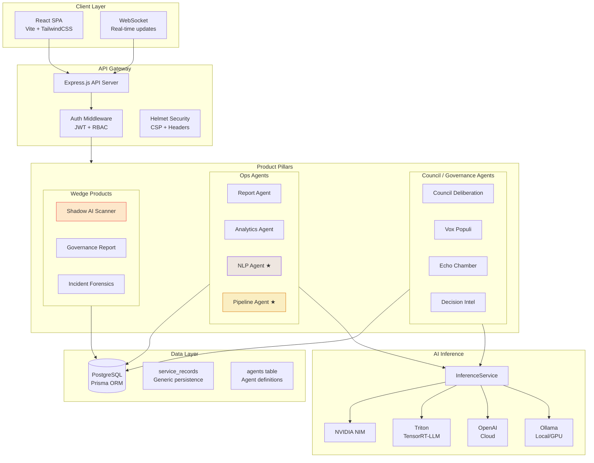
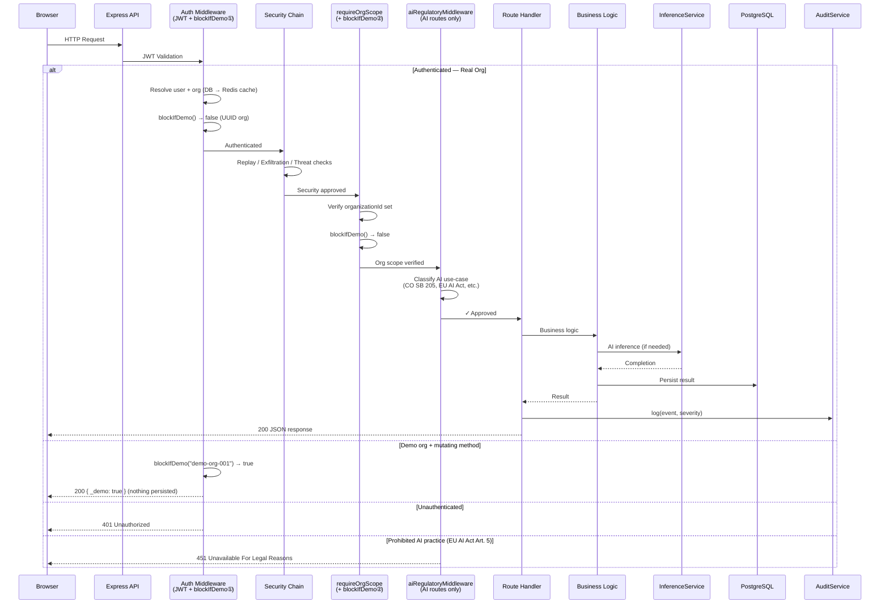
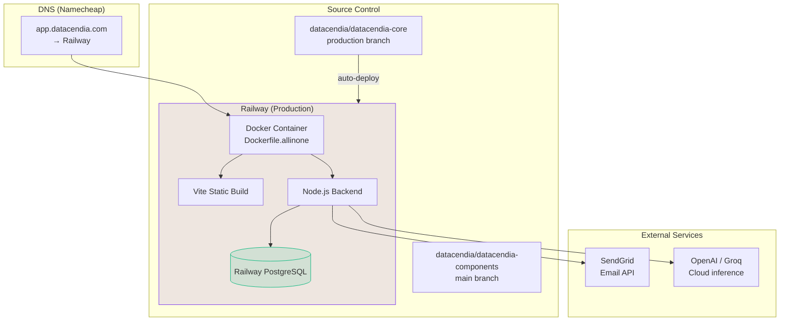

# Datacendia Platform — Architecture Overview

## 1. High-Level Platform Architecture

```mermaid
graph TB
    subgraph Client["Client Layer"]
        WEB[React SPA<br/>Vite + TailwindCSS]
        WS[WebSocket<br/>Real-time updates]
    end

    subgraph Gateway["API Gateway"]
        EXP[Express.js API Server]
        AUTH[Auth Middleware<br/>JWT + RBAC]
        HELM[Helmet Security<br/>CSP + Headers]
    end

    subgraph Products["Product Pillars"]
        subgraph Council["Council / Governance Agents"]
            CA[Council Deliberation]
            VX[Vox Populi]
            EC[Echo Chamber]
            DC[Decision Intel]
        end

        subgraph Ops["Ops Agents"]
            RA[Report Agent]
            AA[Analytics Agent]
            NLP[NLP Agent ★]
            PA[Pipeline Agent ★]
        end

        subgraph Wedge["Wedge Products"]
            SAS[Shadow AI Scanner]
            GR[Governance Report]
            IF[Incident Forensics]
        end
    end

    subgraph Inference["AI Inference"]
        IS[InferenceService]
        IS --> OLL[Ollama<br/>Local/GPU]
        IS --> OAI[OpenAI<br/>Cloud]
        IS --> TRT[Triton<br/>TensorRT-LLM]
        IS --> NIM[NVIDIA NIM]
    end

    subgraph Data["Data Layer"]
        PG[(PostgreSQL<br/>Prisma ORM)]
        SR[service_records<br/>Generic persistence]
        AG[agents table<br/>Agent definitions]
    end

    WEB --> EXP
    WS --> EXP
    EXP --> AUTH --> Products
    Council & Ops --> IS
    Wedge --> PG
    Ops --> PG
    Council --> PG

    style NLP fill:#7c3aed20,stroke:#7c3aed
    style PA fill:#d9770620,stroke:#d97706
    style SAS fill:#ef444420,stroke:#ef4444
```

*★ = Enterprise only*

## 2. Open-Core Model

```mermaid
graph LR
    subgraph Core["datacendia-core (Apache 2.0)"]
        direction TB
        C1[Council Agents<br/>Deliberation engine]
        C2[Ops Agents<br/>Report + Analytics]
        C3[Wedge Products<br/>All 3 scanners]
        C4[Platform UI<br/>Full React app]
        C5[Inference Layer<br/>Ollama + OpenAI]
        C6[DB Persistence<br/>PostgreSQL + Prisma]
    end

    subgraph Components["datacendia-components (Proprietary)"]
        direction TB
        E1[All 4 Ops Agents<br/>+ NLP + Pipeline]
        E2[Higher Limits<br/>32K/128K/10 concurrent]
        E3[Integrity Hashing<br/>SHA-256 on all outputs]
        E4[Full Telemetry<br/>Token tracking per request]
        E5[Real Data Ingestion<br/>SIEM/Proxy/Agent hooks]
        E6[Advanced UI<br/>Multi-format export]
    end

    Core -->|"extends"| Components

    style Core fill:#3b82f620,stroke:#3b82f6
    style Components fill:#7c3aed20,stroke:#7c3aed
```

## 3. Request Flow

```mermaid
sequenceDiagram
    participant Browser
    participant Express as Express API
    participant Auth as Auth Middleware<br/>(JWT + blockIfDemo①)
    participant Sec as Security Chain
    participant OrgScope as requireOrgScope<br/>(+ blockIfDemo②)
    participant AIReg as aiRegulatoryMiddleware<br/>(AI routes only)
    participant Route as Route Handler
    participant Service as Business Logic
    participant AI as InferenceService
    participant DB as PostgreSQL
    participant Audit as AuditService

    Browser->>Express: HTTP Request
    Express->>Auth: JWT Validation

    alt Authenticated — Real Org
        Auth->>Auth: Resolve user + org (DB → Redis cache)
        Auth->>Auth: blockIfDemo() → false (UUID org)
        Auth->>Sec: Authenticated
        Sec->>Sec: Replay / Exfiltration / Threat checks
        Sec->>OrgScope: Security approved
        OrgScope->>OrgScope: Verify organizationId set
        OrgScope->>OrgScope: blockIfDemo() → false
        OrgScope->>AIReg: Org scope verified
        AIReg->>AIReg: Classify AI use-case<br/>(CO SB 205, EU AI Act, etc.)
        AIReg->>Route: ✓ Approved
        Route->>Service: Business logic
        Service->>AI: AI inference (if needed)
        AI-->>Service: Completion
        Service->>DB: Persist result
        Service-->>Route: Result
        Route->>Audit: log(event, severity)
        Route-->>Browser: 200 JSON response
    else Demo org + mutating method
        Auth->>Auth: blockIfDemo("demo-org-001") → true
        Auth-->>Browser: 200 { _demo: true } (nothing persisted)
    else Unauthenticated
        Auth-->>Browser: 401 Unauthorized
    else Prohibited AI practice (EU AI Act Art. 5)
        AIReg-->>Browser: 451 Unavailable For Legal Reasons
    end
```

## 4. Deployment Architecture

```mermaid
graph TB
    subgraph Railway["Railway (Production)"]
        DOCK[Docker Container<br/>Dockerfile.allinone]
        DOCK --> FE[Vite Static Build]
        DOCK --> BE[Node.js Backend]
        BE --> PG[(Railway PostgreSQL)]
    end

    subgraph DNS["DNS (Namecheap)"]
        CNAME[app.datacendia.com<br/>→ Railway]
    end

    subgraph External["External Services"]
        SG[SendGrid<br/>Email API]
        AI[OpenAI / Groq<br/>Cloud inference]
    end

    CNAME --> DOCK
    BE --> SG
    BE --> AI

    subgraph Git["Source Control"]
        GH1[datacendia/datacendia-core<br/>production branch]
        GH2[datacendia/datacendia-components<br/>main branch]
        GH1 -->|"auto-deploy"| Railway
    end

    style Railway fill:#7c3aed20,stroke:#7c3aed
    style PG fill:#10b98120,stroke:#10b981
```
