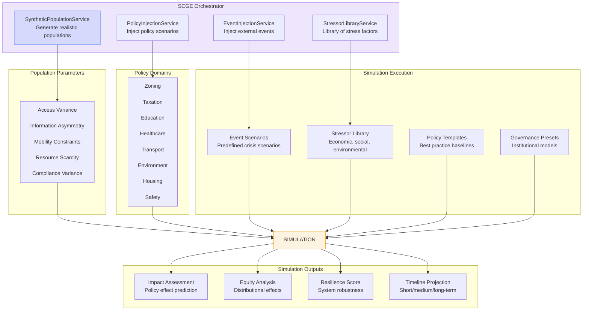
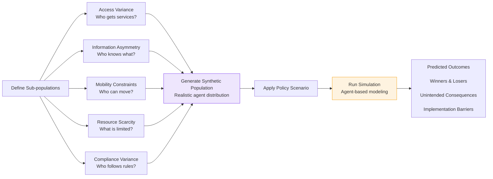
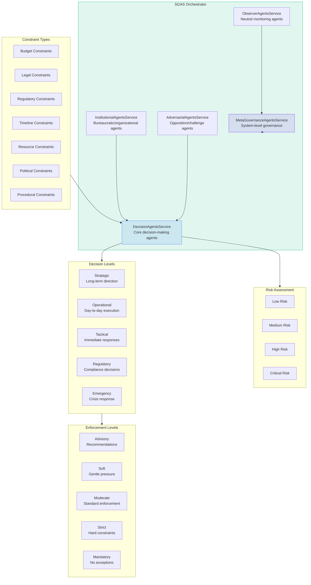
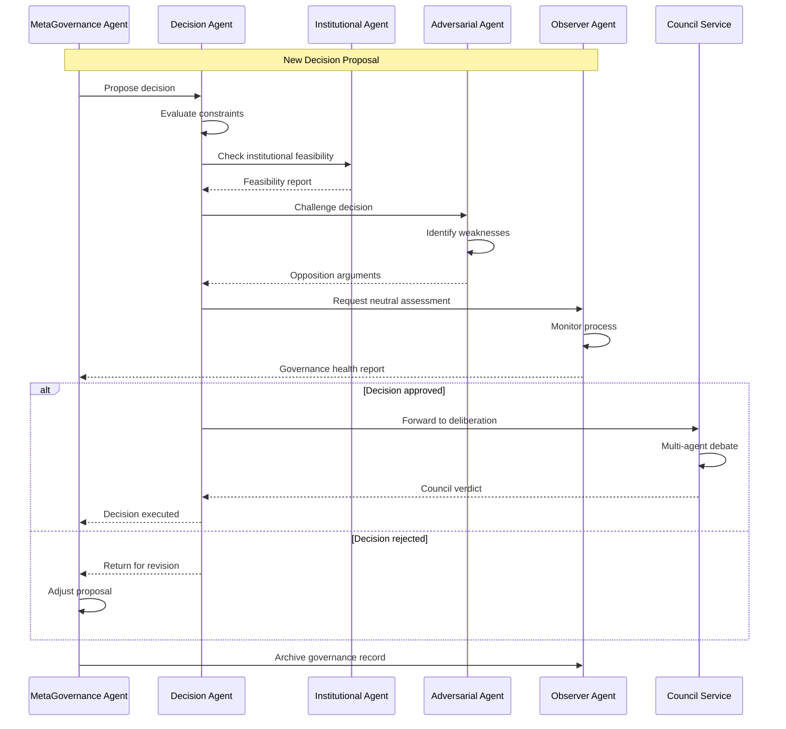
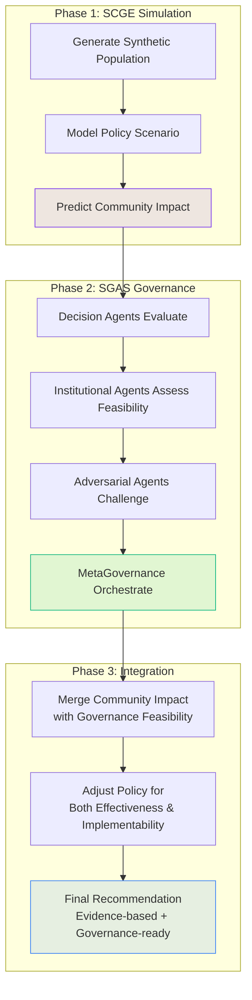

# SCGE & SGAS — Synthetic Community & Agent Systems

## 1. SCGE — Synthetic Community Governance Engine

## 2. SCGE Population Modeling

## 3. SGAS — Self-Governing Agent System

## 4. SGAS Agent Interactions

## 5. Decision Classification Matrix

```mermaid
graph TB
    subgraph Urgency["Urgency Level"]
        LOW[Low — Can wait]
        ROUTINE[Routine — Standard process]
        MED[Medium — Some haste]
        HIGH[High — Expedited]
        EMERG[Emergency — Immediate]
    end

    subgraph Sensitivity["Sensitivity Level"]
        PUBLIC[Public — Open]
        INTERNAL[Internal — Staff only]
        CONF[Confidential — Limited]
        RESTRICT[Restricted — Need-to-know]
    end

    subgraph Risk["Risk Level"]
        RLOW[Low — Minimal impact]
        RMED[Medium — Moderate impact]
        RHIGH[High — Significant impact]
        RCRIT[Critical — Existential]
    end

    LOW --> ADVISORY[Advisory Enforcement]
    ROUTINE --> SOFT[Soft Enforcement]
    MED --> MODERATE[Moderate Enforcement]
    HIGH --> STRICT[Strict Enforcement]
    EMERG --> MANDATORY[Mandatory Enforcement]

    PUBLIC --> TRANSPARENT[Transparent Process]
    INTERNAL --> STANDARD[Standard Process]
    CONF --> LIMITED[Limited Disclosure]
    RESTRICT --> SECRET[Classified Process]

    RLOW --> DELEGATE[Auto-delegate]
    RMED --> REVIEW[Management review]
    RHIGH --> ESCALATE[Leadership decision]
    RCRIT --> CRISIS[Crisis protocol]

    style EMERG fill:#ef444420,stroke:#ef4444
    style RCRIT fill:#dc262620,stroke:#dc2626
    style MANDATORY fill:#7c3aed20,stroke:#7c3aed
```

## 6. Combined SCGE + SGAS Workflow

