# Datacendia — Complete Services Catalog
## Every Service, In-Depth — v0.2.4-alpha (April 2026)

> **60 service directories · 356+ service files · 158 route files**
> This document catalogs every service with its purpose, key exports, upstream callers, and downstream dependencies.

---

## Table of Contents

1. [Council & Deliberation Services](#1-council--deliberation-services)
2. [Compliance Services](#2-compliance-services)
3. [Inference & AI Services](#3-inference--ai-services)
4. [Privacy Services](#4-privacy-services)
5. [Legal Services](#5-legal-services)
6. [Governance Services](#6-governance-services)
7. [Cryptographic & Evidence Services](#7-cryptographic--evidence-services)
8. [Security Services](#8-security-services)
9. [Gateway Services](#9-gateway-services)
10. [Analytics & Intelligence Services](#10-analytics--intelligence-services)
11. [Sovereign & Enterprise Services](#11-sovereign--enterprise-services)
12. [Simulation Services (SGAS / SCGE / COLLAPSE)](#12-simulation-services)
13. [Vertical Industry Agents](#13-vertical-industry-agents)
14. [Operations Services](#14-operations-services)
15. [Platform & Infrastructure Services](#15-platform--infrastructure-services)
16. [Connector Services](#16-connector-services)
17. [Middleware Services](#17-middleware-services)

---

## 1. Council & Deliberation Services

**Directory:** `backend/src/services/council/`

The core deliberation engine — what Datacendia was built around.

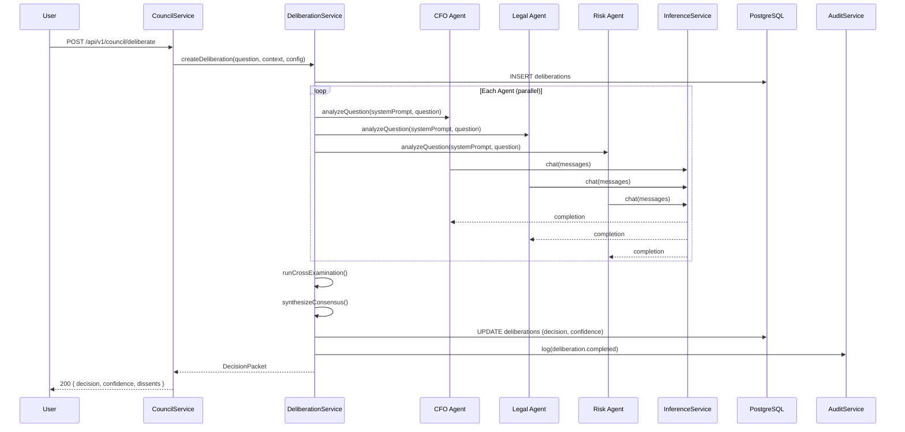

### Services

| Service | Key Exports | Purpose |
|---------|------------|---------|
| `CouncilService` | `deliberate()`, `getStatus()`, `listAgents()` | Entry point — orchestrates the full deliberation lifecycle |
| `DeliberationService` | `create()`, `start()`, `addMessage()`, `complete()` | Manages deliberation state machine (PENDING → IN_PROGRESS → COMPLETED) |
| `DecisionService` | `createDecision()`, `updateStatus()`, `getHistory()` | CRUD for `decisions` table — separate from deliberations |
| `PostDeliberationService` | `runAnalysis()`, `generateSummary()` | Post-deliberation: executive summary, precedent matching, red team |
| `DissentService` | `recordDissent()`, `acknowledgeDissent()`, `getLedger()` | Formal dissent lifecycle with ledger preservation |
| `EchoService` (`echoService`) | `detectEchoChamber()`, `scoreGroupthink()` | Identifies echo chamber patterns in agent responses |
| `GnosisService` (`gnosisService`) | `synthesizeKnowledge()`, `crossReferenceDecisions()` | Cross-deliberation knowledge graph synthesis |

### Decision State Machine

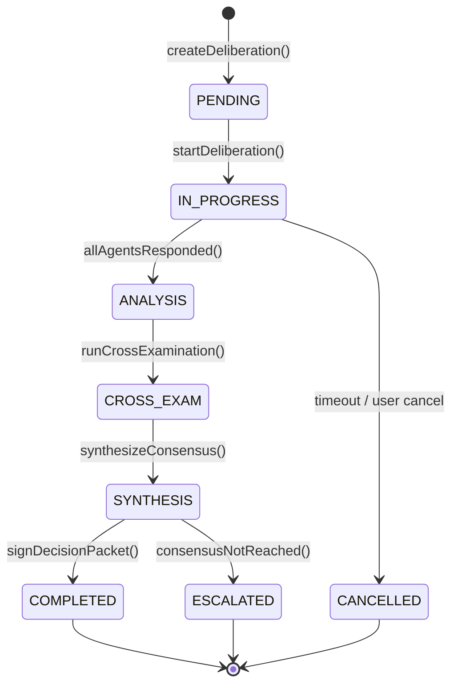

---

## 2. Compliance Services

**Directory:** `backend/src/services/compliance/`

```mermaid
graph TB
    subgraph Compliance["Compliance Service Layer"]
        ARC[AIRegulatoryClassifier<br/>6 frameworks]
        IMS[IncidentMaterialityService<br/>14 jurisdictions]
        CS[ComplianceService<br/>Framework checks]
        CMS[ContinuousMonitorService<br/>Scheduled scans]
        CJS[CrossJurisdictionService<br/>Multi-law mapping]
        RSS[RegulatorySandboxService<br/>Sandbox testing]
        RET[RetentionService<br/>7-year retention]
    end

    subgraph Middleware_["Enforcement Middleware"]
        ARM[aiRegulatoryMiddleware]
        PHI[phiEnforcementMiddleware]
    end

    subgraph Routes_["API Routes"]
        PRI[/api/v1/privacy - 17 endpoints]
        COR[/api/v1/council - AI routes]
    end

    ARM --> ARC
    PHI --> ARC
    COR --> ARM --> PHI
    PRI --> ARC
    PRI --> IMS
```

### Services

| Service | Key Exports | Frameworks | Purpose |
|---------|------------|-----------|---------|
| `AIRegulatoryClassifier` | `classify(useCase)`, `getFrameworks()` | CO SB 205, NYC LL 144, IL AIVIA, EU AI Act Annex III, GDPR Art. 22, BDSG §26 | Runtime AI use-case classification. Returns risk level (CRITICAL/HIGH/MEDIUM/LOW) + applicable regulations |
| `IncidentMaterialityService` | `assess(incident)`, `generateNotificationPlan()` | 14 jurisdictions (SEC, NYDFS, FTC, GDPR, UK GDPR, HIPAA, CCPA, Japan, Singapore, Australia, Nigeria, Brazil, CMMC) | Breach notification planning with deadlines + draft notices |
| `ComplianceService` | `checkFramework()`, `getScore()`, `generateReport()` | CMMC 2.0, CIS v8, SOC 2, ISO 27001, NIST CSF 2.0 | Multi-framework compliance scoring |
| `ContinuousMonitorService` | `startScan()`, `scheduleCheck()`, `getAlerts()` | All active frameworks | Scheduled compliance drift detection |
| `CrossJurisdictionService` | `mapRequirements()`, `conflictAnalysis()` | All documented frameworks | Maps conflicting requirements across jurisdictions |
| `RegulatorySandboxService` | `testScenario()`, `simulateEnforcement()` | EU AI Act, CO SB 205 | Safe sandbox for testing regulatory scenarios |
| `RetentionService` | `applyPolicy()`, `scheduleArchive()`, `purgeExpired()` | SEC 7-year, HIPAA 6-year, FINRA 3-year | Multi-framework data retention lifecycle |

---

## 3. Inference & AI Services

**Directory:** `backend/src/services/inference/`

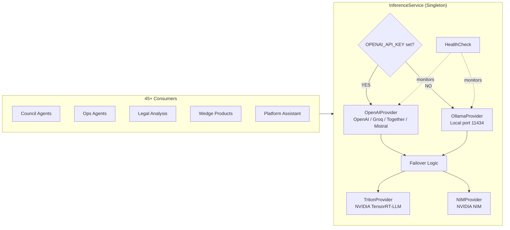

### Services

| Service | Key Exports | Purpose |
|---------|------------|---------|
| `InferenceService` | `complete()`, `chat()`, `embed()`, `healthCheck()`, `getStatus()` | Singleton facade — all consumers use this, never talk to providers directly |
| `OpenAIProvider` | `complete()`, `chat()`, `embed()` | OpenAI-compatible (works with OpenAI, Groq, Together AI, Mistral, LM Studio) |
| `OllamaProvider` | `complete()`, `chat()`, `embed()`, `listModels()` | Local Ollama server at port 11434 |
| `TritonProvider` | `complete()`, `chat()` | NVIDIA Triton Inference Server (TensorRT-LLM) |
| `NIMProvider` | `complete()`, `chat()` | NVIDIA NIM microservices |
| `ollama.ts` (facade) | `generate()`, `chat()` | Legacy facade — now routes through InferenceService for backward compat |

### Status Endpoint (Public — No Auth)

`GET /api/v1/inference/status` → `{ available, provider, primaryProvider, failoverActive, latencyMs, modelsLoaded, error }`

---

## 4. Privacy Services

**Directory:** `backend/src/services/privacy/` | **Routes:** `backend/src/routes/privacy.ts`

```mermaid
flowchart TD
    REQ[Data Subject Request] --> AUTH{Authenticated?}
    AUTH -->|No| REJECT[401 Unauthorized]
    AUTH -->|Yes| GUARD[requireOrgScope<br/>+ demoGuard]
    GUARD --> TYPE{Request Type}

    TYPE -->|Access| ACCESS[GET /access<br/>GDPR Art. 15]
    TYPE -->|Erasure| ERASE[DELETE /erasure<br/>GDPR Art. 17]
    TYPE -->|Portability| PORT[GET /export<br/>GDPR Art. 20]
    TYPE -->|AI Appeal| APPEAL[POST /appeal-ai-decision<br/>CO SB 205]
    TYPE -->|CCPA| CCPA[POST /ccpa/opt-out<br/>CCPA §1798.120]
    TYPE -->|PHI| PHI[POST /deidentify<br/>HIPAA §164.514b]

    ACCESS & ERASE & PORT & APPEAL & CCPA & PHI --> AUDIT[AuditService.log()]
    AUDIT --> RESP[Response to Data Subject]
```

### Services

| Service | Key Exports | Purpose |
|---------|------------|---------|
| `PrivacyService` | `getDataAccess()`, `processErasure()`, `exportData()` | Core GDPR Art. 15–20 request handling |
| `ConsentService` | `recordConsent()`, `revokeConsent()`, `getConsentStatus()` | Consent capture + management (GDPR Art. 7, IL AIVIA) |
| `DataSubjectService` | `verifyIdentity()`, `processRequest()`, `trackRequest()` | DSR lifecycle management with SLA tracking |
| `PHIService` | `deidentify()`, `checkPHI()`, `applyRedaction()` | HIPAA §164.514(b) Safe Harbor de-identification |

---

## 5. Legal Services

**Directory:** `backend/src/services/legal/`

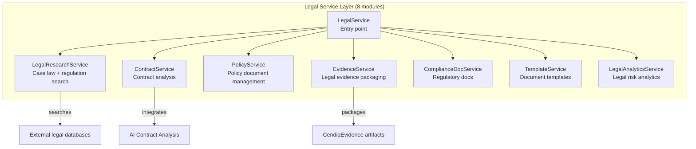

### Services

| Service | Key Exports | Purpose |
|---------|------------|---------|
| `LegalService` | `analyzeDocument()`, `getDraftNotice()`, `getRegulatorContacts()` | Legal document analysis + regulatory contact directory |
| `LegalResearchService` | `searchCaseLaw()`, `findRegulation()`, `getJurisdictionRules()` | Multi-source legal research (Westlaw-style) |
| `ContractService` | `analyzeContract()`, `extractClauses()`, `flagRisks()` | AI-powered contract review |
| `PolicyService` | `createPolicy()`, `versionControl()`, `distributePolicy()` | Policy document lifecycle |
| `EvidenceService` | `packageEvidence()`, `generateChainOfCustody()` | Legal evidence chain packaging |
| `ComplianceDocService` | `generateReport()`, `createAuditPackage()` | Regulatory report generation |
| `TemplateService` | `getTemplate()`, `populateTemplate()`, `versionTemplate()` | Reusable legal document templates |
| `LegalAnalyticsService` | `assessRisk()`, `trendAnalysis()`, `jurisdictionComparison()` | Cross-jurisdiction legal risk analytics |

---

## 6. Governance Services

**Directory:** `backend/src/services/governance/`

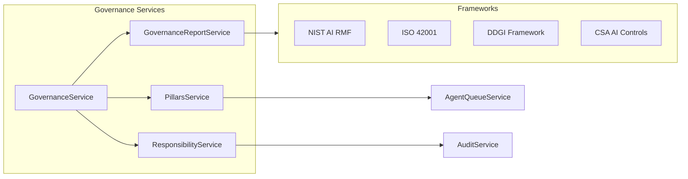

| Service | Key Exports | Purpose |
|---------|------------|---------|
| `GovernanceService` | `assessGovernance()`, `getFrameworkScore()` | Overall AI governance assessment |
| `GovernanceReportService` | `generateReport()`, `runQuestionnaire()`, `mapToFramework()` | Governance questionnaire engine + framework mapping |
| `PillarsService` | `evaluatePillar()`, `getScores()`, `queueAssessment()` | 9-pillar AI governance model evaluation |
| `ResponsibilityService` | `assignResponsibility()`, `trackAccountability()` | AI accountability assignment + tracking |

---

## 7. Cryptographic & Evidence Services

**Directory:** `backend/src/services/crypto/` + `backend/src/services/evidence/`

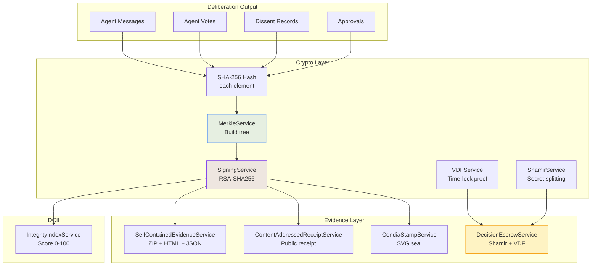

### Crypto Services

| Service | Key Exports | Algorithm | Purpose |
|---------|------------|-----------|---------|
| `KeyManagementService` | `generateKey()`, `rotateKey()`, `getPublicKey()` | RSA-2048 / ECDSA P-256 | Customer-owned signing key lifecycle |
| `MerkleService` | `buildTree()`, `getRootHash()`, `generateProof()`, `verifyProof()` | SHA-256 Merkle | Tamper-evident audit tree construction |
| `StampService` (CendiaStamp) | `generateSeal()`, `renderSVG()`, `verifySeal()` | SHA-256 + RSA | Visual cryptographic seal for decision packets |
| `HashingService` | `hash()`, `compare()`, `hashFile()` | SHA-256 / bcrypt | General-purpose hashing utilities |
| `SigningService` | `sign()`, `verify()`, `getSignatureInfo()` | RSA-SHA256 / ECDSA | Artifact signing + verification |
| `VDFService` | `computeProof()`, `verifyProof()` | Verifiable Delay Function | Time-lock proof of elapsed time |
| `ShamirService` | `splitSecret()`, `reconstructSecret()` | Shamir's Secret Sharing | M-of-N secret reconstruction |

### Evidence Services

| Service | Key Exports | Output | Purpose |
|---------|------------|--------|---------|
| `SelfContainedEvidenceService` | `generate()`, `downloadZip()` | ZIP (HTML + JSON + PDF) | Self-contained tamper-evident evidence package |
| `ContentAddressedReceiptService` | `createReceipt()`, `verifyReceipt()` | JSON receipt | Publicly verifiable content-addressed receipt |
| `EvidenceChainService` | `buildChain()`, `verifyChain()`, `addLink()` | Chain JSON | Immutable evidence chain of custody |
| `ForensicsService` | `analyzeIncident()`, `reconstructTimeline()` | Forensics report | Post-incident forensic analysis |
| `DecisionEscrowService` | `createEscrow()`, `releaseEscrow()`, `addShard()` | Escrow record | Shamir SSS + VDF time-locked decision escrow |
| `DCIIService` | `computeIndex()`, `getHistory()`, `getScore()` | Score 0–100 | Datacendia Cryptographic Integrity Index |

---

## 8. Security Services

**Directory:** `backend/src/security/`

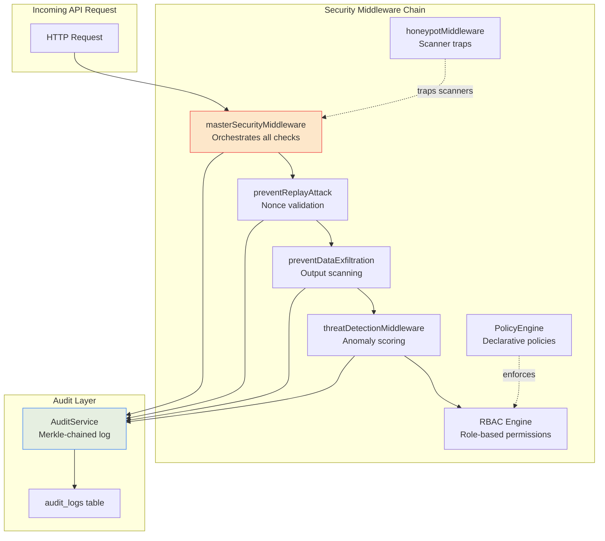

| Service | File | Key Exports | Purpose |
|---------|------|------------|---------|
| `AuditService` | `security/audit.service.ts` | `log()`, `getChain()`, `verifyChain()` | Merkle-chained tamper-evident audit log |
| `ThreatDetectionService` | `security/SecurityHardening.ts` | `threatDetectionMiddleware`, `scoreRequest()` | ML-style request anomaly scoring |
| `PolicyEngine` | `security/PolicyEngine.ts` | `evaluate()`, `addPolicy()`, `enforcePolicy()` | Declarative YAML/JSON policy evaluation |
| `HoneypotService` | `security/Honeypot.ts` | `honeypotMiddleware`, `logHit()` | Trap endpoints that attract and log scanners |
| `RBACEngine` | `security/rbac.ts` | `checkPermission()`, `getRoles()` | Role-based access control (ADMIN/ANALYST/VIEWER/SUPER_ADMIN) |
| `DefenseInDepth` | `security/DefenseInDepth.ts` | `masterSecurityMiddleware`, `preventReplayAttack`, `preventDataExfiltration` | Layered defense orchestration |
| `HeadersService` | `security/headers.ts` | `customSecurityHeaders` | Custom security headers beyond Helmet |
| `CryptoAudit` | `security/crypto-audit.ts` | `hashEvent()`, `buildMerkleChain()` | Cryptographic audit chain utilities |

---

## 9. Gateway Services

**Directory:** `backend/src/services/gateway/`

The `CendiaGateway™` is a 14-module AI proxy that sits between consumers and AI providers.

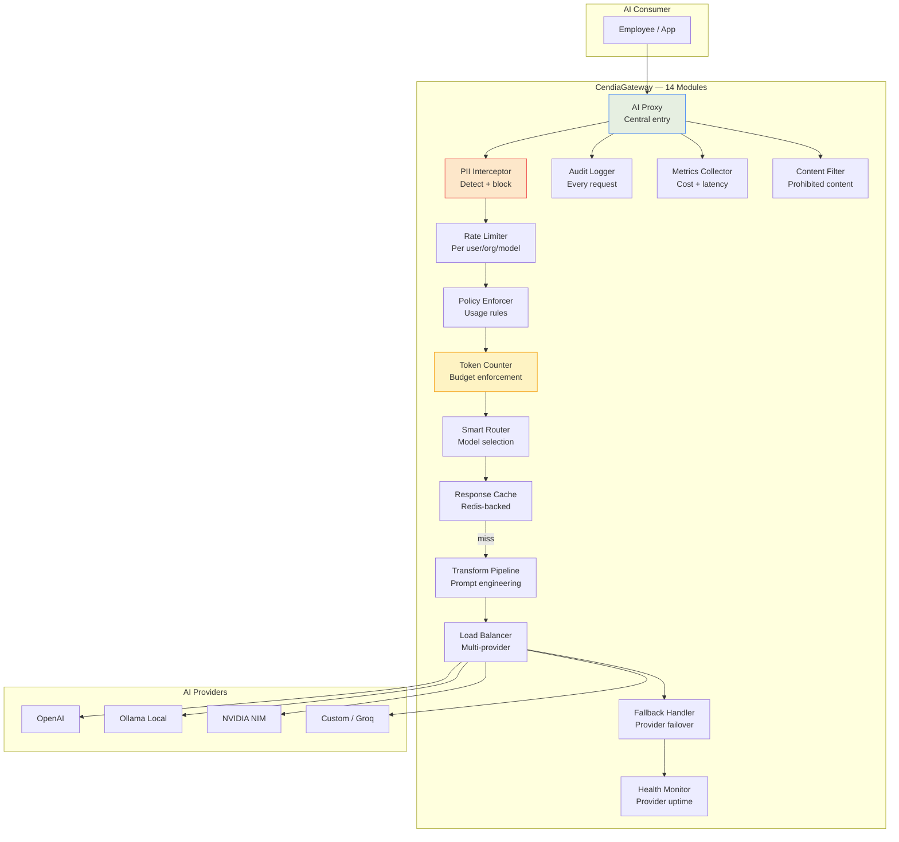

| Module | Purpose | Key Config |
|--------|---------|-----------|
| AI Proxy | Central routing + request lifecycle | Per-org gateway config |
| PII Interceptor | Detect + block sensitive data before it reaches AI | Regex + ML patterns |
| Rate Limiter | Per-user, per-org, per-model request throttling | Redis counters |
| Audit Logger | Immutable log of every AI interaction | Appended to audit chain |
| Policy Enforcer | Declarative usage rules (who can use which model) | OPA integration |
| Smart Router | Select optimal model based on task type + cost | Model capability matrix |
| Response Cache | Redis-backed semantic cache to reduce API costs | TTL + similarity threshold |
| Transform Pipeline | System prompt injection, output formatting | Per-org template |
| Metrics Collector | Cost per token, latency, error rates | Prometheus export |
| Token Counter | Per-user/org budget enforcement + billing | Stripe integration ready |
| Content Filter | Block prohibited content categories | Configurable allowlist |
| Fallback Handler | Automatic failover when primary provider fails | Chain: primary → secondary → local |
| Load Balancer | Distribute across multiple provider accounts | Round-robin + latency-based |
| Health Monitor | Track provider uptime, inject circuit breakers | 30s health check interval |

---

## 10. Analytics & Intelligence Services

**Directories:** `backend/src/services/analytics/`, `backend/src/services/forecasting/`, `backend/src/services/dcii/`, `backend/src/services/cortex/`, `backend/src/services/llm/`

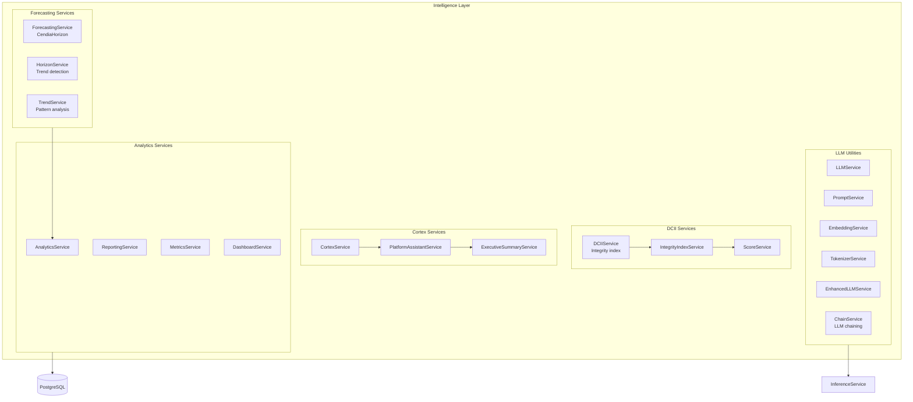

| Service | Key Exports | Purpose |
|---------|------------|---------|
| `AnalyticsService` | `getMetrics()`, `aggregateDecisions()`, `buildReport()` | Usage analytics across deliberations, agents, and decisions |
| `ReportingService` | `generateReport()`, `scheduleReport()`, `exportPDF()` | Scheduled + on-demand report generation |
| `MetricsService` | `track()`, `aggregate()`, `getTimeSeries()` | Platform KPI tracking (decisions/day, consensus rate, dissent rate) |
| `ForecastingService` | `forecast()`, `getTrend()`, `generateProjection()` | ML-based trend forecasting from historical decision data |
| `HorizonService` | `scanHorizon()`, `detectEmergingRisks()` | Emerging risk / regulatory horizon scanning |
| `DCIIService` | `computeIndex()`, `getHistory()`, `compare()` | Datacendia Cryptographic Integrity Index — composite 0–100 score |
| `CortexService` | `query()`, `getContext()`, `synthesize()` | Platform-level intelligence aggregation |
| `PlatformAssistantService` | `chat()`, `getContext()`, `generateSuggestion()` | AI assistant with full platform context |
| `ExecutiveSummaryService` | `summarize()`, `generateBrief()` | C-suite executive summary generation |
| `LLMService` | `complete()`, `chain()`, `embed()` | High-level LLM orchestration with retry + fallback |
| `PromptService` | `build()`, `template()`, `inject()` | Prompt engineering utilities + template management |
| `EmbeddingService` | `embed()`, `similarity()`, `cluster()` | Text embeddings for semantic search + precedent matching |
| `EnhancedLLMService` | `completeWithTools()`, `functionCall()` | Tool-calling and function execution via LLM |
| `ChainService` | `runChain()`, `addStep()`, `getResult()` | Multi-step LLM chain orchestration |

---

## 11. Sovereign & Enterprise Services

**Directories:** `backend/src/services/sovereign/`, `backend/src/services/enterprise/`

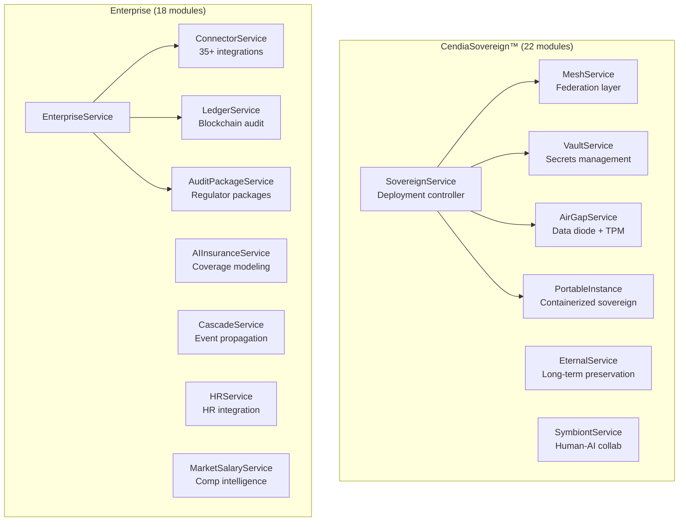

### Sovereign Services

| Service | Key Exports | Purpose |
|---------|------------|---------|
| `SovereignService` | `deploy()`, `configure()`, `getStatus()` | Air-gap deployment orchestration |
| `MeshService` | `connect()`, `federate()`, `syncPolicies()` | Multi-org governance federation |
| `VaultService` | `store()`, `retrieve()`, `rotate()`, `seal()` | OpenBao/Vault secrets lifecycle |
| `EternalService` | `preserve()`, `retrieve()`, `archive()` | Long-term AI decision knowledge preservation |
| `SymbiontService` | `createSession()`, `captureHumanInput()`, `blend()` | Human-AI collaborative decision workflows |
| `AirGapService` | `enableAirGap()`, `configureDataDiode()`, `enableTPM()` | Air-gapped deployment controls |

### Enterprise Services

| Service | Key Exports | Purpose |
|---------|------------|---------|
| `EnterpriseService` | `getStatus()`, `configure()`, `getLicense()` | Enterprise module lifecycle |
| `ConnectorService` | `connect()`, `sync()`, `testConnection()` | 35+ external system connectors |
| `LedgerService` | `recordEntry()`, `auditLedger()`, `exportChain()` | Blockchain-ready immutable audit ledger |
| `AuditPackageService` | `buildPackage()`, `signPackage()`, `exportForRegulator()` | Pre-built regulator audit packages |
| `AIInsuranceService` | `assessRisk()`, `generateQuote()`, `modelCoverage()` | AI liability insurance risk modeling |
| `CascadeService` | `propagate()`, `subscribeToEvent()`, `replay()` | Event propagation + replay across modules |
| `HRService` | `syncEmployees()`, `getOrgChart()`, `trackConsent()` | HR system integration + employee consent |
| `MarketSalaryService` | `getBenchmark()`, `compareCompensation()` | Market salary benchmarking for decision context |

---

## 12. Simulation Services

**Directories:** `backend/src/services/sgas/`, `backend/src/services/scge/`, `backend/src/services/collapse/`

```mermaid
graph TB
    subgraph COLLAPSE_["COLLAPSE™ — Policy Stress Testing"]
        C_ORCH[CollapseOrchestrator<br/>12 adversarial agents]
        C_ADV[AdversarialAgentPool<br/>Attacker personas]
        C_STRESS[StressTestService<br/>Scenario runner]
        C_REPORT[CollapseReport<br/>Vulnerability map]
    end

    subgraph SGAS_["SGAS™ — Self-Governing Agent System"]
        S_ORCH[SGASOrchestrator<br/>Agent lifecycle]
        S_POOL[AgentPool<br/>Self-creating agents]
        S_GOV[AgentGovernanceService<br/>Internal rules]
        S_EVOL[EvolutionService<br/>Agent adaptation]
    end

    subgraph SCGE_["SCGE™ — Synthetic Community Governance Engine"]
        SC_ORCH[SCGEOrchestrator<br/>Community sim]
        SC_SIM[CommunitySimulator<br/>Synthetic stakeholders]
        SC_VOTE[VotingEngine<br/>Preference aggregation]
        SC_OUT[OutcomeModeler<br/>Policy impact]
    end

    C_ORCH --> C_ADV --> C_STRESS --> C_REPORT
    S_ORCH --> S_POOL --> S_GOV --> S_EVOL
    SC_ORCH --> SC_SIM --> SC_VOTE --> SC_OUT
```

| Service | Key Exports | Purpose |
|---------|------------|---------|
| `CollapseService` | `runStressTest()`, `generateScenario()`, `getVulnerabilities()` | 12 adversarial AI agents attack a policy/decision to find failure modes |
| `SGASService` | `createAgent()`, `orchestrate()`, `evolve()`, `selfGovern()` | Self-governing AI agent system with internal rule enforcement |
| `SCGEService` | `simulate()`, `aggregatePreferences()`, `modelOutcome()` | Synthetic community of stakeholders for policy impact modeling |
| `SCGEOrchestratorService` | `runScenario()`, `getConsensus()` | Orchestrates full SCGE simulation with outcome reporting |

---

## 13. Vertical Industry Agents

**Directory:** `backend/src/services/ai/`, `backend/src/connectors/` + vertical routes

107 files covering 30 full vertical packs. Each vertical has 12+ specialized agents:

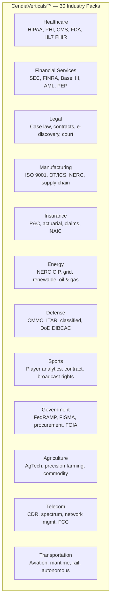

### Vertical Agent Architecture (per vertical)

Each vertical pack contains:
- **Research Agent** — Regulatory research for the vertical
- **Compliance Agent** — Framework-specific compliance checks
- **Risk Agent** — Industry-specific risk modeling
- **Operations Agent** — Operational decision support
- **Legal Agent** — Vertical-specific legal analysis
- **Financial Agent** — Industry financial modeling
- **Arbiter Agent** — Synthesis + recommendation for the vertical

---

## 14. Operations Services

**Directories:** `backend/src/services/ops/`, `backend/src/services/metrics/`, `backend/src/services/backup/`, `backend/src/services/cache/`, `backend/src/services/queue/`, `backend/src/services/scheduler/`

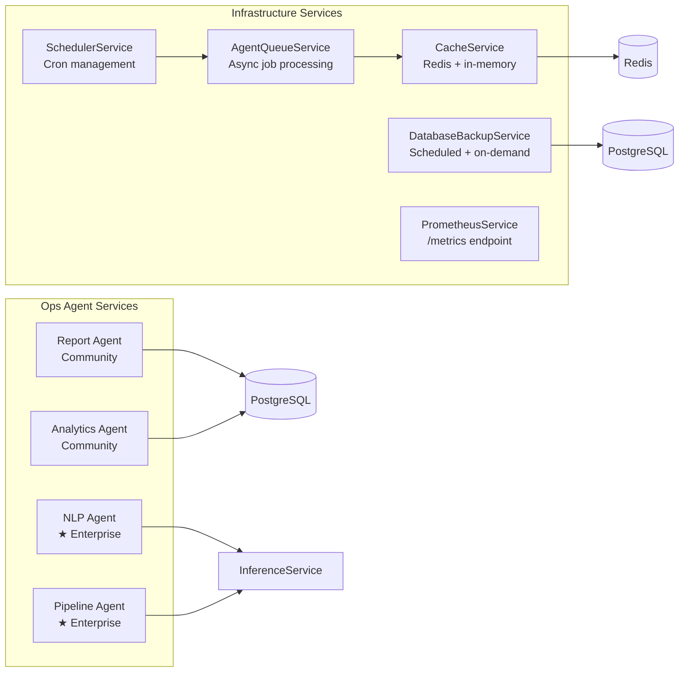

| Service | Key Exports | Purpose |
|---------|------------|---------|
| `OpsAgentService` | `runReport()`, `analyze()`, `processNLP()`, `runPipeline()` | 4-agent operational intelligence system |
| `DatabaseBackupService` | `backup()`, `restore()`, `scheduleBackup()`, `stopScheduler()` | Automated PostgreSQL backup lifecycle |
| `CacheService` | `get()`, `set()`, `invalidate()`, `flush()` | Redis-backed multi-layer caching |
| `AgentQueueService` | `enqueue()`, `process()`, `getStatus()`, `retry()` | Async agent job queue with retry logic |
| `SchedulerService` | `schedule()`, `cancel()`, `getJobs()` | Cron-based scheduled task management |
| `PrometheusService` | `getMetrics()`, `recordMetric()` | Prometheus metrics collection + `/metrics` endpoint |

---

## 15. Platform & Infrastructure Services

**Directories:** `backend/src/services/platform/`, `backend/src/services/admin/`, `backend/src/services/i18n/`, `backend/src/services/feedback/`, `backend/src/services/remediation/`, `backend/src/services/collaboration/`

| Service | Key Exports | Purpose |
|---------|------------|---------|
| `PlatformService` | `getStatus()`, `getHealth()`, `getConfig()` | Platform-wide health + configuration |
| `NotificationService` | `send()`, `subscribe()`, `getHistory()` | In-app + email notification delivery |
| `UploadService` | `upload()`, `scan()`, `store()`, `delete()` | File upload with ClamAV virus scanning |
| `SettingsService` | `get()`, `update()`, `validateSettings()` | Org + user settings management |
| `AdminService` | `listUsers()`, `suspendUser()`, `getAuditLog()` | Admin console operations |
| `UserManagementService` | `createUser()`, `updateRole()`, `deactivate()` | User lifecycle management |
| `OrgManagementService` | `createOrg()`, `updateSettings()`, `getTierStatus()` | Organization lifecycle |
| `I18nService` | `translate()`, `getLocale()`, `getSupportedLanguages()` | 26-language internationalization |
| `OmniTranslateService` | `translateCompliance()`, `translateLegal()` | Domain-specific compliance translation |
| `FeedbackService` | `recordFeedback()`, `analyzeSentiment()`, `aggregate()` | User feedback capture + NLP analysis |
| `ContinuousImprovementService` | `processLoop()`, `generateInsights()` | Automated improvement recommendations |
| `RemediationService` | `createTicket()`, `assignTicket()`, `resolveTicket()` | Automated issue remediation + ticketing |
| `AutoHealService` | `detectAnomaly()`, `selfHeal()`, `rollback()` | Self-healing infrastructure monitoring |
| `StakeholderPortalService` | `createPortal()`, `shareReport()`, `collectInput()` | Stakeholder collaboration portals |
| `SampleDataService` | `generate()`, `seedOrg()`, `clearSamples()` | Demo + test data generation |

---

## 16. Connector Services

**Directory:** `backend/src/connectors/`

35+ connectors organized by vertical:

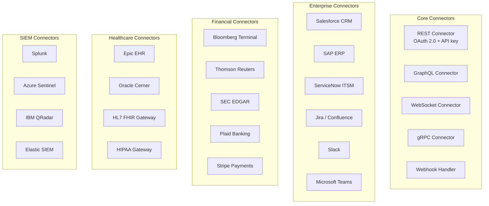

---

## 17. Middleware Services

**Directory:** `backend/src/middleware/`

```mermaid
flowchart TD
    REQ3[HTTP Request] --> STATIC[express.static<br/>Before all middleware]
    STATIC --> HELM2[Helmet CSP]
    HELM2 --> CORS2[CORS validation]
    CORS2 --> RATE3[Rate Limiter<br/>Redis-backed]
    RATE3 --> BODY[Body + Cookie Parser]
    BODY --> COMP[Compression]
    COMP --> RLOG[Request Logger]
    RLOG --> SEC_HDR[customSecurityHeaders]
    SEC_HDR --> MASTER2[masterSecurityMiddleware]
    MASTER2 --> REPLAY3[preventReplayAttack]
    REPLAY3 --> EXFIL3[preventDataExfiltration]
    EXFIL3 --> THREAT3[threatDetectionMiddleware]
    THREAT3 --> HONEY2[honeypotMiddleware]
    HONEY2 --> CSRF2[csrfProtection]
    CSRF2 --> SANIT[inputSanitizationMiddleware]
    SANIT --> PATH[pathTraversalMiddleware]
    PATH --> SQL[sqlInjectionMiddleware]
    SQL --> AUTH_MW[Auth Middleware<br/>JWT + blockIfDemo①]
    AUTH_MW --> ORG[requireOrgScope<br/>+ blockIfDemo②]
    ORG --> AI_REG[aiRegulatoryMiddleware<br/>AI routes only]
    AI_REG --> PHI2[phiEnforcementMiddleware<br/>AI routes only]
    PHI2 --> ROUTE3[Route Handler]

    style AUTH_MW fill:#3b82f620,stroke:#3b82f6
    style ORG fill:#10b98120,stroke:#10b981
    style AI_REG fill:#f59e0b20,stroke:#f59e0b
    style PHI2 fill:#ef444420,stroke:#ef4444
```

### All Middleware Files

| File | Middleware Exported | Applied To |
|------|-------------------|-----------|
| `middleware/auth.ts` | `requireAuth`, `optionalAuth`, `requireRole` | All authenticated routes — also calls `blockIfDemo` |
| `middleware/demoGuard.ts` | `isDemoOrg`, `blockIfDemo`, `demoGuardMiddleware` | All routes via auth + requireOrgScope (v0.2.4+) |
| `middleware/tenantIsolation.ts` | `requireOrgScope`, `verifyOrgOwnership`, `auditTenantAccess` | All org-scoped domain routers — calls `blockIfDemo` (v0.2.4+) |
| `middleware/errorHandler.ts` | `errorHandler`, `errors` | Global error handler |
| `middleware/requestLogger.ts` | `requestLogger` | All requests |
| `middleware/csrf.ts` | `csrfProtection`, `csrfTokenHandler`, `ensureCsrfToken` | State-changing requests |
| `middleware/SecurityMiddleware.ts` | `inputSanitizationMiddleware`, `pathTraversalMiddleware`, `sqlInjectionMiddleware` | All API requests |
| `middleware/cacheMiddleware.ts` | `apiCache`, `CACHE_TTLS` | Cacheable GET endpoints |
| `middleware/aiRegulatoryMiddleware.ts` | `aiRegulatoryMiddleware` | `/api/v1/council`, `/deliberations`, `/inference`, `/platform-assistant` |
| `middleware/phiEnforcementMiddleware.ts` | `phiEnforcementMiddleware` | AI routes (after `aiRegulatoryMiddleware`) |

---

*Last updated: April 2026 — v0.2.4-alpha*
*See also: [Datacendia Bible](../DATACENDIA-BIBLE.md) · [Architecture README](./README.md) · [Compliance Services](./compliance-services.md)*
