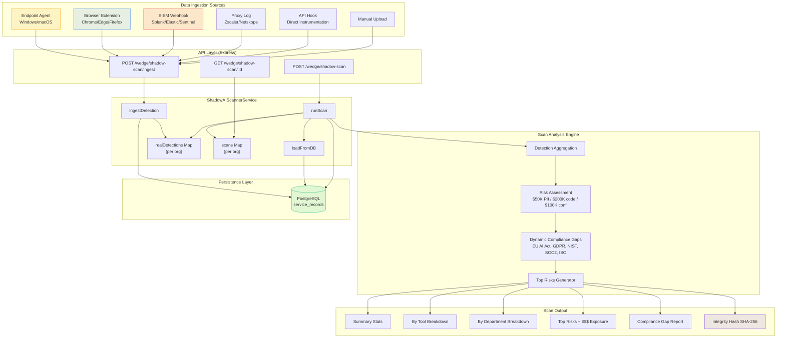
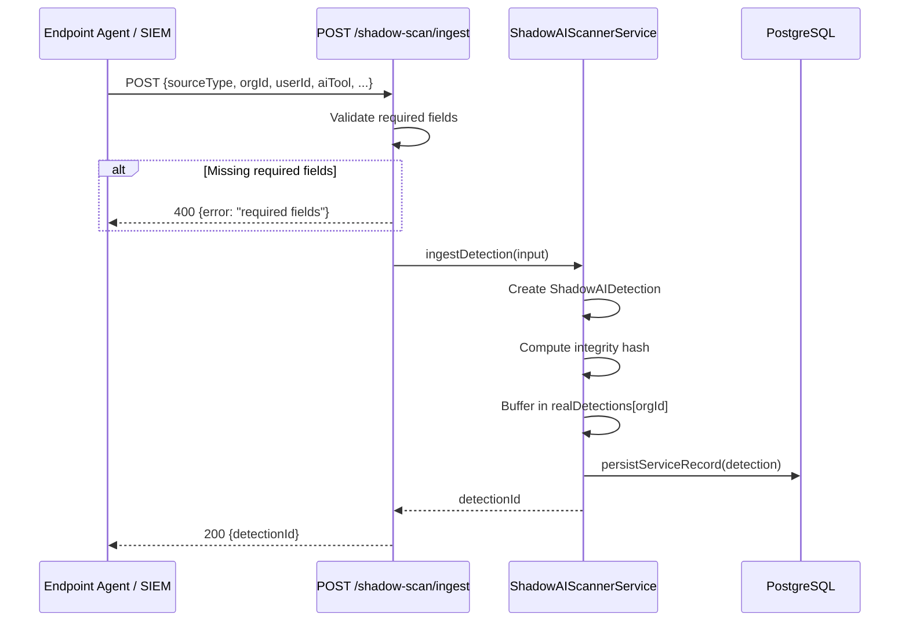
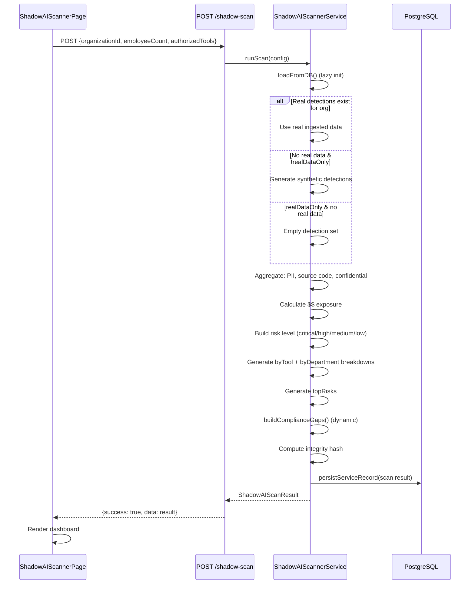
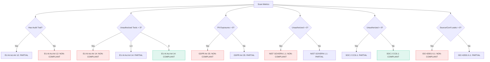

# Shadow AI Scanner — Architecture & Workflow Diagrams

## 1. System Architecture

```mermaid
graph TB
    subgraph DataSources["Data Ingestion Sources"]
        EA[Endpoint Agent<br/>Windows/macOS]
        BE[Browser Extension<br/>Chrome/Edge/Firefox]
        SW[SIEM Webhook<br/>Splunk/Elastic/Sentinel]
        PL[Proxy Log<br/>Zscaler/Netskope]
        AH[API Hook<br/>Direct instrumentation]
        MN[Manual Upload]
    end

    subgraph API["API Layer (Express)"]
        R1["POST /wedge/shadow-scan"]
        R2["POST /wedge/shadow-scan/ingest"]
        R3["GET /wedge/shadow-scan/:id"]
    end

    subgraph Service["ShadowAIScannerService"]
        IG[ingestDetection]
        RS[runScan]
        LD[loadFromDB]
        RD["realDetections Map<br/>(per org)"]
        SC["scans Map<br/>(per org)"]
    end

    subgraph Analysis["Scan Analysis Engine"]
        DE[Detection Aggregation]
        RA[Risk Assessment<br/>$50K PII / $200K code / $100K conf]
        CG[Dynamic Compliance Gaps<br/>EU AI Act, GDPR, NIST, SOC2, ISO]
        TR[Top Risks Generator]
    end

    subgraph Persistence["Persistence Layer"]
        DB[(PostgreSQL<br/>service_records)]
    end

    subgraph Output["Scan Output"]
        SUM[Summary Stats]
        BT[By Tool Breakdown]
        BD[By Department Breakdown]
        RISKS[Top Risks + $$$ Exposure]
        COMP[Compliance Gap Report]
        HASH[Integrity Hash SHA-256]
    end

    EA & BE & SW & PL & AH & MN --> R2
    R2 --> IG
    IG --> RD
    IG --> DB

    R1 --> RS
    RS --> LD
    LD --> DB
    RS --> RD
    RS --> DE --> RA --> CG --> TR
    RS --> SC
    RS --> DB

    TR --> SUM & BT & BD & RISKS & COMP & HASH

    R3 --> SC

    style EA fill:#f59e0b20,stroke:#f59e0b
    style BE fill:#3b82f620,stroke:#3b82f6
    style SW fill:#ef444420,stroke:#ef4444
    style DB fill:#10b98120,stroke:#10b981
    style HASH fill:#7c3aed20,stroke:#7c3aed
```

## 2. Detection Ingestion Flow

```mermaid
sequenceDiagram
    participant Agent as Endpoint Agent / SIEM
    participant API as POST /shadow-scan/ingest
    participant SVC as ShadowAIScannerService
    participant DB as PostgreSQL

    Agent->>API: POST {sourceType, orgId, userId, aiTool, ...}
    API->>API: Validate required fields

    alt Missing required fields
        API-->>Agent: 400 {error: "required fields"}
    end

    API->>SVC: ingestDetection(input)
    SVC->>SVC: Create ShadowAIDetection
    SVC->>SVC: Compute integrity hash
    SVC->>SVC: Buffer in realDetections[orgId]
    SVC->>DB: persistServiceRecord(detection)
    SVC-->>API: detectionId
    API-->>Agent: 200 {detectionId}
```

## 3. Scan Execution Workflow

```mermaid
sequenceDiagram
    participant UI as ShadowAIScannerPage
    participant API as POST /shadow-scan
    participant SVC as ShadowAIScannerService
    participant DB as PostgreSQL

    UI->>API: POST {organizationId, employeeCount, authorizedTools}
    API->>SVC: runScan(config)

    SVC->>SVC: loadFromDB() (lazy init)

    alt Real detections exist for org
        SVC->>SVC: Use real ingested data
    else No real data & !realDataOnly
        SVC->>SVC: Generate synthetic detections
    else realDataOnly & no real data
        SVC->>SVC: Empty detection set
    end

    SVC->>SVC: Aggregate: PII, source code, confidential
    SVC->>SVC: Calculate $$ exposure
    SVC->>SVC: Build risk level (critical/high/medium/low)
    SVC->>SVC: Generate byTool + byDepartment breakdowns
    SVC->>SVC: Generate topRisks
    SVC->>SVC: buildComplianceGaps() (dynamic)
    SVC->>SVC: Compute integrity hash

    SVC->>DB: persistServiceRecord(scan result)
    SVC-->>API: ShadowAIScanResult
    API-->>UI: {success: true, data: result}

    UI->>UI: Render dashboard
```

## 4. Compliance Gap Evaluation Logic

```mermaid
flowchart TD
    START[Scan Metrics] --> EU12{Has Audit Trail?}
    EU12 -->|Yes| EU12P[EU AI Act Art 12: PARTIAL]
    EU12 -->|No| EU12N[EU AI Act Art 12: NON-COMPLIANT]

    START --> EU14{Unauthorized Tools > 3?}
    EU14 -->|Yes| EU14N[EU AI Act Art 14: NON-COMPLIANT]
    EU14 -->|1-3| EU14P[EU AI Act Art 14: PARTIAL]
    EU14 -->|0| EU14C[EU AI Act Art 14: COMPLIANT]

    START --> GDPR{PII Exposures > 0?}
    GDPR -->|Yes| GDPRN[GDPR Art 35: NON-COMPLIANT]
    GDPR -->|No| GDPRP[GDPR Art 35: PARTIAL]

    START --> NIST{Unauthorized > 0?}
    NIST -->|Yes| NISTN[NIST GOVERN 1.1: NON-COMPLIANT]
    NIST -->|No| NISTP[NIST GOVERN 1.1: PARTIAL]

    START --> SOC{Unauthorized > 0?}
    SOC -->|Yes| SOCP[SOC 2 CC6.1: PARTIAL]
    SOC -->|No| SOCC[SOC 2 CC6.1: COMPLIANT]

    START --> ISO{Source/Conf Leaks > 0?}
    ISO -->|Yes| ISON[ISO 42001 6.1: NON-COMPLIANT]
    ISO -->|No| ISOP[ISO 42001 6.1: PARTIAL]

    style EU12N fill:#ef444420,stroke:#ef4444
    style EU14N fill:#ef444420,stroke:#ef4444
    style GDPRN fill:#ef444420,stroke:#ef4444
    style NISTN fill:#ef444420,stroke:#ef4444
    style ISON fill:#ef444420,stroke:#ef4444
    style EU14C fill:#10b98120,stroke:#10b981
    style SOCC fill:#10b98120,stroke:#10b981
```
