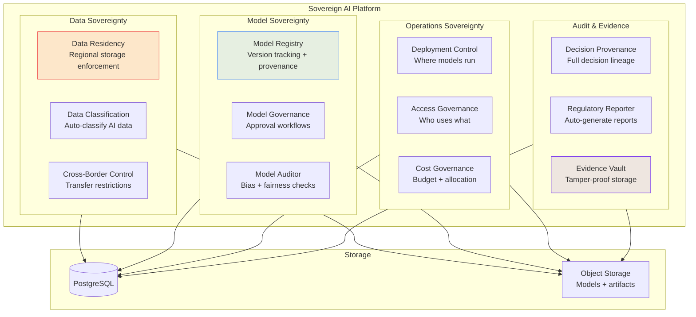
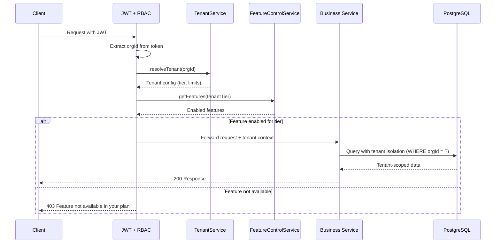
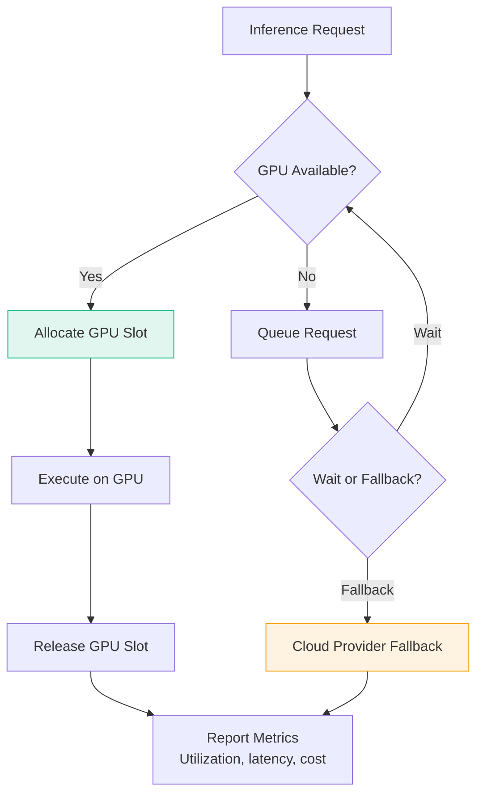

# Sovereign & Enterprise Services — Architecture & Workflow Diagrams

## 1. Sovereign AI Architecture (22 modules)

## 2. Enterprise Services (18 modules)

```mermaid
graph TB
    subgraph Enterprise["Enterprise Layer"]
        subgraph MultiTenant["Multi-Tenancy"]
            TENANT[TenantService<br/>Organization isolation]
            FEATURE[FeatureControlService<br/>Feature flags per tier]
        end

        subgraph AdminTools["Admin & Operations"]
            BRAND[CendiaBrandService<br/>White-label customization]
            SUPPORT[CendiaSupportService<br/>Support ticket system]
            WATCH[CendiaWatchService<br/>System health monitoring]
            FOUNDRY[CendiaFoundryService<br/>Custom model training]
            REVENUE[CendiaRevenueService<br/>Billing + usage metering]
        end

        subgraph Infra["Infrastructure"]
            CACHE[RedisCacheService<br/>Distributed caching]
            STORAGE[StorageService<br/>File + artifact storage]
            KAFKA[KafkaService<br/>Event streaming]
            STREAM[StreamingService<br/>Real-time data feeds]
            GPU_SVC[GPUService<br/>GPU resource management]
        end

        subgraph DataPipeline["Data Pipeline"]
            GRAPH[graphIngestion<br/>Knowledge graph builder]
            VECTOR[VectorDB Service<br/>Embedding storage + search]
            DOC[DocumentService<br/>Document processing]
            SAMPLE[SampleDataService<br/>Demo data generation]
        end
    end

    MultiTenant --> AdminTools
    AdminTools --> Infra
    Infra --> DataPipeline

    style TENANT fill:#7c3aed20,stroke:#7c3aed
    style FEATURE fill:#f59e0b20,stroke:#f59e0b
    style CACHE fill:#3b82f620,stroke:#3b82f6
```

## 3. Multi-Tenant Isolation Flow

## 4. GPU Resource Management

