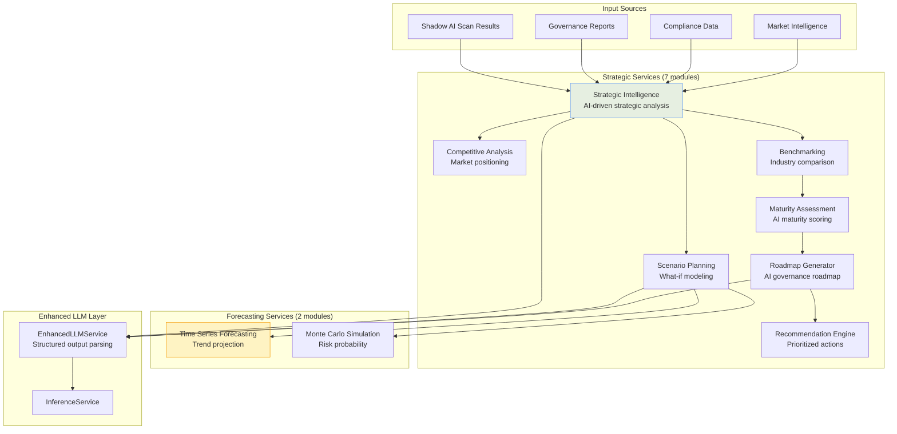
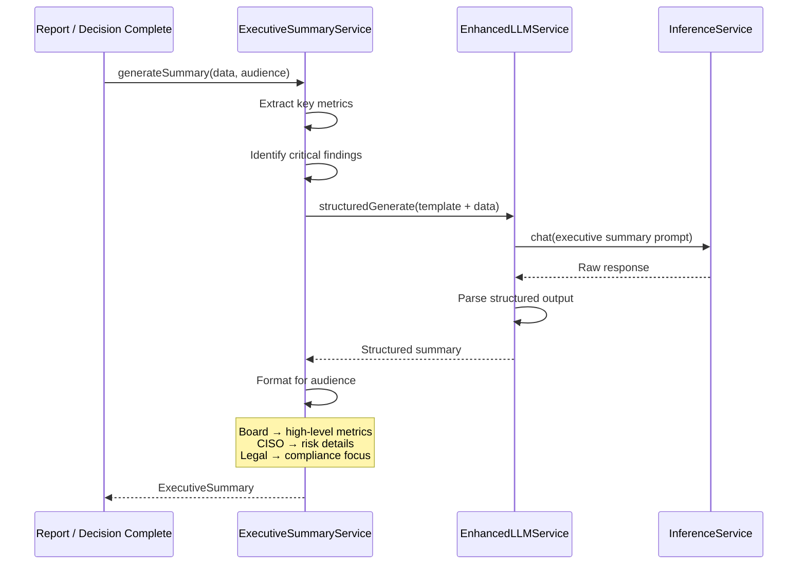
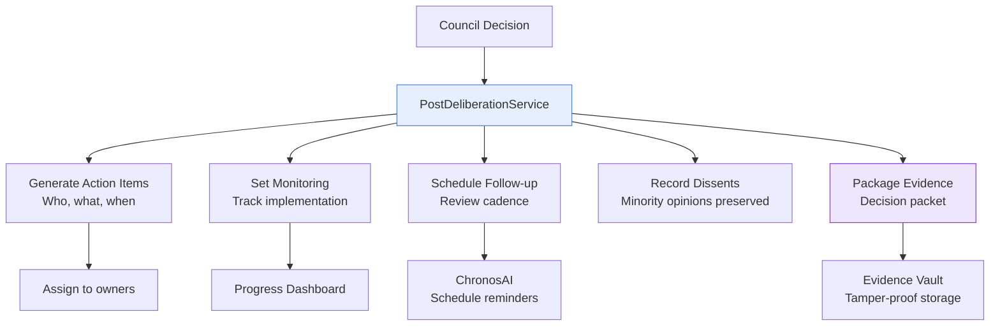

# Strategic & Forecasting Services — Architecture & Workflow Diagrams

## 1. Strategic Intelligence Architecture

```mermaid
graph TB
    subgraph Strategic["Strategic Services (7 modules)"]
        SI[Strategic Intelligence<br/>AI-driven strategic analysis]
        SC[Scenario Planning<br/>What-if modeling]
        COMP[Competitive Analysis<br/>Market positioning]
        ROAD[Roadmap Generator<br/>AI governance roadmap]
        BENCH[Benchmarking<br/>Industry comparison]
        MATURE[Maturity Assessment<br/>AI maturity scoring]
        REC[Recommendation Engine<br/>Prioritized actions]
    end

    subgraph Forecasting["Forecasting Services (2 modules)"]
        TS[Time Series Forecasting<br/>Trend projection]
        MON[Monte Carlo Simulation<br/>Risk probability]
    end

    subgraph LLM["Enhanced LLM Layer"]
        ELLM[EnhancedLLMService<br/>Structured output parsing]
        ELLM --> INF[InferenceService]
    end

    subgraph Inputs["Input Sources"]
        SCAN[Shadow AI Scan Results]
        GOV[Governance Reports]
        COMP_DATA[Compliance Data]
        MARKET[Market Intelligence]
    end

    SCAN & GOV & COMP_DATA & MARKET --> SI
    SI --> SC & COMP & BENCH
    SC --> TS & MON
    BENCH --> MATURE --> ROAD --> REC
    SI & SC & ROAD --> ELLM

    style SI fill:#3b82f620,stroke:#3b82f6
    style TS fill:#f59e0b20,stroke:#f59e0b
```

## 2. Executive Summary Generation

```mermaid
sequenceDiagram
    participant Trigger as Report / Decision Complete
    participant ES as ExecutiveSummaryService
    participant AI as EnhancedLLMService
    participant INF as InferenceService

    Trigger->>ES: generateSummary(data, audience)
    ES->>ES: Extract key metrics
    ES->>ES: Identify critical findings
    ES->>AI: structuredGenerate(template + data)
    AI->>INF: chat(executive summary prompt)
    INF-->>AI: Raw response
    AI->>AI: Parse structured output
    AI-->>ES: Structured summary

    ES->>ES: Format for audience
    Note over ES: Board → high-level metrics<br/>CISO → risk details<br/>Legal → compliance focus

    ES-->>Trigger: ExecutiveSummary
```

## 3. Post-Deliberation Flow

```mermaid
flowchart TD
    DECISION[Council Decision] --> PD[PostDeliberationService]
    PD --> ACTIONS[Generate Action Items<br/>Who, what, when]
    PD --> MONITOR[Set Monitoring<br/>Track implementation]
    PD --> FOLLOWUP[Schedule Follow-up<br/>Review cadence]
    PD --> DISSENT[Record Dissents<br/>Minority opinions preserved]
    PD --> EVIDENCE[Package Evidence<br/>Decision packet]

    ACTIONS --> ASSIGN[Assign to owners]
    MONITOR --> DASHBOARD[Progress Dashboard]
    FOLLOWUP --> CHRONOS[ChronosAI<br/>Schedule reminders]
    EVIDENCE --> VAULT[Evidence Vault<br/>Tamper-proof storage]

    style PD fill:#3b82f620,stroke:#3b82f6
    style EVIDENCE fill:#7c3aed20,stroke:#7c3aed
```
