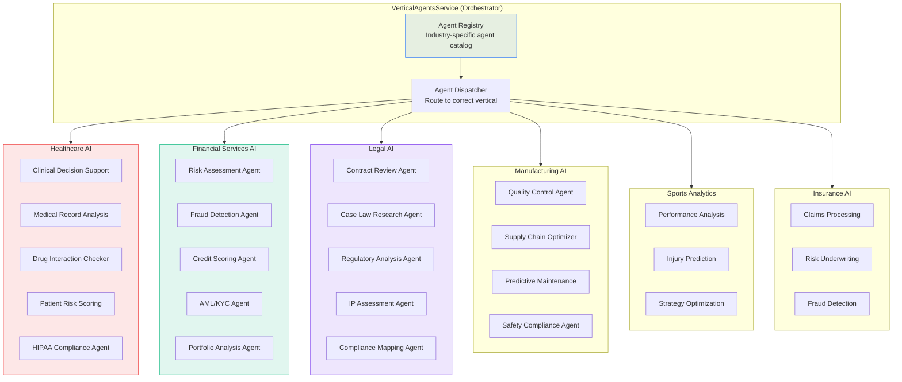
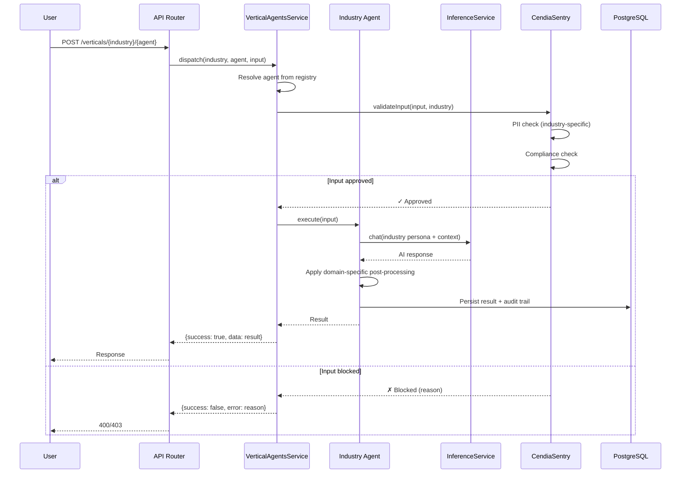
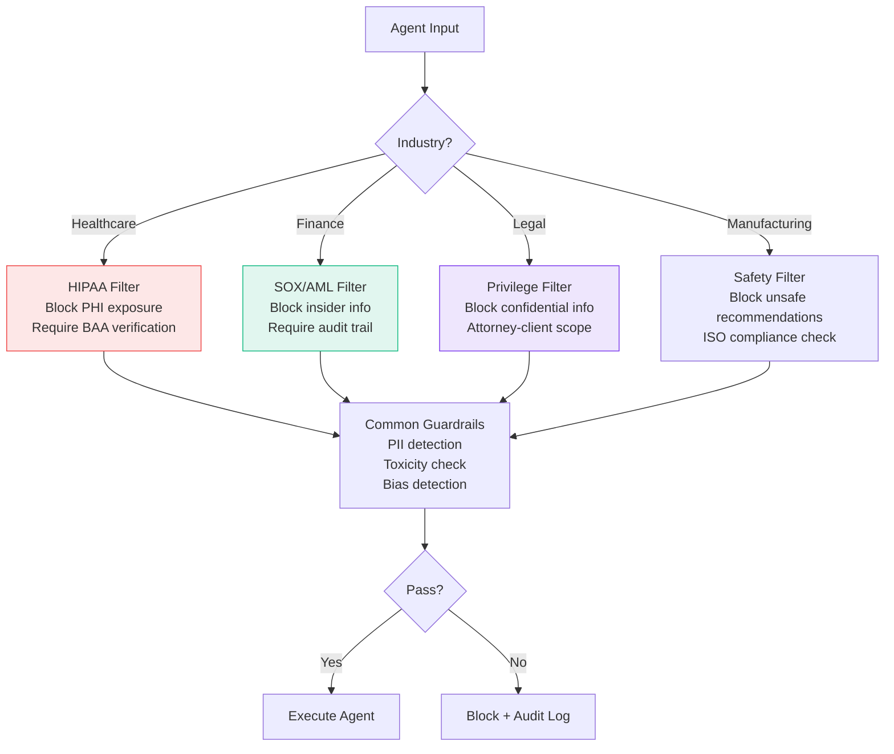

# Vertical Industry Agents — Architecture & Workflow Diagrams

## 1. Vertical Agents Architecture (107 modules)

```mermaid
graph TB
    subgraph Core["VerticalAgentsService (Orchestrator)"]
        VA[Agent Registry<br/>Industry-specific agent catalog]
        VA --> DISPATCH[Agent Dispatcher<br/>Route to correct vertical]
    end

    subgraph Healthcare["Healthcare AI"]
        H1[Clinical Decision Support]
        H2[Medical Record Analysis]
        H3[Drug Interaction Checker]
        H4[Patient Risk Scoring]
        H5[HIPAA Compliance Agent]
    end

    subgraph Finance["Financial Services AI"]
        F1[Risk Assessment Agent]
        F2[Fraud Detection Agent]
        F3[Credit Scoring Agent]
        F4[AML/KYC Agent]
        F5[Portfolio Analysis Agent]
    end

    subgraph Legal["Legal AI"]
        L1[Contract Review Agent]
        L2[Case Law Research Agent]
        L3[Regulatory Analysis Agent]
        L4[IP Assessment Agent]
        L5[Compliance Mapping Agent]
    end

    subgraph Manufacturing["Manufacturing AI"]
        M1[Quality Control Agent]
        M2[Supply Chain Optimizer]
        M3[Predictive Maintenance]
        M4[Safety Compliance Agent]
    end

    subgraph Sports["Sports Analytics"]
        S1[Performance Analysis]
        S2[Injury Prediction]
        S3[Strategy Optimization]
    end

    subgraph Insurance["Insurance AI"]
        I1[Claims Processing]
        I2[Risk Underwriting]
        I3[Fraud Detection]
    end

    DISPATCH --> Healthcare & Finance & Legal & Manufacturing & Sports & Insurance

    style VA fill:#3b82f620,stroke:#3b82f6
    style Healthcare fill:#ef444420,stroke:#ef4444
    style Finance fill:#10b98120,stroke:#10b981
    style Legal fill:#7c3aed20,stroke:#7c3aed
```

## 2. Vertical Agent Execution Flow

```mermaid
sequenceDiagram
    participant User
    participant API as API Router
    participant VA as VerticalAgentsService
    participant Agent as Industry Agent
    participant AI as InferenceService
    participant Guard as CendiaSentry
    participant DB as PostgreSQL

    User->>API: POST /verticals/{industry}/{agent}
    API->>VA: dispatch(industry, agent, input)
    VA->>VA: Resolve agent from registry

    VA->>Guard: validateInput(input, industry)
    Guard->>Guard: PII check (industry-specific)
    Guard->>Guard: Compliance check

    alt Input approved
        Guard-->>VA: ✓ Approved
        VA->>Agent: execute(input)
        Agent->>AI: chat(industry persona + context)
        AI-->>Agent: AI response
        Agent->>Agent: Apply domain-specific post-processing
        Agent->>DB: Persist result + audit trail
        Agent-->>VA: Result
        VA-->>API: {success: true, data: result}
        API-->>User: Response
    else Input blocked
        Guard-->>VA: ✗ Blocked (reason)
        VA-->>API: {success: false, error: reason}
        API-->>User: 400/403
    end
```

## 3. Industry-Specific Guardrails

```mermaid
flowchart TD
    INPUT[Agent Input] --> IND{Industry?}

    IND -->|Healthcare| HC_GUARD[HIPAA Filter<br/>Block PHI exposure<br/>Require BAA verification]
    IND -->|Finance| FIN_GUARD[SOX/AML Filter<br/>Block insider info<br/>Require audit trail]
    IND -->|Legal| LEG_GUARD[Privilege Filter<br/>Block confidential info<br/>Attorney-client scope]
    IND -->|Manufacturing| MFG_GUARD[Safety Filter<br/>Block unsafe recommendations<br/>ISO compliance check]

    HC_GUARD & FIN_GUARD & LEG_GUARD & MFG_GUARD --> COMMON[Common Guardrails<br/>PII detection<br/>Toxicity check<br/>Bias detection]

    COMMON --> PASS{Pass?}
    PASS -->|Yes| EXEC[Execute Agent]
    PASS -->|No| BLOCK[Block + Audit Log]

    style HC_GUARD fill:#ef444420,stroke:#ef4444
    style FIN_GUARD fill:#10b98120,stroke:#10b981
    style LEG_GUARD fill:#7c3aed20,stroke:#7c3aed
```
